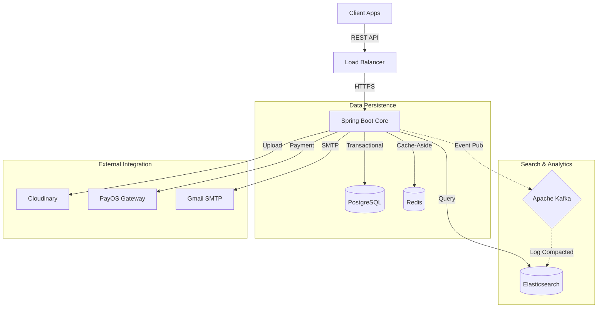

<p align="center">
   <a href="https://spring.io/" target="_blank"></a>
  &nbsp;&nbsp;
   <a href="https://www.postgresql.org/" target="_blank"></a>
  &nbsp;&nbsp;
   <a href="https://redis.io/" target="_blank"></a>
  &nbsp;&nbsp;
   <a href="https://kafka.apache.org/" target="_blank"></a>
  &nbsp;&nbsp;
   <a href="https://www.elastic.co/" target="_blank"></a>
  &nbsp;&nbsp;
   <a href="https://www.docker.com/" target="_blank"></a>
  &nbsp;&nbsp;
   <a href="https://prometheus.io/" target="_blank"></a>
  &nbsp;&nbsp;
   <a href="https://ollama.com/" target="_blank"></a>
</p>

## Introduction

Per is a production-ready e-commerce backend application built with Java 21 and Spring Boot 3.5. The system follows a modular monolith architecture, providing separation of concerns while maintaining deployment simplicity. It features JWT-based authentication, Elasticsearch full-text search, Redis caching with transactional consistency, event-driven processing via Kafka, and resilience patterns for external service integration.

<p align="center">
  <a href="./">
    
  </a>
</p>

## System Architecture

The application is architected as a **Modular Monolith** driven by Domain-Driven Design (DDD) principles. It leverages an event-driven backbone (Kafka) to synchronize state between the transactional core (PostgreSQL) and the search capability (Elasticsearch).



### Core Capabilities

*   **Transactional Integrity**: ACID compliance via PostgreSQL for critical paths (Order, Payment).
*   **High-Performance Search**: CQRS implementation offloading complex queries to Elasticsearch.
*   **Resilience**: Circuit Breakers and Rate Limiters (Resilience4j) protecting against external outages.
*   **Scalability**: Stateless authentication (JWT) and distributed caching (Redis) enable horizontal scaling.

---

## Technical Stack

| Category | Technology | Version | Purpose |
| :--- | :--- | :--- | :--- |
| **Runtime** | Java | 21 (LTS) | Core Platform |
| **Framework** | Spring Boot | 3.5.x | Application Skeleton |
| **Database** | PostgreSQL | 16 | Primary Data Store |
| **Cache** | Redis | 7.x | L2 Cache & Session Store |
| **Search** | Elasticsearch | 7.x | Full-text Engine |
| **Messaging** | Kafka | 3.x | Event Bus |
## Getting Started

### Prerequisites

*   **Docker Desktop** (or Engine + Compose)
*   **Java 21**
*   **Maven**

### Infrastructure Provisioning

The entire dependent infrastructure (DB, Cache, Broker, Search) is containerized.

```bash
# Start all dependencies
docker-compose up -d

# Verify container status
docker-compose ps
```

### Configuration

Copy the example configuration to a local environment file.

```bash
cp .env.example .env
```
> **Note**: Populate critical secrets (Payment Keys, Cloudinary Credentials) in `.env` before starting the application.

### Build & Run

```bash
# Verify code quality and build
./mvnw clean verify

# Run the application
./mvnw spring-boot:run
```

The API will be available at `http://localhost:8080/per`.

---

## Developer Guide

### Quality Assurance

The project enforces strict code style guidelines using **Spotless**.

```bash
# Apply formatting
./mvnw spotless:apply

# Run Unit & Integration Tests
./mvnw test
```

### API Documentation

Interactive OpenAPI 3.0 documentation is available at:
`http://localhost:8080/per/swagger-ui/index.html`

---

## License

This project is licensed under the MIT License - see the [LICENSE](LICENSE) file for details.
