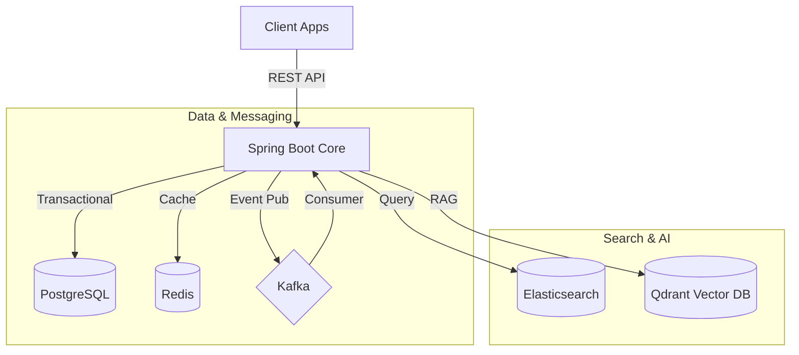

<p align="center">
    <a href="https://spring.io/" target="_blank"></a>&nbsp;
    <a href="https://www.postgresql.org/" target="_blank"></a>&nbsp;
    <a href="https://qdrant.tech/" target="_blank"></a>&nbsp;
    <a href="https://redis.io/" target="_blank"></a>&nbsp;
    <a href="https://www.elastic.co/" target="_blank"></a>&nbsp;
    <br/>
    <br/>
    <a href="https://kafka.apache.org/" target="_blank"></a>&nbsp;
    <a href="https://debezium.io/" target="_blank"></a>&nbsp;
    <a href="https://www.docker.com/" target="_blank"></a>&nbsp;
    <a href="https://jenkins.io/" target="_blank"></a>&nbsp;
    <a href="https://prometheus.io/" target="_blank"></a>&nbsp;
    <a href="https://grafana.com/" target="_blank"></a>
</p>

# Per - E-Commerce Backend

[](README.vi.md)

**Per** is a production-ready Modular Monolith e-commerce system built with Java 21, Spring Boot 3.5, and a robust Event-Driven Architecture.

<p align="center">
  <a href="./">
    
  </a>
</p>

## Module Documentation

| Module | Purpose | Tech Stack |
| :--- | :--- | :--- |
| **[Common](docs/modules/common/README.md)** | Shared Utilities, Global Exceptions | Spring Web, Resilience4j |
| **[Auth](docs/modules/auth/README.md)** | Security, JWT, Role Management | Spring Security 6, JJWT |
| **[User](docs/modules/user/README.md)** | Identity & Profile Management | JPA, PostgreSQL |
| **[Product](docs/modules/product/README.md)** | Catalog, Elasticsearch Sync | Elastic, Kafka |
| **[Media](docs/modules/media/README.md)** | Cloudinary Asset Management | Cloudinary SDK |
| **[Cart](docs/modules/cart/README.md)** | Persistent Shopping Cart | JPA (Persistent) |
| **[Order](docs/modules/order/README.md)** | Transaction Lifecycle | State Machine |
| **[Payment](docs/modules/payment/README.md)** | Gateways & Webhooks | PayOS SDK |
| **[RAG](docs/modules/rag/README.md)** | AI Shopping Assistant | Spring AI, Qdrant |

## Quick Start

### Prerequisites
*   Java 21
*   Docker Desktop

### Run Infrastructure
```bash
docker-compose up -d
```

### Run Application
```bash
./mvnw spring-boot:run
```

## System Architecture

The application follows a **Modular Monolith** pattern with **Event-Driven** consistency by default.



## License
MIT License
