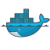

<p align="center">
    <a href="https://spring.io/" target="_blank"></a>&nbsp;
    <a href="https://www.postgresql.org/" target="_blank"></a>&nbsp;
    <a href="https://qdrant.tech/" target="_blank"></a>&nbsp;
    <a href="https://redis.io/" target="_blank"></a>&nbsp;
    <a href="https://www.elastic.co/" target="_blank"></a>&nbsp;
    <br/>
    <br/>
    <a href="https://kafka.apache.org/" target="_blank"></a>&nbsp;
    <a href="https://debezium.io/" target="_blank"></a>&nbsp;
    <a href="https://www.docker.com/" target="_blank"></a>&nbsp;
    <a href="https://jenkins.io/" target="_blank"></a>&nbsp;
    <a href="https://prometheus.io/" target="_blank"></a>&nbsp;
    <a href="https://grafana.com/" target="_blank"></a>
</p>

# Per - E-Commerce Backend

[](README.vi.md)

**Per** is a Modular Monolith e-commerce system built with Java 21, Spring Boot 3.5, and a robust Event-Driven Architecture.

<p align="center">
  <a href="./">
    
  </a>
</p>

## Quick Start

### Prerequisites
*   Java 21
*   Docker Desktop

### Run Infrastructure
```bash
docker-compose up -d
```

### Run Application
```bash
./mvnw spring-boot:run
```

## License
MIT License
