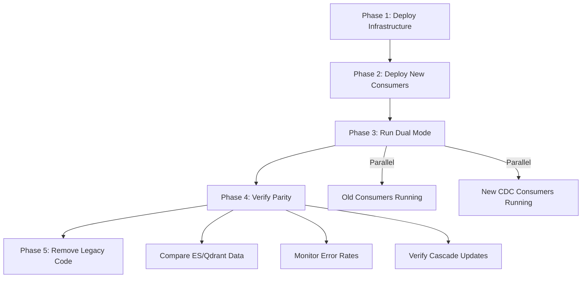

# Debezium CDC Implementation Plan

## Goal

Migrate from synchronous dual-write pattern (Application → PostgreSQL + Kafka) to asynchronous Change Data Capture (Debezium → Kafka → Consumers) for Elasticsearch and Qdrant synchronization.

---

## Current Architecture Analysis

### Dual-Write Pattern Identified

| Service | File | Kafka Topic | Target |
|---------|------|-------------|--------|
| `ProductServiceImpl` | [ProductServiceImpl.java](file:///home/minhg/Desktop/Per/src/main/java/com/per/product/service/impl/ProductServiceImpl.java) | `product-index-topic` | Elasticsearch |
| `BrandServiceImpl` | [BrandServiceImpl.java](file:///home/minhg/Desktop/Per/src/main/java/com/per/brand/service/impl/BrandServiceImpl.java) | `brand-index-topic` | Elasticsearch |
| `CategoryServiceImpl` | [CategoryServiceImpl.java](file:///home/minhg/Desktop/Per/src/main/java/com/per/category/service/impl/CategoryServiceImpl.java) | `category-index-topic` | Elasticsearch |
| `MadeInServiceImpl` | [MadeInServiceImpl.java](file:///home/minhg/Desktop/Per/src/main/java/com/per/made_in/service/impl/MadeInServiceImpl.java) | `madein-index-topic` | Elasticsearch |

### Existing Kafka Consumers

| Consumer | File | Function |
|----------|------|----------|
| `ProductIndexConsumer` | [ProductIndexConsumer.java](file:///home/minhg/Desktop/Per/src/main/java/com/per/product/consumer/ProductIndexConsumer.java) | ES sync |
| `BrandIndexConsumer` | [BrandIndexConsumer.java](file:///home/minhg/Desktop/Per/src/main/java/com/per/brand/consumer/BrandIndexConsumer.java) | ES sync |
| `CategoryIndexConsumer` | [CategoryIndexConsumer.java](file:///home/minhg/Desktop/Per/src/main/java/com/per/category/consumer/CategoryIndexConsumer.java) | ES sync |
| `MadeInIndexConsumer` | [MadeInIndexConsumer.java](file:///home/minhg/Desktop/Per/src/main/java/com/per/made_in/consumer/MadeInIndexConsumer.java) | ES sync |

### Qdrant Integration

| Service | File | Method |
|---------|------|--------|
| `EntityVectorServiceImpl` | [EntityVectorServiceImpl.java](file:///home/minhg/Desktop/Per/src/main/java/com/per/rag/service/impl/EntityVectorServiceImpl.java) | Direct API calls (not event-driven) |

---

## User Review Required

> [!IMPORTANT]
> **PostgreSQL WAL Configuration**
> Debezium requires PostgreSQL `wal_level=logical`. Confirm if production PostgreSQL is configured for logical replication or if migration is needed.

> [!WARNING]
> **Breaking Changes**
> - Existing Kafka topics (`product-index-topic`, etc.) will be replaced by Debezium CDC topics (`per.public.products`, etc.)
> - Existing consumers will require rewrite to handle Debezium CDC message format

> [!CAUTION]
> **Data Migration**
> Initial sync of existing PostgreSQL data to ES/Qdrant will require a snapshot phase. Debezium handles this, but it may cause temporary load on PostgreSQL.

---

## Proposed Changes

### Phase 1: Infrastructure

---

#### [MODIFY] [docker-compose.yml](file:///home/minhg/Desktop/Per/docker-compose.yml)

Add Debezium infrastructure services:

```yaml
# Kafka Connect (Debezium)
kafka-connect:
  image: debezium/connect:2.5
  container_name: kafka-connect
  ports:
    - "8083:8083"
  networks:
    - per-network
  environment:
    BOOTSTRAP_SERVERS: kafka:9092
    GROUP_ID: debezium-connect
    CONFIG_STORAGE_TOPIC: debezium_connect_configs
    OFFSET_STORAGE_TOPIC: debezium_connect_offsets
    STATUS_STORAGE_TOPIC: debezium_connect_statuses
    CONFIG_STORAGE_REPLICATION_FACTOR: 1
    OFFSET_STORAGE_REPLICATION_FACTOR: 1
    STATUS_STORAGE_REPLICATION_FACTOR: 1
  depends_on:
    - kafka
    - db

# Debezium UI
debezium-ui:
  image: debezium/debezium-ui:2.5
  container_name: debezium-ui
  ports:
    - "8084:8080"
  networks:
    - per-network
  environment:
    KAFKA_CONNECT_URIS: http://kafka-connect:8083
  depends_on:
    - kafka-connect
```

Update PostgreSQL service:

```diff
  db:
    image: pgvector/pgvector:pg16
    container_name: postgres
    environment:
      POSTGRES_DB: postgres
      POSTGRES_USER: ${POSTGRES_USER}
      POSTGRES_PASSWORD: ${POSTGRES_PASSWORD}
+   command:
+     - "postgres"
+     - "-c"
+     - "wal_level=logical"
+     - "-c"
+     - "max_wal_senders=4"
+     - "-c"
+     - "max_replication_slots=4"
```

---

#### [NEW] [debezium/connector-postgres.json](file:///home/minhg/Desktop/Per/debezium/connector-postgres.json)

Debezium PostgreSQL connector configuration with **SMT (ExtractNewRecordState)** for flat payload and proper date/time handling:

```json
{
  "name": "per-postgres-connector",
  "config": {
    "connector.class": "io.debezium.connector.postgresql.PostgresConnector",
    "database.hostname": "postgres",
    "database.port": "5432",
    "database.user": "${POSTGRES_USER}",
    "database.password": "${POSTGRES_PASSWORD}",
    "database.dbname": "postgres",
    "topic.prefix": "per",
    "table.include.list": "public.products,public.product_variants,public.brands,public.categories,public.made_ins",
    "plugin.name": "pgoutput",
    "publication.autocreate.mode": "filtered",
    "slot.name": "debezium_slot",

    "tombstones.on.delete": "true",

    "key.converter": "org.apache.kafka.connect.json.JsonConverter",
    "value.converter": "org.apache.kafka.connect.json.JsonConverter",
    "key.converter.schemas.enable": "false",
    "value.converter.schemas.enable": "false",

    "time.precision.mode": "connect",
    "decimal.handling.mode": "string",

    "transforms": "unwrap",
    "transforms.unwrap.type": "io.debezium.transforms.ExtractNewRecordState",
    "transforms.unwrap.drop.tombstones": "false",
    "transforms.unwrap.delete.handling.mode": "rewrite",
    "transforms.unwrap.add.fields": "op,source.ts_ms,source.table"
  }
}
```

**Key SMT Configuration:**
- `ExtractNewRecordState`: Flattens `payload.after` to top-level fields
- `delete.handling.mode=rewrite`: On DELETE, outputs the `before` state as the record value with `__deleted=true`
- `add.fields`: Preserves `op`, `ts_ms`, `table` as `__op`, `__source_ts_ms`, `__table` in the flat record
- `drop.tombstones=false`: Keeps tombstone records for log compaction (handled separately in consumer)
- `time.precision.mode=connect`: Uses Kafka Connect's logical types for dates (ISO-8601 strings)

---

#### [NEW] [debezium/register-connector.sh](file:///home/minhg/Desktop/Per/debezium/register-connector.sh)

Script to register Debezium connector:

```bash
#!/bin/bash
set -e

CONNECT_URL="${KAFKA_CONNECT_URL:-http://localhost:8083}"
CONNECTOR_NAME="per-postgres-connector"

echo "Waiting for Kafka Connect to be ready..."
until curl -s "${CONNECT_URL}/connectors" > /dev/null 2>&1; do
  sleep 2
done

echo "Registering Debezium connector..."
curl -X POST "${CONNECT_URL}/connectors" \
  -H "Content-Type: application/json" \
  -d @connector-postgres.json

echo "Connector registered. Checking status..."
sleep 3
curl -s "${CONNECT_URL}/connectors/${CONNECTOR_NAME}/status" | jq .
```

---

### Phase 2: Spring Boot Consumers

---

#### [NEW] [CdcPayload.java](file:///home/minhg/Desktop/Per/src/main/java/com/per/common/event/cdc/CdcPayload.java)

Base marker interface for CDC payloads:

```java
package com.per.common.event.cdc;

/**
 * Marker interface for CDC payload DTOs.
 * All CDC entity payloads should implement this.
 */
public interface CdcPayload {
    /**
     * Returns the entity ID (UUID as String).
     */
    String getId();
}
```

---

#### [NEW] [CdcMetadata.java](file:///home/minhg/Desktop/Per/src/main/java/com/per/common/event/cdc/CdcMetadata.java)

Metadata fields added by ExtractNewRecordState SMT:

```java
package com.per.common.event.cdc;

import com.fasterxml.jackson.annotation.JsonProperty;

/**
 * CDC metadata fields added by Debezium ExtractNewRecordState SMT.
 * These are prefixed with "__" in the flattened JSON.
 */
public record CdcMetadata(
    @JsonProperty("__op") String op,
    @JsonProperty("__source_ts_ms") Long sourceTsMs,
    @JsonProperty("__table") String table,
    @JsonProperty("__deleted") Boolean deleted
) {
    public boolean isCreate() {
        return "c".equals(op) || "r".equals(op);
    }
    
    public boolean isUpdate() {
        return "u".equals(op);
    }
    
    public boolean isDelete() {
        return "d".equals(op) || Boolean.TRUE.equals(deleted);
    }
}
```

---

#### [NEW] [ProductCdcPayload.java](file:///home/minhg/Desktop/Per/src/main/java/com/per/common/event/cdc/ProductCdcPayload.java)

Flattened CDC payload for Product entity:

```java
package com.per.common.event.cdc;

import java.time.Instant;

import com.fasterxml.jackson.annotation.JsonIgnoreProperties;
import com.fasterxml.jackson.annotation.JsonProperty;

@JsonIgnoreProperties(ignoreUnknown = true)
public record ProductCdcPayload(
    String id,
    String name,
    String description,
    
    @JsonProperty("brand_id") String brandId,
    @JsonProperty("category_id") String categoryId,
    @JsonProperty("made_in_id") String madeInId,
    
    @JsonProperty("is_active") Boolean isActive,
    
    // Date fields - ISO-8601 strings with time.precision.mode=connect
    @JsonProperty("created_at") Instant createdAt,
    @JsonProperty("updated_at") Instant updatedAt,
    
    // CDC Metadata (added by SMT)
    @JsonProperty("__op") String op,
    @JsonProperty("__source_ts_ms") Long sourceTsMs,
    @JsonProperty("__table") String table,
    @JsonProperty("__deleted") Boolean deleted
) implements CdcPayload {
    @Override
    public String getId() {
        return id;
    }
    
    public boolean isDeleted() {
        return "d".equals(op) || Boolean.TRUE.equals(deleted);
    }
}
```

Similar pattern for `BrandCdcPayload`, `CategoryCdcPayload`, `MadeInCdcPayload`.

---

#### [NEW] [CdcRecordFilter.java](file:///home/minhg/Desktop/Per/src/main/java/com/per/common/config/kafka/CdcRecordFilter.java)

Filter to handle tombstone records (null values):

```java
package com.per.common.config.kafka;

import org.apache.kafka.clients.consumer.ConsumerRecord;
import org.springframework.kafka.listener.adapter.RecordFilterStrategy;
import org.springframework.stereotype.Component;

/**
 * Filters out Kafka tombstone records (null values) to prevent NPE.
 * Tombstones are emitted by Debezium after DELETE for log compaction.
 */
@Component
public class CdcRecordFilter implements RecordFilterStrategy<String, Object> {
    
    @Override
    public boolean filter(ConsumerRecord<String, Object> record) {
        // Return true to SKIP/filter out the record
        if (record.value() == null) {
            // Tombstone record - skip processing
            return true;
        }
        return false;
    }
}
```

---

#### [MODIFY] [KafkaConfig.java](file:///home/minhg/Desktop/Per/src/main/java/com/per/common/config/kafka/KafkaConfig.java)

Add CDC-specific consumer factory with tombstone filter and custom deserializer:

```java
// Add to existing KafkaConfig.java

@Bean
public ConsumerFactory<String, Object> cdcConsumerFactory() {
    Map<String, Object> configProps = new HashMap<>();
    configProps.put(ConsumerConfig.BOOTSTRAP_SERVERS_CONFIG, bootstrapServers);
    configProps.put(ConsumerConfig.KEY_DESERIALIZER_CLASS_CONFIG, StringDeserializer.class);
    configProps.put(ConsumerConfig.VALUE_DESERIALIZER_CLASS_CONFIG, JsonDeserializer.class);
    configProps.put(JsonDeserializer.TRUSTED_PACKAGES, "com.per.*");
    configProps.put(ConsumerConfig.ENABLE_AUTO_COMMIT_CONFIG, false);
    // Handle null values (tombstones) gracefully
    configProps.put(JsonDeserializer.VALUE_DEFAULT_TYPE, "java.util.Map");
    return new DefaultKafkaConsumerFactory<>(configProps);
}

@Bean
public ConcurrentKafkaListenerContainerFactory<String, Object> cdcKafkaListenerContainerFactory(
        CdcRecordFilter cdcRecordFilter) {
    ConcurrentKafkaListenerContainerFactory<String, Object> factory =
            new ConcurrentKafkaListenerContainerFactory<>();
    factory.setConsumerFactory(cdcConsumerFactory());
    factory.setRecordFilterStrategy(cdcRecordFilter);
    return factory;
}
```

---

#### [MODIFY] [ProductIndexConsumer.java](file:///home/minhg/Desktop/Per/src/main/java/com/per/product/consumer/ProductIndexConsumer.java)

Refactor to consume Debezium CDC events with tombstone handling and related entity propagation:

```java
package com.per.product.consumer;

import java.util.UUID;

import org.springframework.kafka.annotation.KafkaListener;
import org.springframework.kafka.annotation.RetryableTopic;
import org.springframework.kafka.retrytopic.DltStrategy;
import org.springframework.retry.annotation.Backoff;
import org.springframework.stereotype.Component;

import com.per.common.config.kafka.KafkaTopicNames;
import com.per.common.event.cdc.ProductCdcPayload;
import com.per.product.entity.Product;
import com.per.product.repository.ProductRepository;
import com.per.product.repository.ProductSearchRepository;
import com.per.product.repository.ProductVariantRepository;
import com.per.product.mapper.ProductDocumentMapper;
import com.per.rag.service.QdrantCdcService;

import lombok.RequiredArgsConstructor;
import lombok.extern.slf4j.Slf4j;

@Component
@RequiredArgsConstructor
@Slf4j
public class ProductIndexConsumer {

    private final ProductRepository productRepository;
    private final ProductVariantRepository variantRepository;
    private final ProductSearchRepository searchRepository;
    private final ProductDocumentMapper documentMapper;
    private final QdrantCdcService qdrantCdcService;

    @RetryableTopic(
            attempts = "4",
            backoff = @Backoff(delay = 1000, multiplier = 2, maxDelay = 4000),
            dltTopicSuffix = "-dlt",
            dltStrategy = DltStrategy.FAIL_ON_ERROR,
            autoCreateTopics = "true",
            include = {Exception.class})
    @KafkaListener(
            topics = KafkaTopicNames.CDC_PRODUCTS_TOPIC,
            groupId = KafkaTopicNames.CDC_PRODUCT_GROUP,
            containerFactory = "cdcKafkaListenerContainerFactory")
    public void consumeCdc(ProductCdcPayload payload) {
        // Tombstones are filtered at container level, but double-check
        if (payload == null) {
            log.debug("Received tombstone record, skipping");
            return;
        }
        
        UUID productId = UUID.fromString(payload.id());
        
        log.info("Processing product CDC event: op={}, productId={}",
                payload.op(), productId);

        if (payload.isDeleted()) {
            // DELETE operation
            searchRepository.deleteById(productId.toString());
            qdrantCdcService.deleteProduct(productId);
            log.info("Product deleted from ES/Qdrant: {}", productId);
        } else {
            // CREATE or UPDATE - reload full entity with relations
            productRepository.findById(productId).ifPresent(product -> {
                var variants = variantRepository.findByProductId(productId);
                var document = documentMapper.toDocument(product, variants);
                searchRepository.save(document);
                qdrantCdcService.indexProduct(productId);
                log.info("Product indexed to ES/Qdrant: {}", productId);
            });
        }
    }
}
```

---

#### [NEW] [BrandCdcConsumer.java](file:///home/minhg/Desktop/Per/src/main/java/com/per/brand/consumer/BrandCdcConsumer.java)

Brand consumer with **cascade re-indexing of related Products** (the "Join" problem fix):

```java
package com.per.brand.consumer;

import java.util.List;
import java.util.UUID;

import org.springframework.kafka.annotation.KafkaListener;
import org.springframework.kafka.annotation.RetryableTopic;
import org.springframework.kafka.retrytopic.DltStrategy;
import org.springframework.retry.annotation.Backoff;
import org.springframework.stereotype.Component;

import com.per.brand.entity.Brand;
import com.per.brand.repository.BrandRepository;
import com.per.brand.repository.BrandSearchRepository;
import com.per.brand.mapper.BrandDocumentMapper;
import com.per.common.config.kafka.KafkaTopicNames;
import com.per.common.event.cdc.BrandCdcPayload;
import com.per.product.entity.Product;
import com.per.product.repository.ProductRepository;
import com.per.product.repository.ProductVariantRepository;
import com.per.product.repository.ProductSearchRepository;
import com.per.product.mapper.ProductDocumentMapper;
import com.per.rag.service.QdrantCdcService;

import lombok.RequiredArgsConstructor;
import lombok.extern.slf4j.Slf4j;

@Component
@RequiredArgsConstructor
@Slf4j
public class BrandCdcConsumer {

    private final BrandRepository brandRepository;
    private final BrandSearchRepository brandSearchRepository;
    private final BrandDocumentMapper brandDocumentMapper;
    
    // For cascade re-indexing products
    private final ProductRepository productRepository;
    private final ProductVariantRepository variantRepository;
    private final ProductSearchRepository productSearchRepository;
    private final ProductDocumentMapper productDocumentMapper;
    private final QdrantCdcService qdrantCdcService;

    @RetryableTopic(
            attempts = "4",
            backoff = @Backoff(delay = 1000, multiplier = 2, maxDelay = 4000),
            dltTopicSuffix = "-dlt",
            dltStrategy = DltStrategy.FAIL_ON_ERROR)
    @KafkaListener(
            topics = KafkaTopicNames.CDC_BRANDS_TOPIC,
            groupId = KafkaTopicNames.CDC_BRAND_GROUP,
            containerFactory = "cdcKafkaListenerContainerFactory")
    public void consumeCdc(BrandCdcPayload payload) {
        if (payload == null) {
            return;
        }
        
        UUID brandId = UUID.fromString(payload.id());
        log.info("Processing brand CDC event: op={}, brandId={}", payload.op(), brandId);

        if (payload.isDeleted()) {
            brandSearchRepository.deleteById(brandId.toString());
            qdrantCdcService.deleteBrand(brandId);
            // Products with this brand should have their brand_id set to null in DB
            // or be handled by FK constraint - no cascade delete needed here
            log.info("Brand deleted from ES/Qdrant: {}", brandId);
        } else {
            // Index brand itself
            brandRepository.findById(brandId).ifPresent(brand -> {
                brandSearchRepository.save(brandDocumentMapper.toDocument(brand));
                qdrantCdcService.indexBrand(brandId);
                log.info("Brand indexed: {}", brandId);
                
                // CASCADE: Re-index all products that reference this brand
                reindexProductsByBrand(brandId);
            });
        }
    }
    
    /**
     * Re-index all products that belong to this brand.
     * This ensures denormalized brand data in Product ES documents stays in sync.
     */
    private void reindexProductsByBrand(UUID brandId) {
        List<Product> products = productRepository.findByBrandId(brandId);
        log.info("Cascade re-indexing {} products for brand {}", products.size(), brandId);
        
        for (Product product : products) {
            var variants = variantRepository.findByProductId(product.getId());
            var document = productDocumentMapper.toDocument(product, variants);
            productSearchRepository.save(document);
            qdrantCdcService.indexProduct(product.getId());
        }
    }
}
```

Similar cascade pattern for `CategoryCdcConsumer` and `MadeInCdcConsumer`.

---

#### [MODIFY] [ProductServiceImpl.java](file:///home/minhg/Desktop/Per/src/main/java/com/per/product/service/impl/ProductServiceImpl.java)

Remove dual-write logic:

```diff
  @Override
  public ProductDetailResponse createProduct(ProductCreateRequest request) {
      ...
      Product savedProduct = productRepository.save(product);
      ...
-     // Publish event for Elasticsearch indexing
-     publishIndexEvent(ProductIndexEvent.Action.INDEX, savedProduct, variants);
      return buildDetail(savedProduct, variants);
  }

- private final org.springframework.kafka.core.KafkaTemplate<String, Object> kafkaTemplate;

- private void publishIndexEvent(...) { ... }
- private void publishDeleteEvent(...) { ... }
```

Remove `KafkaTemplate` dependency from `BrandServiceImpl`, `CategoryServiceImpl`, `MadeInServiceImpl`.

---

### Phase 3: Qdrant Integration via CDC

---

#### [NEW] [QdrantCdcService.java](file:///home/minhg/Desktop/Per/src/main/java/com/per/rag/service/QdrantCdcService.java)

Unified Qdrant sync service consumed by CDC listeners:

```java
@Service
@RequiredArgsConstructor
@Slf4j
public class QdrantCdcService {
    
    private final EntityVectorServiceImpl entityVectorService;

    public void indexProduct(UUID productId) {
        try {
            entityVectorService.indexProduct(productId);
        } catch (Exception e) {
            log.error("Failed to index product {} to Qdrant", productId, e);
            throw new RuntimeException("Qdrant indexing failed", e);
        }
    }
    
    public void deleteProduct(UUID productId) {
        try {
            entityVectorService.deleteProduct(productId);
        } catch (Exception e) {
            log.error("Failed to delete product {} from Qdrant", productId, e);
            throw new RuntimeException("Qdrant deletion failed", e);
        }
    }
    
    public void indexBrand(UUID brandId) {
        entityVectorService.indexBrand(brandId);
    }
    
    public void deleteBrand(UUID brandId) {
        entityVectorService.deleteBrand(brandId);
    }
    
    public void indexCategory(UUID categoryId) {
        entityVectorService.indexCategory(categoryId);
    }
    
    public void deleteCategory(UUID categoryId) {
        entityVectorService.deleteCategory(categoryId);
    }
}
```

---

### Phase 4: Configuration Updates

---

#### [MODIFY] [KafkaTopicNames.java](file:///home/minhg/Desktop/Per/src/main/java/com/per/common/config/kafka/KafkaTopicNames.java)

Add CDC topic constants:

```java
// Debezium CDC Topics (format: {topic.prefix}.{schema}.{table})
public static final String CDC_PRODUCTS_TOPIC = "per.public.products";
public static final String CDC_PRODUCT_VARIANTS_TOPIC = "per.public.product_variants";
public static final String CDC_BRANDS_TOPIC = "per.public.brands";
public static final String CDC_CATEGORIES_TOPIC = "per.public.categories";
public static final String CDC_MADE_INS_TOPIC = "per.public.made_ins";

// CDC Consumer Groups
public static final String CDC_PRODUCT_GROUP = "product-cdc-group";
public static final String CDC_BRAND_GROUP = "brand-cdc-group";
public static final String CDC_CATEGORY_GROUP = "category-cdc-group";
public static final String CDC_MADEIN_GROUP = "madein-cdc-group";
```

---

#### [MODIFY] [application.yml](file:///home/minhg/Desktop/Per/src/main/resources/application.yml)

Add Debezium-related configuration:

```yaml
app:
  cdc:
    enabled: ${CDC_ENABLED:true}
    connector-url: ${KAFKA_CONNECT_URL:http://localhost:8083}
```

---

## Technical Deep Dive: Fixes Applied

### Fix 1: JSON Structure Mismatch (SMT)

**Problem:** Standard Debezium output is nested: `{ "payload": { "before": {...}, "after": {...}, "op": "u" } }`

**Solution:** Use `ExtractNewRecordState` SMT:
```json
"transforms": "unwrap",
"transforms.unwrap.type": "io.debezium.transforms.ExtractNewRecordState",
"transforms.unwrap.delete.handling.mode": "rewrite",
"transforms.unwrap.add.fields": "op,source.ts_ms,source.table"
```

**Result:** Flat payload with entity fields + metadata fields prefixed with `__`:
```json
{
  "id": "uuid",
  "name": "Product Name",
  "__op": "u",
  "__deleted": false,
  "__source_ts_ms": 1707318120000
}
```

---

### Fix 2: Data Consistency (Cascade Re-indexing)

**Problem:** When Brand/Category/MadeIn changes, Product index becomes stale.

**Solution:** In each entity consumer, after indexing the entity itself, query and re-index all related products:

```java
private void reindexProductsByBrand(UUID brandId) {
    List<Product> products = productRepository.findByBrandId(brandId);
    for (Product product : products) {
        var document = productDocumentMapper.toDocument(product, variants);
        productSearchRepository.save(document);
    }
}
```

**Required Repository Methods:**
- `ProductRepository.findByBrandId(UUID brandId)`
- `ProductRepository.findByCategoryId(UUID categoryId)`
- `ProductRepository.findByMadeInId(UUID madeInId)`

---

### Fix 3: Date/Time Serialization

**Problem:** Debezium default serializes dates as epoch integers (microseconds since epoch).

**Solution:** Configure connector for ISO-8601 strings:
```json
"time.precision.mode": "connect"
```

This uses Kafka Connect's logical types, which serialize as ISO-8601 strings compatible with Java `Instant`/`LocalDateTime`.

**Alternative (if using adaptive precision):**
```json
"time.precision.mode": "adaptive_time_microseconds"
```
Then use `@JsonDeserialize(using = EpochMicrosDeserializer.class)` on date fields.

---

### Fix 4: Tombstone Handling

**Problem:** After DELETE, Debezium emits a tombstone (key + null value) for log compaction.

**Solution:** Two-layer defense:

1. **Container-level filter:** `CdcRecordFilter` skips null-value records before deserialization
2. **Consumer-level null check:** Explicit `if (payload == null) return;`

```java
@Component
public class CdcRecordFilter implements RecordFilterStrategy<String, Object> {
    @Override
    public boolean filter(ConsumerRecord<String, Object> record) {
        return record.value() == null; // true = skip
    }
}
```

---

## Verification Plan

### Automated Tests

1. **Unit Tests**
   - `ProductCdcPayloadTest`: Verify `isDeleted()` logic for all operation types
   - `CdcRecordFilterTest`: Verify tombstone filtering

2. **Integration Tests**
   ```bash
   # Start infrastructure
   docker compose up -d db kafka kafka-connect debezium-ui elasticsearch qdrant
   
   # Register Debezium connector
   ./debezium/register-connector.sh
   
   # Verify connector status
   curl http://localhost:8083/connectors/per-postgres-connector/status
   ```

3. **End-to-End Verification**
   ```bash
   # Insert test product via API
   curl -X POST http://localhost:8080/api/products -d '{...}'
   
   # Verify Kafka topic received CDC event (should be flat JSON)
   docker exec kafka kafka-console-consumer \
     --topic per.public.products \
     --from-beginning \
     --max-messages 1
   
   # Verify Elasticsearch indexed
   curl http://localhost:9200/products/_search
   
   # Update a Brand and verify Product index is updated
   curl -X PATCH http://localhost:8080/api/brands/{id} -d '{"name": "New Name"}'
   curl http://localhost:9200/products/_search?q=brand.name:New*
   ```

### Manual Verification

1. Access Debezium UI at `http://localhost:8084` to monitor connector health
2. Access Kafka UI at `http://localhost:8090` to inspect CDC topics
3. Test DELETE operation and verify no NPE from tombstones

---

## Migration Strategy



### Rollback Plan

If issues arise:
1. Stop Debezium connector: `curl -X DELETE http://localhost:8083/connectors/per-postgres-connector`
2. Re-enable old Kafka publishing in service classes
3. Re-deploy application

---

## Files Summary

| Action | File |
|--------|------|
| MODIFY | `docker-compose.yml` |
| NEW | `debezium/connector-postgres.json` |
| NEW | `debezium/register-connector.sh` |
| NEW | `src/main/java/com/per/common/event/cdc/CdcPayload.java` |
| NEW | `src/main/java/com/per/common/event/cdc/CdcMetadata.java` |
| NEW | `src/main/java/com/per/common/event/cdc/ProductCdcPayload.java` |
| NEW | `src/main/java/com/per/common/event/cdc/BrandCdcPayload.java` |
| NEW | `src/main/java/com/per/common/event/cdc/CategoryCdcPayload.java` |
| NEW | `src/main/java/com/per/common/event/cdc/MadeInCdcPayload.java` |
| NEW | `src/main/java/com/per/common/config/kafka/CdcRecordFilter.java` |
| MODIFY | `src/main/java/com/per/common/config/kafka/KafkaConfig.java` |
| MODIFY | `src/main/java/com/per/product/consumer/ProductIndexConsumer.java` |
| NEW | `src/main/java/com/per/brand/consumer/BrandCdcConsumer.java` |
| NEW | `src/main/java/com/per/category/consumer/CategoryCdcConsumer.java` |
| NEW | `src/main/java/com/per/made_in/consumer/MadeInCdcConsumer.java` |
| MODIFY | `src/main/java/com/per/product/service/impl/ProductServiceImpl.java` |
| MODIFY | `src/main/java/com/per/brand/service/impl/BrandServiceImpl.java` |
| MODIFY | `src/main/java/com/per/category/service/impl/CategoryServiceImpl.java` |
| MODIFY | `src/main/java/com/per/made_in/service/impl/MadeInServiceImpl.java` |
| NEW | `src/main/java/com/per/rag/service/QdrantCdcService.java` |
| MODIFY | `src/main/java/com/per/common/config/kafka/KafkaTopicNames.java` |
| MODIFY | `src/main/java/com/per/product/repository/ProductRepository.java` |
| MODIFY | `src/main/resources/application.yml` |
| DELETE | Legacy `publishIndexEvent()` methods in all services |
