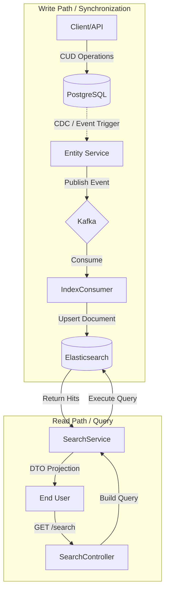

# Search Engine Architecture: Elasticsearch Implementation

## 1. Introduction

The application leverages **Elasticsearch** as a secondary datastore to provide high-performance, full-text search capabilities. This implementation follows the **Command Query Responsibility Segregation (CQRS)** pattern, where write operations are handled by the primary relational database (PostgreSQL) and read/search operations are offloaded to the search engine.

### 1.1 Core Capabilities

*   **Inverted Index:** Utilizes Apache Lucene's inverted index for sub-second keyword retrieval.
*   **Fuzzy Matching:** Implements Levenshtein edit distance logic for typo tolerance.
*   **Relevance Scoring:** Employs BM25 (Best Matching 25) algorithm for ranking results based on Term Frequency (TF) and Inverse Document Frequency (IDF).
*   **Eventual Consistency:** Synchronizes data via asynchronous event streams.

---

## 2. System Architecture

The search subsystem operates on a dual-path architecture: the synchronization path (Write) and the query path (Read).

### 2.1 CQRS Data Flow



### 2.2 Component Roles

| Component | Responsibility | Pattern |
| :--- | :--- | :--- |
| `PostgreSQL` | Source of Truth (Canonical Data Store) | DBMS |
| `Kafka` | Synchronization Message Bus | Evalual Consistency |
| `Elasticsearch` | Read-Optimized View | Search Engine |
| `IndexConsumer` | Projection Updater | Event Handler |

---

## 3. Search Strategy & Algorithms

The system employs a composite query strategy to balance precision (exact matches) and recall (broad matches).

### 3.1 Query Construction Priority

When a user submits a query term $t$, the system constructs a Boolean Disjunction (`OR`) query with boosting factors $\beta$:

$$ Score(doc) = \sum (\beta_{field} \cdot Score_{match}(t, doc.field)) $$

**Implementation logic:**

| Query Type | Field Target | Boosting ($\beta$) | Purpose |
| :--- | :--- | :--- | :--- |
| **Prefix Match** | `name` | `3.0` (High) | Auto-complete behavior, exact start matches. |
| **Wildcard** | `name` | `2.0` (Medium) | Substring matching. |
| **Fuzzy Match** | `name`, `desc` | `1.0` (Base) | Tolerance for user typographical errors. |

### 3.2 Fuzziness Configuration

Fuzziness is set to `AUTO`, which dynamically adjusts edit distance based on token length:
*   Length $0..2$: Must match exactly.
*   Length $3..5$: One edit allowed.
*   Length $>5$: Two edits allowed.

---

## 4. API Specification

### 4.1 Product Search: `GET /per/products/search`

Provides multifaceted search with filtering capabilities.

**Parameters:**

| Parameter | Type | Description |
| :--- | :--- | :--- |
| `query` | `string` | The full-text search term. |
| `minPrice`, `maxPrice` | `decimal` | Price range strict filter. |
| `gender` | `enum` | Categorical filter (MALE, FEMALE, UNISEX). |
| `sillage`, `longevity` | `enum` | Attribute filters. |

**Example Request:**

```http
GET /per/products/search?query=sauvage&minPrice=2000000&gender=MALE
```

---

## 5. Synchronization & Consistency

### 5.1 Eventual Consistency Model

Data is not instantly available in search results upon creation. The propagation delay is defined by:
$$ T_{propagation} = T_{kafka\_latency} + T_{consumer\_processing} + T_{es\_refresh\_interval} $$

Typically $T_{propagation} < 1000ms$.

### 5.2 Indexing Events

Synchronization is driven by domain events:

*   `PRODUCT_CREATED`: Triggers document creation.
*   `PRODUCT_UPDATED`: Triggers full document update.
*   `PRODUCT_DELETED`: Triggers document removal by ID.

### 5.3 Dead Letter Handling

If an indexing operation fails (e.g., Elasticsearch downtime), the message retries 3 times before moving to a Dead Letter Topic (DLT) to prevent queue blocking.

---

## 6. Operational Procedures

### 6.1 Full Re-indexing

In cases of schema changes or data drift, a full re-index is required.

**Endpoint:** `POST /per/products/reindex`
**Authentication:** ADMIN role required.
**Process:**
1.  Iterates all entities in PostgreSQL (Batched/Paged).
2.  Publishes synthetic `INDEX` events to Kafka.
3.  Consumers update Elasticsearch asynchronously.

### 6.2 Monitoring

Kibana (`localhost:5601`) should be used to monitor:
*   Index health (Green/Yellow/Red).
*   Search latency/throughput.
*   Unassigned shards.
