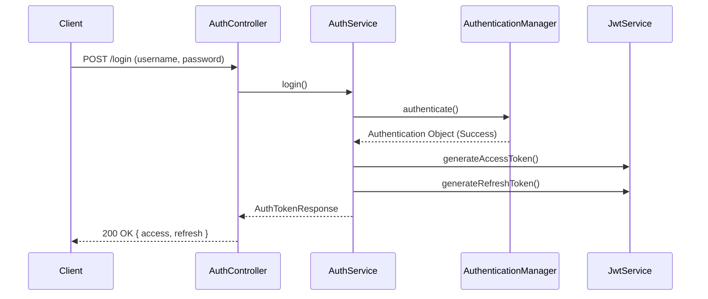

# Auth Module

## 1. Overview

### Purpose
The **Auth Module** orchestrates the security infrastructure of the Per application. It handles authentication, authorization, token management (JWT), and session statelessness.

### Responsibility
-   **Security Chain**: Configures the Spring Security Filter Chain.
-   **Token Management**: Issues, validates, and rotates JWT Access & Refresh tokens.
-   **Identity Provider**: specific implementation of `UserDetailsService` backed by the database.

## 2. Technology Stack

*   **Spring Security 6**: The de-facto standard for securing Spring apps.
*   **JJWT (Java JWT)**: For creating and parsing JSON Web Tokens.
*   **BCrypt**: For secure password hashing (Cost factor 12).
*   **Kafka**: Sends async events for emails (e.g., Verification, Forgot Password).

**Why?**
We avoid sticky sessions to ensure the backend can scale horizontally. JWT provides a stateless mechanism to carry identity across requests.

## 3. Architecture & Flow

### Login Flow



## 4. Key Implementation Details

### Security Configuration (`SecurityConfig`)
We explicitly disable CSRF (unnecessary for REST APIs) and enforce `SessionCreationPolicy.STATELESS`.

```java
@Bean
public SecurityFilterChain securityFilterChain(HttpSecurity http) {
    http.csrf(AbstractHttpConfigurer::disable)
        .sessionManagement(s -> s.sessionCreationPolicy(SessionCreationPolicy.STATELESS))
        .authorizeHttpRequests(auth -> auth
            .requestMatchers(publicEndpoints).permitAll()
            .anyRequest().authenticated())
        .addFilterBefore(jwtFilter, UsernamePasswordAuthenticationFilter.class);
    return http.build();
}
```

### Token Rotation
Refresh tokens have a longer TTL than Access tokens. The `/refresh` endpoint allows clients to obtain a new Access token using a valid Refresh token without re-entering credentials.

## 5. Maintenance & Operations

### Troubleshooting
*   **401 Unauthorized**: Often caused by expired JWT or missing `Authorization: Bearer <token>` header.
*   **403 Forbidden**: User is authenticated but lacks the required Role (e.g., USER trying to access ADMIN resource).

### Refactoring Guide
*   **Adding Public Endpoints**: Add the path constant to `ApiConstants` first, then reference it in `SecurityConfig`'s `publicEndpoints` array.
*   **Key Rotation**: Update the JWT Secret in `.env` (or Vault in production) to invalidate all existing tokens immediately.
