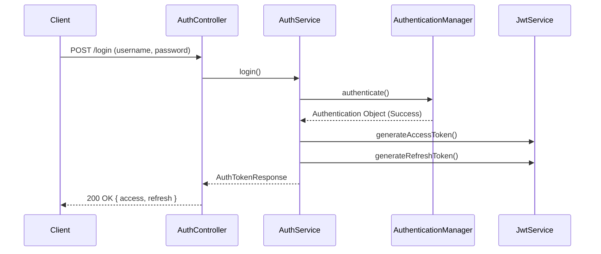

# Auth Module (Vietnamese Version)

## 1. Overview

### Purpose
**Auth Module** điều phối cơ sở hạ tầng bảo mật (security infrastructure) của ứng dụng Per. Nó xử lý xác thực (authentication), phân quyền (authorization), quản lý token (JWT), và tính trạng thái stateless của session.

### Responsibility
-   **Security Chain**: Cấu hình Spring Security Filter Chain.
-   **Token Management**: Phát hành, xác thực, và xoay vòng (rotates) JWT Access & Refresh tokens.
-   **Identity Provider**: Triển khai cụ thể của `UserDetailsService` được hỗ trợ bởi database.

## 2. Technology Stack

*   **Spring Security 6**: Tiêu chuẩn thực tế (de-facto standard) để bảo mật ứng dụng Spring.
*   **JJWT (Java JWT)**: Để tạo và phân tích cú pháp JSON Web Tokens.
*   **BCrypt**: Để băm mật khẩu an toàn (Cost factor 12).
*   **Kafka**: Gửi các sự kiện bất đồng bộ (async events) cho emails (ví dụ: Verification, Forgot Password).

**Why?**
Chúng tôi tránh sticky sessions để đảm bảo backend có thể mở rộng theo chiều ngang (scale horizontally). JWT cung cấp cơ chế stateless để mang danh tính (identity) qua các requests.

## 3. Architecture & Flow

### Login Flow



## 4. Key Implementation Details

### Security Configuration (`SecurityConfig`)
Chúng tôi vô hiệu hóa CSRF (không cần thiết cho REST APIs) và thực thi `SessionCreationPolicy.STATELESS`.

```java
@Bean
public SecurityFilterChain securityFilterChain(HttpSecurity http) {
    http.csrf(AbstractHttpConfigurer::disable)
        .sessionManagement(s -> s.sessionCreationPolicy(SessionCreationPolicy.STATELESS))
        .authorizeHttpRequests(auth -> auth
            .requestMatchers(publicEndpoints).permitAll()
            .anyRequest().authenticated())
        .addFilterBefore(jwtFilter, UsernamePasswordAuthenticationFilter.class);
    return http.build();
}
```

### Token Rotation
Refresh tokens có TTL (Time-To-Live) dài hơn Access tokens. Endpoint `/refresh` cho phép clients lấy Access token mới bằng cách sử dụng Refresh token hợp lệ mà không cần nhập lại thông tin đăng nhập (credentials).

## 5. Maintenance & Operations

### Troubleshooting
*   **401 Unauthorized**: Thường do JWT hết hạn hoặc thiếu header `Authorization: Bearer <token>`.
*   **403 Forbidden**: User đã được xác thực nhưng thiếu Role yêu cầu (ví dụ: USER cố truy cập tài nguyên ADMIN).

### Refactoring Guide
*   **Adding Public Endpoints**: Thêm hằng số đường dẫn vào `ApiConstants` trước, sau đó tham chiếu nó trong mảng `publicEndpoints` của `SecurityConfig`.
*   **Key Rotation**: Cập nhật JWT Secret trong `.env` (hoặc Vault trên production) để vô hiệu hóa tất cả tokens hiện có ngay lập tức.
