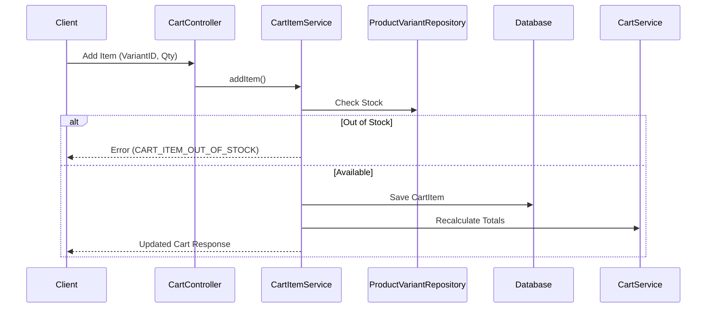

# Cart Module

## 1. Overview

### Purpose
The **Cart Module** manages the temporary selection of products before purchase. It supports adding, updating, and removing items, automatically calculating subtotals and totals.

### Responsibility
-   **Session Persistence**: Stores cart data in the database (Persistent Cart), allowing users to access their cart across devices.
-   **Stock Validation**: Checks availability (`ProductVariant`) before adding.
-   **Calculation**: Real-time calculation of totals.

## 2. Technology Stack

*   **Spring Data JPA**: Persistent storage in `cart` and `cart_items` tables.
*   **PostgreSQL**: Relational backing.

**Why?**
We chose a persistent DB-backed cart over a pure session/Redis cart to ensure a seamless cross-device experience for logged-in users.

## 3. Architecture & Flow

### Add to Cart Flow



## 4. Key Implementation Details

### Cart Merging
Currently, the implementation focuses on `Logged-in User` carts.
*(Future capability: Merging guest cart with user cart upon login).*

### Stock Check
We perform an optimistic check. Real reservation happens at `Checkout`.

```java
// CartItemServiceImpl.java
if (variant.getStockQuantity() < request.getQuantity()) {
    throw new ApiException(ApiErrorCode.CART_ITEM_OUT_OF_STOCK);
}
```

## 5. Maintenance & Operations

### Troubleshooting
*   **Stale Data**: Prices in the cart might differ from live product prices if not refreshed. Our `CartHelper.recalculateCart` ensures consistency on every write.

### Refactoring Guide
*   **Redis Migration**: For high-scale traffic (Black Friday), consider moving `Active Carts` to Redis to reduce DB write pressure, flushing to DB only on session end or checkout.
