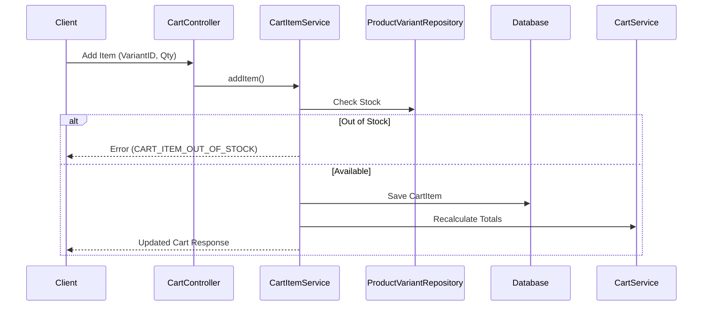

# Cart Module (Vietnamese Version)

## 1. Overview

### Purpose
**Cart Module** quản lý việc lựa chọn tạm thời các sản phẩm trước khi mua hàng. Nó hỗ trợ thêm, cập nhật, và xóa các mục (items), tự động tính toán tổng phụ (subtotals) và tổng cộng.

### Responsibility
-   **Session Persistence**: Lưu trữ dữ liệu giỏ hàng trong database (Persistent Cart), cho phép người dùng truy cập giỏ hàng của họ trên nhiều thiết bị.
-   **Stock Validation**: Kiểm tra tính khả dụng (`ProductVariant`) trước khi thêm.
-   **Calculation**: Tính toán tổng số theo thời gian thực (Real-time).

## 2. Technology Stack

*   **Spring Data JPA**: Lưu trữ bền vững trong các bảng `cart` và `cart_items`.
*   **PostgreSQL**: Relational backing.

**Why?**
Chúng tôi chọn persistent DB-backed cart thay vì pure session/Redis cart để đảm bảo trải nghiệm xuyên suốt trên nhiều thiết bị cho người dùng đã đăng nhập.

## 3. Architecture & Flow

### Add to Cart Flow



## 4. Key Implementation Details

### Cart Merging
Hiện tại, việc triển khai tập trung vào giỏ hàng của `Logged-in User`.
*(Khả năng trong tương lai: Hợp nhất guest cart với user cart khi đăng nhập).*

### Stock Check
Chúng tôi thực hiện kiểm tra lạc quan (optimistic check). Việc giữ chỗ thực sự (real reservation) diễn ra tại `Checkout`.

```java
// CartItemServiceImpl.java
if (variant.getStockQuantity() < request.getQuantity()) {
    throw new ApiException(ApiErrorCode.CART_ITEM_OUT_OF_STOCK);
}
```

## 5. Maintenance & Operations

### Troubleshooting
*   **Stale Data**: Giá trong giỏ hàng có thể khác với giá sản phẩm trực tiếp nếu không được làm mới. `CartHelper.recalculateCart` của chúng tôi đảm bảo tính nhất quán trên mỗi lần ghi.

### Refactoring Guide
*   **Redis Migration**: Đối với lưu lượng truy cập quy mô cao (Black Friday), hãy cân nhắc chuyển `Active Carts` sang Redis để giảm áp lực ghi DB, chỉ flush xuống DB khi kết thúc session hoặc checkout.
