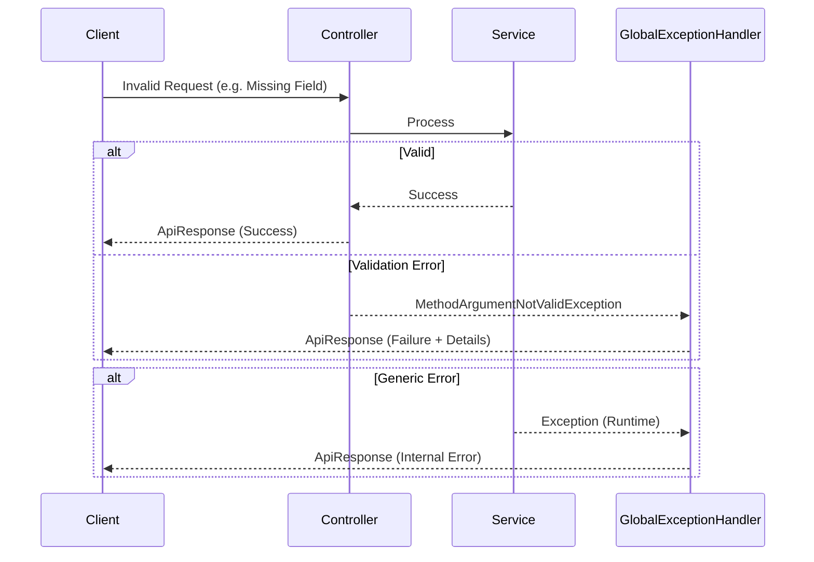

# Common Module

## 1. Overview

### Purpose
The **Common Module** serves as the foundational layer for the Per application, providing shared utilities, global configurations, and standardized patterns for error handling and API responses. It ensures consistency across all other modules (Auth, Product, Order, etc.).

### Responsibility
-   **Standardization**: Defines uniform API response structures and error codes.
-   **Global Handling**: Centralizes exception handling and application-wide configurations (OpenAPI, Kafka, Cache).
-   **Shared Constants**: Manages API paths (`ApiConstants`) to prevent hardcoding.

## 2. Technology Stack

*   **Spring Boot Web**: Core framework for REST APIs.
*   **Lombok**: Reduces boilerplate code (Getters, Setters, Builders).
*   **SpringDoc OpenAPI**: Generates API documentation.
*   **Resilience4j**: Handles Rate Limiting exceptions globally.

**Why?**
A centralized common module enforces **DRY (Don't Repeat Yourself)** principles, ensuring that cross-cutting concerns (like how an error looks to the frontend) are handled in exactly one place.

## 3. Architecture & Flow

### Global Exception Handling Flow



### Response Structure
All APIs return a consistent JSON wrapper:

```json
{
  "success": true,
  "code": "SUCCESS",
  "message": "Operation completed successfully",
  "data": { ... },
  "timestamp": "2023-10-27T10:00:00Z"
}
```

## 4. Key Implementation Details

### Standardized Error Codes (`ApiErrorCode`)
We use a strictly typed Enum for all system errors to avoid "Magic Strings".

```java
// Centralized Error Definitions
public enum ApiErrorCode {
    VALIDATION_ERROR("VALIDATION_ERROR", "Request validation failed", HttpStatus.BAD_REQUEST),
    NOT_FOUND("NOT_FOUND", "Resource not found", HttpStatus.NOT_FOUND),
    // ...
}
```

### Global Exception Handler
The `GlobalExceptionHandler` catches all exceptions and converts them into the standard `ApiResponse`.

```java
@ExceptionHandler(ApiException.class)
public ResponseEntity<ApiResponse<Void>> handleApiException(ApiException ex) {
    return ResponseEntity.status(ex.getErrorCode().getStatus())
            .body(ApiResponse.failure(ex));
}
```

## 5. Maintenance & Operations

### Troubleshooting
*   **Unknown Error**: Check `GlobalExceptionHandler` logs. If an exception isn't explicitly handled, it falls back to `Exception.class` (Internal Error).
*   **Validation Errors**: Ensure DTOs use Jakarta Validation annotations (`@NotNull`, `@NotBlank`).

### Refactoring Guide
*   **Adding New Errors**: ALWAYS add a new entry to `ApiErrorCode` before using it. Never manually type an error code string in the code.
*   **Constants**: All new API paths must be defined in `ApiConstants` under their respective inner class (e.g., `ApiConstants.Product`).
