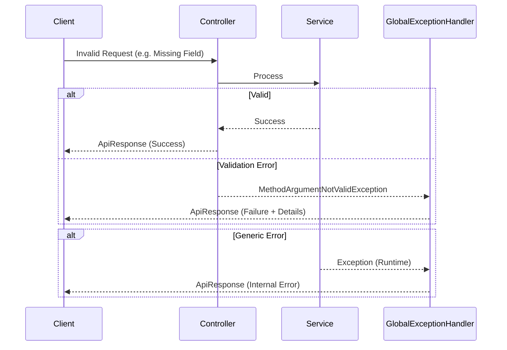

# Common Module (Vietnamese Version)

## 1. Overview

### Purpose
**Common Module** đóng vai trò là lớp nền tảng cho ứng dụng Per, cung cấp các tiện ích chia sẻ (shared utilities), cấu hình toàn cục (global configurations), và các pattern chuẩn hóa cho error handling và API responses. Nó đảm bảo sự nhất quán trên tất cả các module khác (Auth, Product, Order, v.v.).

### Responsibility
-   **Standardization**: Định nghĩa cấu trúc API response và error codes đồng nhất.
-   **Global Handling**: Tập trung hóa việc xử lý ngoại lệ (exception handling) và cấu hình toàn ứng dụng (OpenAPI, Kafka, Cache).
-   **Shared Constants**: Quản lý các đường dẫn API (`ApiConstants`) để tránh việc hardcoding.

## 2. Technology Stack

*   **Spring Boot Web**: Core framework cho REST APIs.
*   **Lombok**: Giảm thiểu boilerplate code (Getters, Setters, Builders).
*   **SpringDoc OpenAPI**: Tự động tạo API documentation.
*   **Resilience4j**: Xử lý các ngoại lệ Rate Limiting ở cấp độ toàn cục.

**Why?**
Việc sử dụng một common module tập trung đảm bảo nguyên tắc **DRY (Don't Repeat Yourself)**, đảm bảo rằng các cross-cutting concerns (như cách một lỗi hiển thị xuống frontend) được xử lý chính xác tại một nơi duy nhất.

## 3. Architecture & Flow

### Global Exception Handling Flow



### Response Structure
Tất cả APIs trả về một JSON wrapper nhất quán:

```json
{
  "success": true,
  "code": "SUCCESS",
  "message": "Operation completed successfully",
  "data": { ... },
  "timestamp": "2023-10-27T10:00:00Z"
}
```

## 4. Key Implementation Details

### Standardized Error Codes (`ApiErrorCode`)
Chúng tôi sử dụng Enum được định kiểu chặt chẽ (strictly typed) cho tất cả các lỗi hệ thống để tránh "Magic Strings".

```java
// Centralized Error Definitions
public enum ApiErrorCode {
    VALIDATION_ERROR("VALIDATION_ERROR", "Request validation failed", HttpStatus.BAD_REQUEST),
    NOT_FOUND("NOT_FOUND", "Resource not found", HttpStatus.NOT_FOUND),
    // ...
}
```

### Global Exception Handler
`GlobalExceptionHandler` bắt tất cả các exceptions và chuyển đổi chúng thành định dạng `ApiResponse` tiêu chuẩn.

```java
@ExceptionHandler(ApiException.class)
public ResponseEntity<ApiResponse<Void>> handleApiException(ApiException ex) {
    return ResponseEntity.status(ex.getErrorCode().getStatus())
            .body(ApiResponse.failure(ex));
}
```

## 5. Maintenance & Operations

### Troubleshooting
*   **Unknown Error**: Kiểm tra logs của `GlobalExceptionHandler`. Nếu một exception không được xử lý rõ ràng, nó sẽ rơi vào trường hợp `Exception.class` (Internal Error).
*   **Validation Errors**: Đảm bảo các DTO sử dụng các annotation của Jakarta Validation (`@NotNull`, `@NotBlank`).

### Refactoring Guide
*   **Adding New Errors**: LUÔN LUÔN thêm một entry mới vào `ApiErrorCode` trước khi sử dụng. Không bao giờ gõ thủ công chuỗi error code trong code.
*   **Constants**: Tất cả các API paths mới phải được định nghĩa trong `ApiConstants` dưới inner class tương ứng của chúng (ví dụ: `ApiConstants.Product`).
