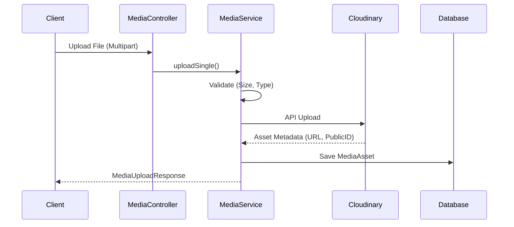

# Media Module

## 1. Overview

### Purpose
The **Media Module** handles the storage, optimization, and retrieval of digital assets (images, videos). It acts as a bridge between the application and the Cloudinary CDN.

### Responsibility
-   **Asset Storage**: Uploads files to Cloudinary.
-   **Metadata Management**: Stores asset metadata (URL, format, size) in the local database (`media_assets`).
-   **Validation**: Enforces file type (Image/Video) and size limits (10MB).

## 2. Technology Stack

*   **Cloudinary SDK**: For interacting with the Cloudinary Media API.
*   **Spring Boot Multipart**: For handling file uploads over HTTP.
*   **PostgreSQL**: For persistent storage of asset links.

**Why?**
Offloading media to a dedicated CDN (Cloudinary) ensures faster delivery times globally and reduces the load (bandwidth/storage) on our primary servers.

## 3. Architecture & Flow

### Upload Flow



## 4. Key Implementation Details

### Validation Logic
We enforce strict validation before attempting an upload to save bandwidth.

```java
private void validateFile(MultipartFile file) {
    if (file.getSize() > MAX_FILE_SIZE) {
        throw new ApiException(ApiErrorCode.MEDIA_FILE_TOO_LARGE);
    }
    String contentType = file.getContentType();
    if (!contentType.startsWith("image/") && !contentType.startsWith("video/")) {
        throw new ApiException(ApiErrorCode.MEDIA_UNSUPPORTED_TYPE);
    }
}
```

## 5. Maintenance & Operations

### Troubleshooting
*   **MEDIA_UPLOAD_FAILED**: Usually network issues with Cloudinary or invalid credentials. Check `CLOUDINARY_URL` in env.
*   **File Size Errors**: Adjust `MAX_FILE_SIZE_BYTES` constant in `MediaServiceImpl` if larger files are needed.

### Refactoring Guide
*   **New Providers**: To switch to AWS S3, implement a new `StorageService` interface and replace usage of `Cloudinary` bean.
