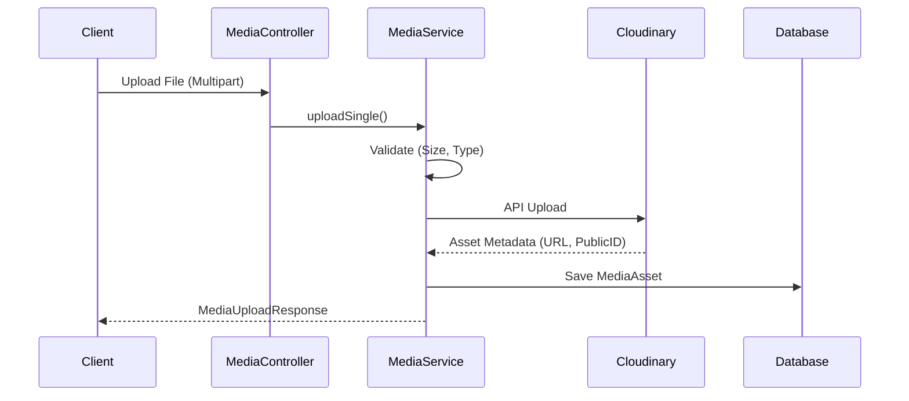

# Media Module (Vietnamese Version)

## 1. Overview

### Purpose
**Media Module** xử lý việc lưu trữ, tối ưu hóa và truy xuất các tài sản kỹ thuật số (digital assets - hình ảnh, video). Nó đóng vai trò là cầu nối giữa ứng dụng và Cloudinary CDN.

### Responsibility
-   **Asset Storage**: Upload files lên Cloudinary.
-   **Metadata Management**: Lưu trữ metadata của asset (URL, định dạng, kích thước) trong local database (`media_assets`).
-   **Validation**: Thực thi các giới hạn về loại file (Image/Video) và kích thước (10MB).

## 2. Technology Stack

*   **Cloudinary SDK**: Để tương tác với Cloudinary Media API.
*   **Spring Boot Multipart**: Để xử lý file uploads qua HTTP.
*   **PostgreSQL**: Để lưu trữ liên kết của asset.

**Why?**
Việc chuyển tải media sang một CDN chuyên dụng (Cloudinary) đảm bảo thời gian phân phối nhanh hơn trên toàn cầu và giảm tải (băng thông/lưu trữ) cho các servers chính của chúng tôi.

## 3. Architecture & Flow

### Upload Flow



## 4. Key Implementation Details

### Validation Logic
Chúng tôi thực thi xác thực nghiêm ngặt (strict validation) trước khi cố gắng upload để tiết kiệm băng thông.

```java
private void validateFile(MultipartFile file) {
    if (file.getSize() > MAX_FILE_SIZE) {
        throw new ApiException(ApiErrorCode.MEDIA_FILE_TOO_LARGE);
    }
    String contentType = file.getContentType();
    if (!contentType.startsWith("image/") && !contentType.startsWith("video/")) {
        throw new ApiException(ApiErrorCode.MEDIA_UNSUPPORTED_TYPE);
    }
}
```

## 5. Maintenance & Operations

### Troubleshooting
*   **MEDIA_UPLOAD_FAILED**: Thường do sự cố mạng với Cloudinary hoặc thông tin đăng nhập không hợp lệ. Kiểm tra `CLOUDINARY_URL` trong env.
*   **File Size Errors**: Điều chỉnh hằng số `MAX_FILE_SIZE_BYTES` trong `MediaServiceImpl` nếu cần hỗ trợ file lớn hơn.

### Refactoring Guide
*   **New Providers**: Để chuyển sang AWS S3, hãy triển khai interface `StorageService` mới và thay thế việc sử dụng `Cloudinary` bean.
