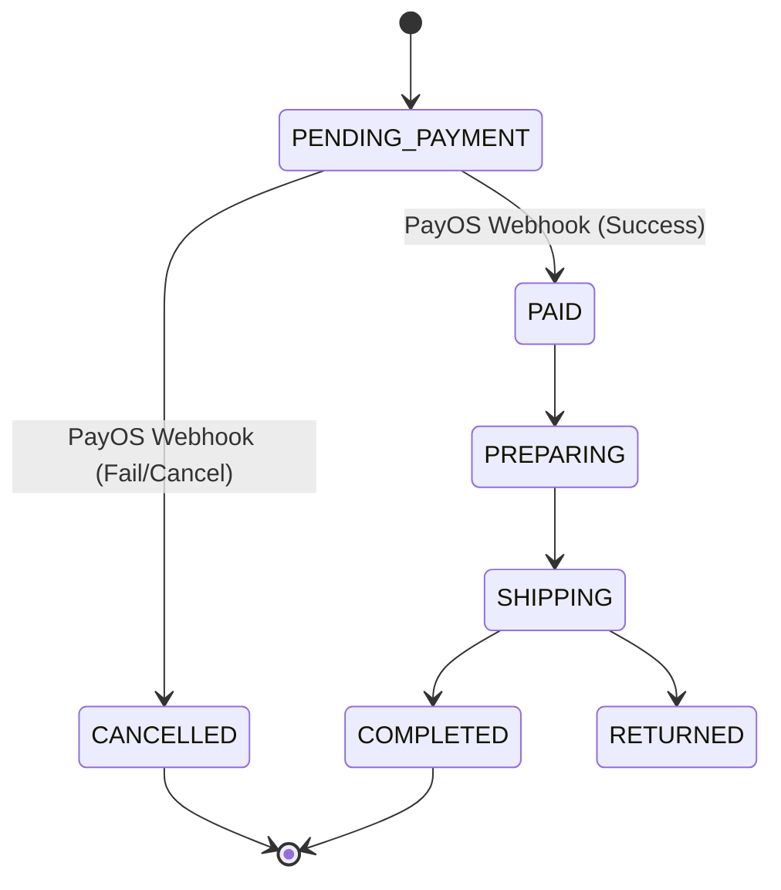

# Order Module

## 1. Overview

### Purpose
The **Order Module** is the central transactional record. It tracks the lifecycle of a purchase from placement to fulfillment and cancellation.

### Responsibility
-   **State Management**: Manages state transitions (PENDING -> PAID -> SHIPPING -> COMPLETED).
-   **Inventory**: Deducts stock upon placement and restores it upon cancellation.
-   **Record Keeping**: Immutable history of what was bought and at what price.

## 2. Technology Stack

*   **Spring Data JPA**: Core persistence.
*   **Transactional**: ACID guarantees for stock updates.

## 3. Architecture & Flow

### Order State Machine

## 4. Key Implementation Details

### Order Creation
Controlled by the `Payment` module's `CheckoutService` to ensure an Order is only created when a Payment intent is established.

### Inventory Management
`OrderInventoryService` handles stock logic.
- **Deduction**: Happens at Checkout (Safe Reservation).
- **Restoration**: Happens if Payment fails or Order is Cancelled.

## 5. Maintenance & Operations

### Troubleshooting
*   **Stuck Orders**: Orders remaining in `PENDING_PAYMENT` for too long should be auto-cancelled by a scheduler (implemented in Payment module).

### Refactoring Guide
*   **Event Sourcing**: For a complex audit trail, consider moving to an Event Sourcing model for the Order Aggregate.
