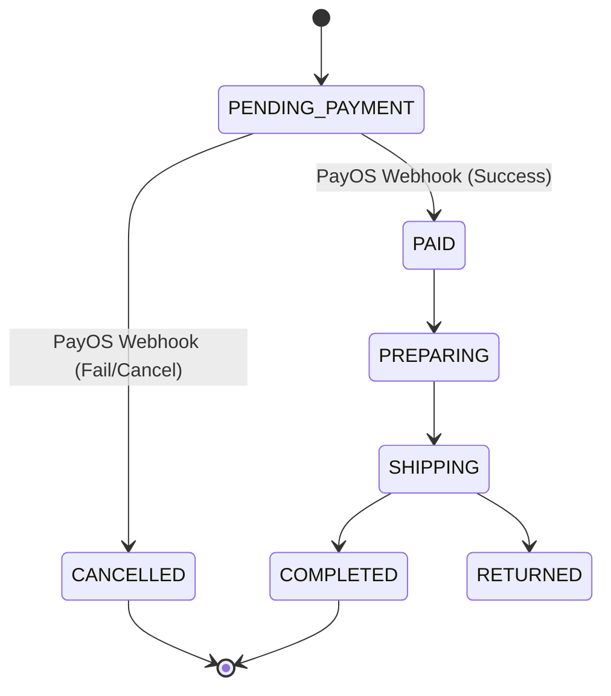

# Order Module (Vietnamese Version)

## 1. Overview

### Purpose
**Order Module** là bản ghi giao dịch trung tâm (central transactional record). Nó theo dõi vòng đời của một giao dịch mua từ khi đặt hàng đến khi hoàn tất và hủy bỏ.

### Responsibility
-   **State Management**: Quản lý chuyển đổi trạng thái (PENDING -> PAID -> SHIPPING -> COMPLETED).
-   **Inventory**: Khấu trừ thồn kho (deducts stock) khi đặt hàng và khôi phục nó khi hủy bỏ.
-   **Record Keeping**: Lịch sử bất biến (immutable history) về những gì đã mua và ở mức giá nào.

## 2. Technology Stack

*   **Spring Data JPA**: Core persistence.
*   **Transactional**: Các đảm bảo ACID cho cập nhật tồn kho.

## 3. Architecture & Flow

### Order State Machine

## 4. Key Implementation Details

### Order Creation
Được kiểm soát bởi `CheckoutService` của `Payment` module để đảm bảo một Order chỉ được tạo khi một ý định thanh toán (Payment intent) được thiết lập.

### Inventory Management
`OrderInventoryService` xử lý logic tồn kho.
-   **Deduction**: Xảy ra tại Checkout (Safe Reservation).
-   **Restoration**: Xảy ra nếu Payment thất bại hoặc Order bị hủy.

## 5. Maintenance & Operations

### Troubleshooting
*   **Stuck Orders**: Các đơn hàng ở trạng thái `PENDING_PAYMENT` quá lâu nên được tự động hủy bởi một scheduler (được triển khai trong Payment module).

### Refactoring Guide
*   **Event Sourcing**: Đối với một audit trail phức tạp, hãy cân nhắc chuyển sang mô hình Event Sourcing cho Order Aggregate.
