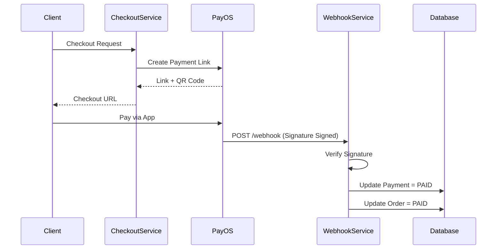

# Payment Module

## 1. Overview

### Purpose
The **Payment Module** handles interactions with external Payment Gateways (PayOS). It secures the checkout process and processes asynchronous callbacks (Webhooks).

### Responsibility
-   **Gateway Integration**: PayOS API (Create Link, Verify Webhook).
-   **Checkout Orchestration**: Coordinates Cart, Stock, and Order Creation (`CheckoutService`).
-   **Reconciliation**: Matches Webhook data with local Payment records.

## 2. Technology Stack

*   **PayOS SDK**: Third-party library for Vietnam QR payments.
*   **Spring Scheduled**: Daemon task (`ExpiredPaymentScheduler`) to cleanup unpaid orders.

## 3. Architecture & Flow

### Payment Flow



## 4. Key Implementation Details

### Webhook Security
We rely on PayOS's signature verification to ensure the webhook is authentic.

```java
// PayOsWebhookServiceImpl.java
try {
    payOS.verifyPaymentWebhookData(payload);
} catch (Exception e) {
    throw new ApiException(ApiErrorCode.PAYMENT_WEBHOOK_INVALID);
}
```

### Idempotency
Webhooks may be delivered multiple times. We check if the transaction reference already exists to prevent double processing.

```java
if (paymentTransactionRepository.findByReference(ref).isPresent()) {
    return; // Already processed
}
```

## 5. Security & Concurrency

### Checkout Locking
To prevent overselling during high traffic (e.g., Flash Sales):
-   `CheckoutService` acquires a **Pessimistic Write Lock** on `ProductVariant` records.
-   Stock availability is checked *after* the lock is acquired.
-   Stock is decremented within the same transaction.

## 5. Maintenance & Operations

### Troubleshooting
*   **Signature Verification Failed**: Check if `PAYOS_CHECKSUM_KEY` in `.env` matches the dashboard.
*   **Callback URL Unreachable**: Ensure the `PAYOS_RETURN_URL` and `PAYOS_CANCEL_URL` are accessible from the user's browser.

### Refactoring Guide
*   **Multi-Gateway**: To add MoMo/Stripe, create a `PaymentGateway` strategy interface and implement adapters for each provider.
