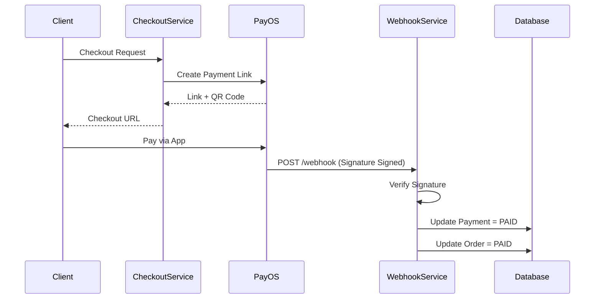

# Payment Module (Vietnamese Version)

## 1. Overview

### Purpose
**Payment Module** xử lý các tương tác với Payment Gateways bên ngoài (PayOS). Nó bảo mật quy trình thanh toán (checkout process) và xử lý các callbacks bất đồng bộ (Webhooks).

### Responsibility
-   **Gateway Integration**: PayOS API (Create Link, Verify Webhook).
-   **Checkout Orchestration**: Phối hợp Cart, Stock, và Order Creation (`CheckoutService`).
-   **Reconciliation**: Khớp dữ liệu Webhook với các bản ghi Payment cục bộ.

## 2. Technology Stack

*   **PayOS SDK**: Thư viện bên thứ ba cho thanh toán QR tại Việt Nam.
*   **Spring Scheduled**: Daemon task (`ExpiredPaymentScheduler`) để dọn dẹp các đơn hàng chưa thanh toán.

## 3. Architecture & Flow

### Payment Flow



## 4. Key Implementation Details

### Webhook Security
Chúng tôi dựa vào xác minh chữ ký (signature verification) của PayOS để đảm bảo webhook là xác thực (authentic).

```java
// PayOsWebhookServiceImpl.java
try {
    payOS.verifyPaymentWebhookData(payload);
} catch (Exception e) {
    throw new ApiException(ApiErrorCode.PAYMENT_WEBHOOK_INVALID);
}
```

### Idempotency
Webhooks có thể được gửi nhiều lần. Chúng tôi kiểm tra xem tham chiếu giao dịch (transaction reference) đã tồn tại hay chưa để ngăn xử lý kép (double processing).

```java
if (paymentTransactionRepository.findByReference(ref).isPresent()) {
    return; // Already processed
}
```

## 5. Maintenance & Operations

### Troubleshooting
*   **Signature Verification Failed**: Kiểm tra xem `PAYOS_CHECKSUM_KEY` trong `.env` có khớp với dashboard hay không.
*   **Callback URL Unreachable**: Đảm bảo `PAYOS_RETURN_URL` và `PAYOS_CANCEL_URL` có thể truy cập được từ trình duyệt của người dùng.

### Refactoring Guide
*   **Multi-Gateway**: Để thêm MoMo/Stripe, hãy tạo một `PaymentGateway` strategy interface và triển khai adapters cho từng provider.
