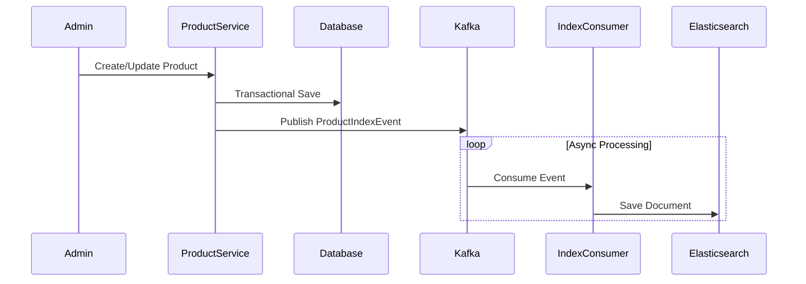

# Product Module

## 1. Overview

### Purpose
The **Product Module** is the core catalog engine. It manages product lifecycle, variants, and provides high-performance search capabilities through Elasticsearch.

### Responsibility
-   **Data Consistency**: Uses **Event-Driven Architecture** to sync PostgreSQL (Write Model) with Elasticsearch (Read Model).
-   **Search**: Full-text search, filtering, and aggregation.
-   **Catalog Management**: CRUD operations for products and their variants.

## 2. Technology Stack

*   **Spring Data Elasticsearch**: For interacting with the search engine.
*   **Apache Kafka**: Message broker for decoupling write and index operations.
*   **PostgreSQL**: Source of truth for product data.

**Why?**
Directly searching PostgreSQL with `LIKE %...%` is slow and inefficient at scale. We offload read interactions to Elasticsearch for sub-millisecond query performance.

## 3. Architecture & Flow

### Indexing Flow (CQRS Variant)



## 4. Key Implementation Details

### Event Publisher
When a product is saved, we don't write to ES immediately. We publish an event.

```java
// ProductServiceImpl.java
kafkaTemplate.send(KafkaTopicNames.PRODUCT_INDEX_TOPIC, 
    new ProductIndexEvent(product.getId(), Action.INDEX));
```

### Resilience Pattern
The consumer uses `@RetryableTopic` to handle temporary ES outages without losing data.

```java
@RetryableTopic(attempts = "4", backoff = @Backoff(delay = 1000))
@KafkaListener(topics = "product.index")
public void consume(ProductIndexEvent event) { ... }
```

## 5. Maintenance & Operations

### Troubleshooting
*   **Data Mismatch**: If a product exists in DB but not in Search, check the Kafka DLQ (Dead Letter Queue) topic `product.index-dlt`.
*   **Reindexing**: Use the `/reindex` endpoint to rebuild the Elasticsearch index from the Database source of truth.

### Refactoring Guide
*   **Adding Fields**: Update `ProductDocument` class and `ProductMapper` to include new fields in the search index.
