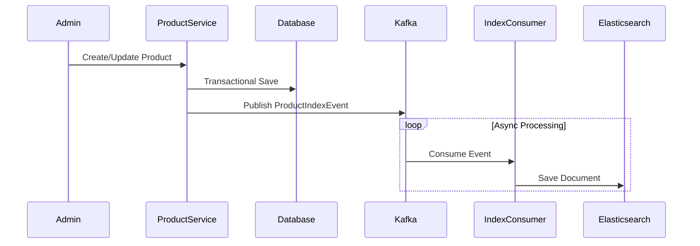

# Product Module (Vietnamese Version)

## 1. Overview

### Purpose
**Product Module** là công cụ danh mục cốt lõi (core catalog engine). Nó quản lý vòng đời sản phẩm, các biến thể, và cung cấp khả năng tìm kiếm hiệu suất cao thông qua Elasticsearch.

### Responsibility
-   **Data Consistency**: Sử dụng **Event-Driven Architecture** để đồng bộ PostgreSQL (Write Model) với Elasticsearch (Read Model).
-   **Search**: Full-text search, lọc (filtering), và tổng hợp (aggregation).
-   **Catalog Management**: Các thao tác CRUD cho sản phẩm và các biến thể của chúng.

## 2. Technology Stack

*   **Spring Data Elasticsearch**: Để tương tác với công cụ tìm kiếm.
*   **Apache Kafka**: Message broker để tách biệt các thao tác ghi và lập chỉ mục (index operations).
*   **PostgreSQL**: Nguồn dữ liệu tin cậy (Source of truth) cho dữ liệu sản phẩm.

**Why?**
Tìm kiếm trực tiếp trên PostgreSQL với `LIKE %...%` rất chậm và không hiệu quả ở quy mô lớn. Chúng tôi chuyển tải (offload) các tương tác đọc sang Elasticsearch để đạt hiệu suất truy vấn dưới một phần nghìn giây (sub-millisecond).

## 3. Architecture & Flow

### Indexing Flow (CQRS Variant)



## 4. Key Implementation Details

### Event Publisher
Khi một sản phẩm được lưu, chúng tôi không ghi vào ES ngay lập tức. Chúng tôi xuất bản (publish) một sự kiện.

```java
// ProductServiceImpl.java
kafkaTemplate.send(KafkaTopicNames.PRODUCT_INDEX_TOPIC, 
    new ProductIndexEvent(product.getId(), Action.INDEX));
```

### Resilience Pattern
Consumer sử dụng `@RetryableTopic` để xử lý sự cố ngừng hoạt động tạm thời của ES mà không làm mất dữ liệu.

```java
@RetryableTopic(attempts = "4", backoff = @Backoff(delay = 1000))
@KafkaListener(topics = "product.index")
public void consume(ProductIndexEvent event) { ... }
```

## 5. Maintenance & Operations

### Troubleshooting
*   **Data Mismatch**: Nếu sản phẩm tồn tại trong DB nhưng không có trong Search, hãy kiểm tra topic Kafka DLQ (Dead Letter Queue) `product.index-dlt`.
*   **Reindexing**: Sử dụng endpoint `/reindex` để xây dựng lại chỉ mục Elasticsearch từ nguồn dữ liệu Database.

### Refactoring Guide
*   **Adding Fields**: Cập nhật class `ProductDocument` và `ProductMapper` để bao gồm các trường mới trong search index.
