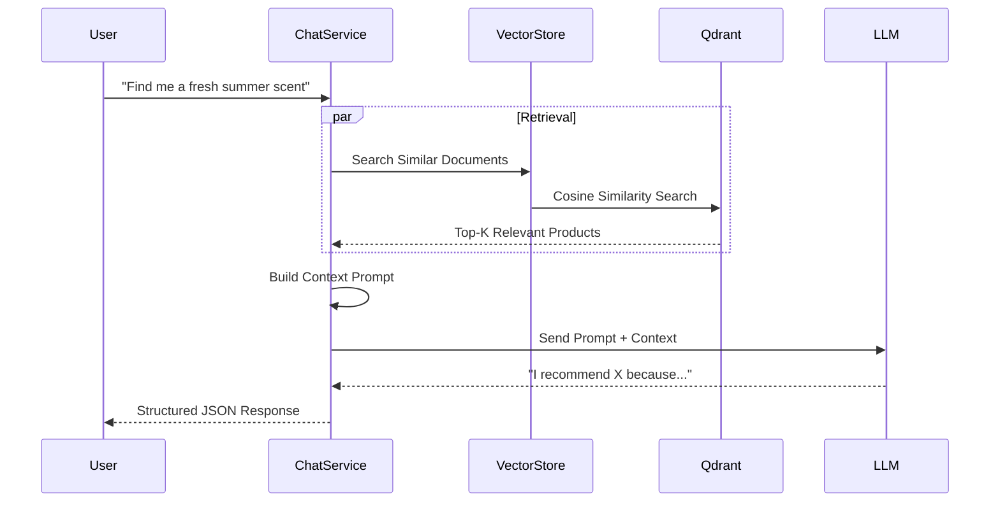

# RAG Module (AI Assistant)

## 1. Overview

### Purpose
The **RAG Module** powers the AI Shopping Assistant. It uses **Retrieval-Augmented Generation** to provide accurate, context-aware answers about the product catalog, avoiding LLM hallucinations.

### Responsibility
-   **Vector Indexing**: Converts structured Product/Brand/Category data into vector embeddings stored in Qdrant.
-   **Semantic Search**: Retrieves the most relevant documentation based on natural language queries.
-   **Generation**: Synthesizes the retrieved context into a helpful customer response using an LLM.

## 2. Technology Stack

*   **Spring AI**: Framework for AI integration.
*   **Qdrant**: Vector Database for high-speed similarity search.
*   **OpenAI GPT-4o**: The underlying Large Language Model (LLM).

**Why?**
A standard keyword search cannot answer complex questions like *"Suggest a perfume for a summer date night"*. Vector search understands the semantic meaning of "summer" (fresh, citrus) and "date night" (romantic, sillage) to find the best match.

## 3. Architecture & Flow

### RAG Pipeline



## 4. Key Implementation Details

### Document Construction
We flatten the rich relational data of a Product into a text document for embedding.

```text
Product: Chanel No. 5
Brand: Chanel
Category: Women's Perfume
Fragrance Family: Floral Aldehyde
Seasonality: All Year
Price Range: 3,000,000 - 5,000,000 VND
Description: The now and forever fragrance...
```

### Multi-Collection Search
The system searches across multiple vector collections (`products`, `brands`, `knowledge`) to gather comprehensive context.

## 5. Security & Optimization
### Document Chunking (Knowledge Base)
To improve retrieval relevance and manage Context Window limits:
-   **Strategy**: Recursive Character Text Splitter.
-   **Size**: ~800 tokens (approx. 3200 characters).
-   **Overlap**: ~100 tokens (approx. 400 characters).
-   **Separators**: Paragraphs (`\n\n`) -> Sentences (`. `) -> Words (` `).

### Prompt Security
-   **Prevention**: Utilizes `PromptTemplate` with parameterized inputs to separate System Instructions from User Queries.
-   **Sanitization**: User input is treated strictly as data, preventing "Ignore previous instructions" attacks.

## 5. Maintenance & Operations

### Troubleshooting
*   **RAG_INDEXING_FAILED**: Ensure Qdrant is running (`docker-compose ps`) and accessible on port 6334 (gRPC) / 6333 (HTTP).
*   **Hallucinations**: If the bot gives wrong info, check if the product is indexed (`/per/rag/knowledge/status`).

### Refactoring Guide
*   **Prompt Engineering**: Edit `system-prompt.st` in the resources folder (if verified) or `PromptHelper` to adjust the bot's tone.
