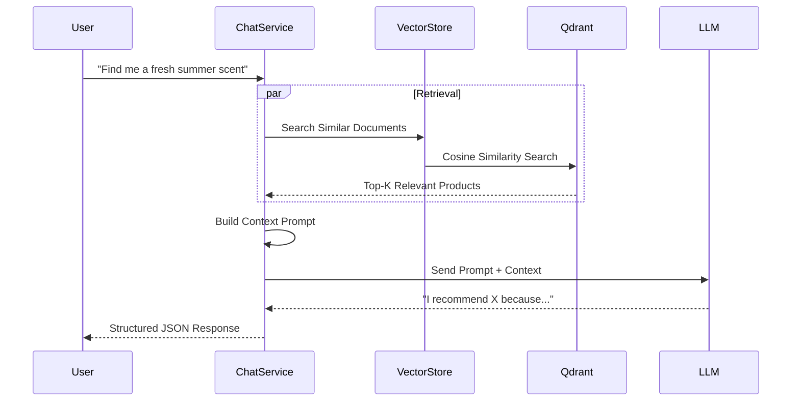

# RAG Module (AI Assistant) (Vietnamese Version)

## 1. Overview

### Purpose
**RAG Module** vận hành AI Shopping Assistant. Nó sử dụng **Retrieval-Augmented Generation** để cung cấp các câu trả lời chính xác, nhận thức ngữ cảnh (context-aware) về danh mục sản phẩm, tránh các ảo giác (hallucinations) của LLM.

### Responsibility
-   **Vector Indexing**: Chuyển đổi dữ liệu có cấu trúc Product/Brand/Category thành vector embeddings được lưu trữ trong Qdrant.
-   **Semantic Search**: Truy xuất tài liệu liên quan nhất dựa trên các truy vấn ngôn ngữ tự nhiên.
-   **Generation**: Tổng hợp ngữ cảnh đã truy xuất thành phản hồi hữu ích cho khách hàng bằng cách sử dụng LLM.

## 2. Technology Stack

*   **Spring AI**: Framework cho tích hợp AI.
*   **Qdrant**: Vector Database cho tìm kiếm tương đồng tốc độ cao.
*   **OpenAI GPT-4o**: Large Language Model (LLM) nền tảng.

**Why?**
Tìm kiếm từ khóa tiêu chuẩn không thể trả lời các câu hỏi phức tạp như *"Gợi ý nước hoa cho buổi hẹn hò mùa hè"*. Vector search hiểu ý nghĩa ngữ nghĩa của "mùa hè" (tươi mát, cam quýt) và "hẹn hò" (lãng mạn, độ tỏa hương) để tìm ra kết quả phù hợp nhất.

## 3. Architecture & Flow

### RAG Pipeline



## 4. Key Implementation Details

### Document Construction
Chúng tôi làm phẳng (flatten) dữ liệu quan hệ phong phú của một Sản phẩm thành văn bản (text document) để embedding.

```text
Product: Chanel No. 5
Brand: Chanel
Category: Women's Perfume
Fragrance Family: Floral Aldehyde
Seasonality: All Year
Price Range: 3,000,000 - 5,000,000 VND
Description: The now and forever fragrance...
```

### Multi-Collection Search
Hệ thống tìm kiếm trên nhiều vector collections (`products`, `brands`, `knowledge`) để thu thập ngữ cảnh toàn diện.

## 5. Maintenance & Operations

### Troubleshooting
*   **RAG_INDEXING_FAILED**: Đảm bảo Qdrant đang chạy (`docker-compose ps`) và có thể truy cập được trên port 6334 (gRPC) / 6333 (HTTP).
*   **Hallucinations**: Nếu bot đưa ra thông tin sai, hãy kiểm tra xem sản phẩm có được lập chỉ mục hay không (`/per/rag/knowledge/status`).

### Refactoring Guide
*   **Prompt Engineering**: Chỉnh sửa `system-prompt.st` trong thư mục resources (nếu đã xác minh) hoặc `PromptHelper` để điều chỉnh giọng điệu (tone) của bot.
