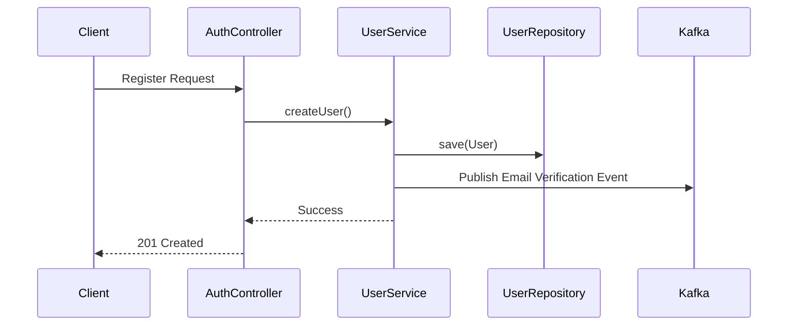

# User Module

## 1. Overview

### Purpose
The **User Module** manages the lifecycle of user identities and profiles within the Per ecosystem. It provides endpoints for user search, profile updates, and serves as the data backbone for the Auth module.

### Responsibility
-   **Identity Persistence**: Manages the `users` table and relationships (Roles).
-   **Profile Management**: Update names, verify emails, manage account status.
-   **Search**: Admin capabilities to search users by criteria.

## 2. Technology Stack

*   **Spring Data JPA**: Repository abstraction for PostgreSQL interactions.
*   **PostgreSQL**: Relational storage for user data with strict integrity constraints.
*   **Lombok**: Logic-less DTOs and Entities.

**Why?**
User data is highly relational (Users <-> Roles, Users <-> Orders). JPA/Hibernate provides the most robust mapping for this consistency.

## 3. Architecture & Flow

### Registration Flow



## 4. Key Implementation Details

### User Entity
The usage of rich domain model with helper methods like `addRole()`.

```java
@Entity
@Table(name = "users")
public class User extends BaseEntity {
    @Column(unique = true, nullable = false)
    private String username;
    
    @Column(unique = true, nullable = false)
    private String email;
    
    @ManyToMany(fetch = FetchType.EAGER)
    private Set<Role> roles = new HashSet<>();
}
```

## 5. Maintenance & Operations

### Troubleshooting
*   **Constraint Violations**: `USER_USERNAME_CONFLICT` or `USER_EMAIL_CONFLICT` errors occur if enforcing uniqueness fails at the app layer but is caught by the DB.
*   **LazyInitializationException**: Be careful when accessing collections (like Roles) outside of a Transaction if `FetchType` is LAZY (currently EAGER for Roles).

### Refactoring Guide
*   **Adding Profile Fields**: Add the field to the Entity, update the DTO, and generate a new Flyway migration script.
