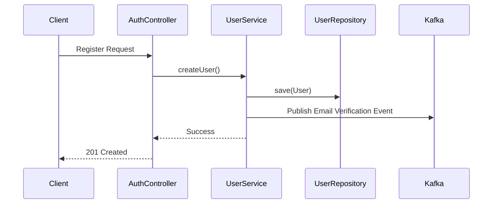

# User Module (Vietnamese Version)

## 1. Overview

### Purpose
**User Module** quản lý vòng đời của danh tính người dùng (user identities) và hồ sơ (profiles) trong hệ sinh thái Per. Nó cung cấp các endpoints để tìm kiếm user, cập nhật hồ sơ, và đóng vai trò là xương sống dữ liệu cho Auth module.

### Responsibility
-   **Identity Persistence**: Quản lý bảng `users` và các mối quan hệ (Roles).
-   **Profile Management**: Cập nhật tên, xác minh emails, quản lý trạng thái tài khoản.
-   **Search**: Các khả năng của Admin để tìm kiếm users theo tiêu chí.

## 2. Technology Stack

*   **Spring Data JPA**: Repository abstraction cho các tương tác PostgreSQL.
*   **PostgreSQL**: Lưu trữ quan hệ cho dữ liệu người dùng với các ràng buộc toàn vẹn nghiêm ngặt (strict integrity constraints).
*   **Lombok**: Logic-less DTOs và Entities.

**Why?**
Dữ liệu người dùng có tính quan hệ cao (Users <-> Roles, Users <-> Orders). JPA/Hibernate cung cấp ánh xạ mạnh mẽ nhất cho sự nhất quán này.

## 3. Architecture & Flow

### Registration Flow



## 4. Key Implementation Details

### User Entity
Việc sử dụng rich domain model với các phương thức hỗ trợ như `addRole()`.

```java
@Entity
@Table(name = "users")
public class User extends BaseEntity {
    @Column(unique = true, nullable = false)
    private String username;
    
    @Column(unique = true, nullable = false)
    private String email;
    
    @ManyToMany(fetch = FetchType.EAGER)
    private Set<Role> roles = new HashSet<>();
}
```

## 5. Maintenance & Operations

### Troubleshooting
*   **Constraint Violations**: Lỗi `USER_USERNAME_CONFLICT` hoặc `USER_EMAIL_CONFLICT` xảy ra nếu việc thực thi tính duy nhất thất bại ở lớp ứng dụng nhưng bị bắt bởi DB.
*   **LazyInitializationException**: Cẩn thận khi truy cập các collections (như Roles) bên ngoài Transaction nếu `FetchType` là LAZY (hiện tại là EAGER cho Roles).

### Refactoring Guide
*   **Adding Profile Fields**: Thêm trường vào Entity, cập nhật DTO, và tạo một kịch bản di chuyển Flyway (Flyway migration script) mới.
