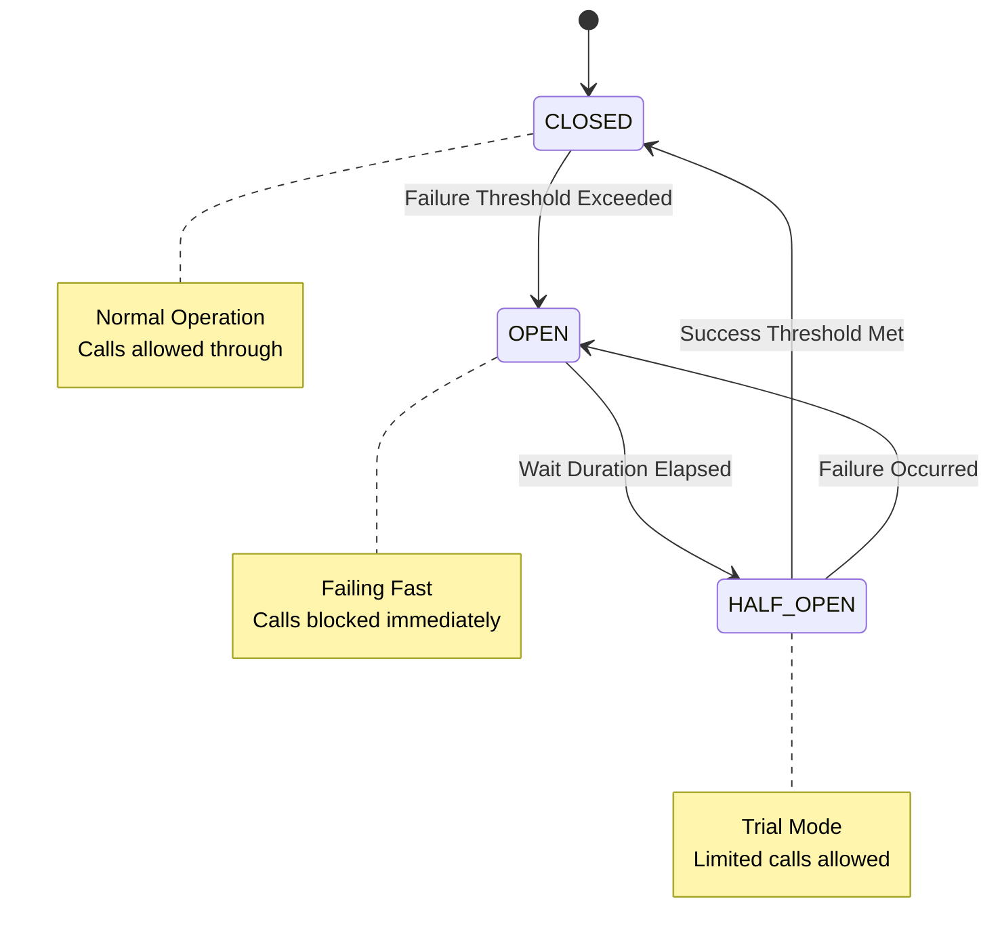

# Resilience Pattern: Circuit Breaker

## 1. Introduction

The **Circuit Breaker** pattern allows the application to fail fast and recover gracefully when dependent services or operations are experiencing high failure rates or latency. This prevents cascading failures and resource exhaustion in distributed systems.

---

## 2. Operational States

The circuit breaker operates as a finite state machine (FSM) with three primary states.



### 2.1 State Definitions

*   **CLOSED**: The system is healthy. Requests are executed normally. Metrics are collected to monitor failure rates.
*   **OPEN**: The failure threshold has been breached. Requests fail immediately with a `CallNotPermittedException` without executing the underlying logic.
*   **HALF_OPEN**: After a configured wait duration, the circuit allows a limited number of "probe" requests to check if the underlying issue has resolved.

---

## 3. Configuration Specification

The implementation utilizes **Resilience4j**. Configurations are defined in `resilience4j.yml`.

### 3.1 Threshold Parameters

| Parameter | Value | Description |
| :--- | :--- | :--- |
| `slidingWindowSize` | 10 | Number of calls to measure failure rate. |
| `failureRateThreshold` | 50% | Percentage of failures to trigger OPEN state. |
| `waitDurationInOpenState` | 5s | Time to stay OPEN before switching to HALF_OPEN. |
| `permittedNumberOfCallsInHalfOpenState` | 3 | Number of probe requests allowed. |

### 3.2 Exception Handling

Only specific critical exceptions trigger the failure count. Business exceptions (e.g., Validation Error) are ignored.

*   **Recorded Exceptions**: `ResourceAccessException`, `TimeoutException`, `ConnectException`
*   **Ignored Exceptions**: `IllegalArgumentException`, `MethodArgumentNotValidException`

---

## 4. Implementation

### 4.1 Annotation Usage

The `@CircuitBreaker` annotation decorates service methods or controllers.

```java
@CircuitBreaker(name = "backendA", fallbackMethod = "fallback")
public String doSomething() {
    return restTemplate.getForObject("/slow-service", String.class);
}

// Fallback signature must match original method + exception
public String fallback(CallNotPermittedException ex) {
    return "Service is currently unavailable. Please try again later.";
}
```

### 4.2 Actuator Integration

Monitoring is exposed via Spring Boot Actuator endpoints:

*   **Health Check**: `/actuator/health` (Reports UP/CIRCUIT_OPEN)
*   **Metrics**: `/actuator/metrics/resilience4j.circuitbreaker.calls`

---

## 5. Use Case Scenarios

| Scenario | Behavior | User Experience |
| :--- | :--- | :--- |
| **Database Down** | Circuit Opens | Fast failure message ("System maintenance") instead of hanging. |
| **External API Timeout** | Circuit Opens | Cached data returned or default fallback applied. |
| **Recovery** | Transition to Half-Open | System automatically self-heals without manual restart. |
