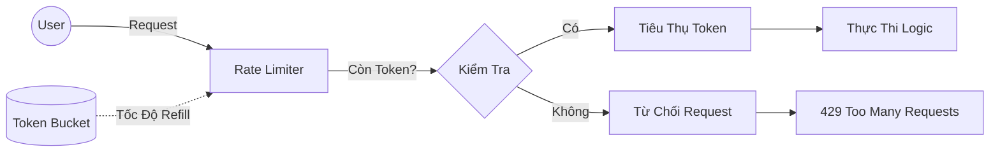

# Mẫu Resilience: Rate Limiter (Giới Hạn Tốc Độ)

## 1. Giới Thiệu

Mẫu **Rate Limiter** kiểm soát thông lượng (throughput) lưu lượng truy cập gửi đến hoặc nhận từ một giao diện mạng hoặc dịch vụ. Nó bảo vệ ứng dụng khỏi các đợt tăng đột biến lưu lượng (traffic spikes), các cuộc tấn công DoS vô tình và đảm bảo phân bổ tài nguyên công bằng giữa các người dùng.

---

## 2. Kiến Trúc

Việc triển khai sử dụng thuật toán **Token Bucket** (hoặc Leaky Bucket) được cung cấp bởi Resilience4j.



### 2.1 Cơ Chế Thuật Toán

*   **Limit**: Số lượng giấy phép (requests) tối đa được phép trong một chu kỳ.
*   **Period**: Cửa sổ thời gian cho chu kỳ làm mới (refresh cycle).
*   **Timeout**: Thời gian một thread chờ giấy phép trước khi bỏ cuộc.

---

## 3. Đặc Tả Cấu Hình

Cấu hình được quản lý trong `resilience4j.yml`. Phân biệt giữa các profile development và production.

### 3.1 Định Nghĩa Chính Sách

| Tên Instance | Giới Hạn | Chu Kỳ | Timeout | Trường Hợp Sử Dụng |
| :--- | :--- | :--- | :--- | :--- |
| `general` | 100 | 1s | 0ms | Bảo vệ API tiêu chuẩn. |
| `sensitive` | 5 | 1m | 0ms | Endpoint rủi ro cao (vd: tạo OTP). |
| `media` | 10 | 1s | 0ms | Endpoint tải lên tệp tin. |

### 3.2 Hợp Đồng Phản Hồi (Response Contract)

Khi một request bị từ chối, hệ thống ném ra `RequestNotPermitted`. Ngoại lệ này được ánh xạ thành phản hồi HTTP chuẩn bởi Global Exception Handler.

*   **HTTP Status**: `429 Too Many Requests`
*   **Body**: `ApiResponse` chuẩn với mã lỗi `RATE_LIMIT_EXCEEDED`.

---

## 4. Tham Chiếu Triển Khai

### 4.1 Decorating Endpoints

```java
@RestController
public class MediaController {

    @PostMapping("/upload")
    @RateLimiter(name = "media", fallbackMethod = "handleRateLimit")
    public ApiResponse<String> upload(@RequestParam MultipartFile file) {
        return mediaService.upload(file);
    }

    public ApiResponse<String> handleRateLimit(RequestNotPermitted ex) {
        throw new ApiException(ApiErrorCode.RATE_LIMIT_EXCEEDED);
    }
}
```

### 4.2 Xử Lý Fallbacks

Thực hành tốt nhất là ném ra một ngoại lệ cụ thể của miền (domain-specific exception) trong fallback thay vì trả về giá trị mặc định, cho phép global handler chuẩn hóa cấu trúc phản hồi 429.

---

## 5. Giám Sát & Khả Năng Quan Sát

Metrics giới hạn tốc độ là rất quan trọng cho việc lập kế hoạch dung lượng (capacity planning).

*   **Endpoint**: `/actuator/metrics/resilience4j.ratelimiter.waiting_threads`
*   **Endpoint**: `/actuator/metrics/resilience4j.ratelimiter.available_permissions`

**Ý Tưởng Quy Tắc Cảnh Báo:**
Kích hoạt cảnh báo nếu `available_permissions` giảm xuống 0 cho $> 10\%$ số requests trong cửa sổ 1 phút.
