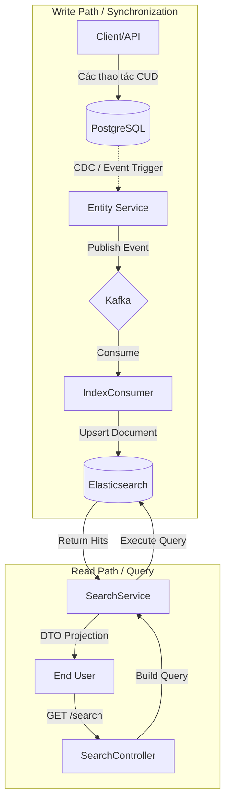

# Kiến Trúc Công Cụ Tìm Kiếm: Triển Khai Elasticsearch

## 1. Giới Thiệu

Ứng dụng tận dụng **Elasticsearch** như một kho dữ liệu thứ cấp (secondary datastore) để cung cấp khả năng tìm kiếm full-text hiệu năng cao. Việc triển khai tuân theo mẫu **Command Query Responsibility Segregation (CQRS)**, trong đó các thao tác ghi được xử lý bởi cơ sở dữ liệu quan hệ chính (PostgreSQL) và các thao tác đọc/tìm kiếm được chuyển tải sang công cụ tìm kiếm.

### 1.1 Khả Năng Cốt Lõi

*   **Chỉ Mục Đảo Ngược (Inverted Index):** Sử dụng Inverted Index của Apache Lucene cho việc truy xuất từ khóa dưới giây (sub-second retrieval).
*   **Khớp Mờ (Fuzzy Matching):** Triển khai logic khoảng cách chỉnh sửa Levenshtein (Levenshtein edit distance) để chấp nhận lỗi chính tả.
*   **Chấm Điểm Liên Quan (Relevance Scoring):** Sử dụng thuật toán BM25 (Best Matching 25) để xếp hạng kết quả dựa trên Tần suất Xuất hiện (TF) và Tần suất Nghịch đảo Tài liệu (IDF).
*   **Nhất Quán Cuối Cùng (Eventual Consistency):** Đồng bộ dữ liệu thông qua các luồng sự kiện bất đồng bộ.

---

## 2. Kiến Trúc Hệ Thống

Hệ thống phụ tìm kiếm hoạt động trên kiến trúc hai đường dẫn: đường dẫn đồng bộ hóa (Write path) và đường dẫn truy vấn (Read path).

### 2.1 Luồng Dữ Liệu CQRS



### 2.2 Vai Trò Thành Phần

| Thành Phần | Trách Nhiệm | Pattern |
| :--- | :--- | :--- |
| `PostgreSQL` | Nguồn Sự Thật (Canonical Data Store) | DBMS |
| `Kafka` | Bus Thông Điệp Đồng Bộ Hóa | Eventual Consistency |
| `Elasticsearch` | View Tối Ưu Cho Đọc | Search Engine |
| `IndexConsumer` | Cập Nhật Projection (Projection Updater) | Event Handler |

---

## 3. Chiến Lược Tìm Kiếm & Thuật Toán

Hệ thống sử dụng chiến lược truy vấn hỗn hợp để cân bằng giữa độ chính xác (precision) và độ phủ (recall).

### 3.1 Độ Ưu Tiên Xây Dựng Truy Vấn

Khi người dùng gửi thuật ngữ truy vấn $t$, hệ thống xây dựng một truy vấn Boolean Disjunction (`OR`) với các hệ số tăng cường (boosting factors) $\beta$:

$$ Score(doc) = \sum (\beta_{field} \cdot Score_{match}(t, doc.field)) $$

**Logic Triển Khai:**

| Loại Truy Vấn | Trường Mục Tiêu | Boosting ($\beta$) | Mục Đích |
| :--- | :--- | :--- | :--- |
| **Prefix Match** | `name` | `3.0` (Cao) | Hành vi Auto-complete, khớp chính xác phần đầu. |
| **Wildcard** | `name` | `2.0` (Trung bình) | Khớp chuỗi con (substring matching). |
| **Fuzzy Match** | `name`, `desc` | `1.0` (Cơ bản) | Chấp nhận lỗi đánh máy của người dùng. |

### 3.2 Cấu Hình Fuzziness

Fuzziness được thiết lập là `AUTO`, tự động điều chỉnh khoảng cách chỉnh sửa dựa trên độ dài token:
*   Độ dài $0..2$: Phải khớp chính xác.
*   Độ dài $3..5$: Cho phép 1 chỉnh sửa.
*   Độ dài $>5$: Cho phép 2 chỉnh sửa.

---

## 4. Đặc Tả API

### 4.1 Tìm Kiếm Sản Phẩm: `GET /per/products/search`

Cung cấp tìm kiếm đa chiều với khả năng lọc.

**Tham số:**

| Tham số | Kiểu | Mô tả |
| :--- | :--- | :--- |
| `query` | `string` | Thuật ngữ tìm kiếm full-text. |
| `minPrice`, `maxPrice` | `decimal` | Bộ lọc nghiêm ngặt khoảng giá. |
| `gender` | `enum` | Bộ lọc phân loại (MALE, FEMALE, UNISEX). |
| `sillage`, `longevity` | `enum` | Bộ lọc thuộc tính. |

**Ví Dụ Request:**

```http
GET /per/products/search?query=sauvage&minPrice=2000000&gender=MALE
```

---

## 5. Đồng Bộ Hóa & Nhất Quán Dữ Liệu

### 5.1 Mô Hình Nhất Quán Cuối Cùng (Eventual Consistency)

Dữ liệu không khả dụng ngay lập tức trong kết quả tìm kiếm sau khi tạo. Độ trễ lan truyền được định nghĩa bởi:
$$ T_{propagation} = T_{kafka\_latency} + T_{consumer\_processing} + T_{es\_refresh\_interval} $$

Thông thường $T_{propagation} < 1000ms$.

### 5.2 Sự Kiện Indexing

Đồng bộ hóa được thúc đẩy bởi các sự kiện miền (domain events):

*   `PRODUCT_CREATED`: Kích hoạt tạo document.
*   `PRODUCT_UPDATED`: Kích hoạt cập nhật toàn bộ document.
*   `PRODUCT_DELETED`: Kích hoạt xóa document theo ID.

### 5.3 Xử Lý Dead Letter

Nếu một thao tác indexing thất bại (ví dụ: Elasticsearch downtime), message sẽ retry 3 lần trước khi chuyển sang Dead Letter Topic (DLT) để ngăn chặn tắc nghẽn hàng đợi.

---

## 6. Quy Trình Vận Hành

### 6.1 Re-indexing Toàn Bộ

Trong trường hợp thay đổi schema hoặc trôi dữ liệu (data drift), cần thực hiện re-index toàn bộ.

**Endpoint:** `POST /per/products/reindex`
**Xác Thực:** Yêu cầu vai trò ADMIN.
**Quy Trình:**
1.  Lặp qua tất cả thực thể trong PostgreSQL (Batched/Paged).
2.  Publish các sự kiện `INDEX` tổng hợp vào Kafka.
3.  Consumers cập nhật Elasticsearch bất đồng bộ.

### 6.2 Giám Sát (Monitoring)

Sử dụng Kibana (`localhost:5601`) để giám sát:
*   Sức khỏe Index (Green/Yellow/Red).
*   Độ trễ/Thông lượng tìm kiếm.
*   Unassigned shards.
