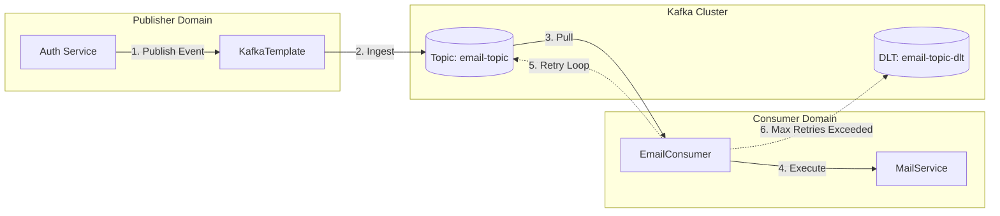

# Event-Driven Architecture: Kafka Messaging System

## 1. Introduction

The application utilizes Apache Kafka as a distributed streaming platform to implement an Event-Driven Architecture (EDA). This decouples high-latency I/O operations (such as SMTP email delivery) from the primary synchronous HTTP request-response cycle, enhancing system responsiveness/throughput and ensuring fault tolerance.

### 1.1 Architectural Pattern

The system adopts a **Fire-and-Forget** pattern for event publishing, combined with **At-Least-Once** delivery semantics for consumption. This ensures data durability while accepting the possibility of duplicate processing, which is handled via idempotent consumers where necessary.

---

## 2. System Architecture

### 2.1 Event Flow Topology

The following diagram illustrates the topological flow of an event from generation to valid consumption or deadlock handling.



### 2.2 Component Specifications

| Component | Role | Responsibility |
| :--- | :--- | :--- |
| `AuthServiceImpl` | Producer | Constructs domain events (`EmailEvent`) and publishes to specific topics. |
| `KafkaTemplate` | Transport | Spring abstraction handling serialization and broker communication. |
| `EmailConsumer` | Consumer | Subscribes to topics, deserializes payloads, and triggers business logic. |
| `Dead Letter Queue` | Fault Tolerance | Persists messages that fail processing after exhaustive retries for manual intervention. |

---

## 3. Data Specification

### 3.1 Event Schema: `EmailEvent`

Events are serialized using standard JSON formatting to ensure interoperability.

```json
{
  "to": "user@example.com",
  "subject": "Account Verification",
  "content": "<html>...</html>"
}
```

**Schema Definition:**

| Field | Type | Constraint | Description |
| :--- | :--- | :--- | :--- |
| `to` | `String` | Non-Null, Email | Recipient address. |
| `subject` | `String` | Non-Null | Email subject line. |
| `content` | `String` | Non-Null, HTML | Rendered HTML payload. |

---

## 4. Operational Semantics

### 4.1 Reliability & Fault Tolerance

The system implements a robust retry strategy with exponential backoff to handle transient failures (e.g., SMTP timeout).

*   **Initial Attempt:** Immediate execution upon consumption.
*   **Retry Policy:** Exponential Backoff `(delay * multiplier)`.
    *   *Delay:* 1000ms
    *   *Multiplier:* 2.0
    *   *Max Delay:* 4000ms
    *   *Max Attempts:* 4
*   **Failure Handling:** Upon exhausting retries, the message is routed to the DLT (`email-topic-dlt`).

### 4.2 Configuration

Configuration is managed via `application.yml` and injected into `KafkaConfig`.

```yaml
spring:
  kafka:
    bootstrap-servers: ${KAFKA_BOOTSTRAP_SERVERS:localhost:9092}
    consumer:
      group-id: email-group
      auto-offset-reset: latest
      key-deserializer: org.apache.kafka.common.serialization.StringDeserializer
      value-deserializer: org.springframework.kafka.support.serializer.JsonDeserializer
    producer:
      key-serializer: org.apache.kafka.common.serialization.StringSerializer
      value-serializer: org.springframework.kafka.support.serializer.JsonSerializer
```

---

## 5. Implementation Reference

### 5.1 Producer Implementation

```java
@Service
@RequiredArgsConstructor
public class AuthServiceImpl implements AuthService {
    
    private final KafkaTemplate<String, Object> kafkaTemplate;
    
    private void dispatchEvent(User user, String type) {
        EmailEvent event = buildEvent(user, type);
        // Asynchronous publish
        kafkaTemplate.send(KafkaTopicNames.EMAIL_TOPIC, event)
            .whenComplete((result, ex) -> {
                if (ex != null) log.error("Publish failed", ex);
                else log.debug("Offset: {}", result.getRecordMetadata().offset());
            });
    }
}
```

### 5.2 Consumer Implementation

```java
@Component
@KafkaListener(topics = "email-topic", groupId = "email-group")
public class EmailConsumer {

    @RetryableTopic(
        backoff = @Backoff(delay = 1000, multiplier = 2.0),
        dltTopicSuffix = "-dlt"
    )
    public void consume(EmailEvent event) {
        // Business logic execution
        mailService.send(event);
    }
    
    @DltHandler
    public void processFailure(EmailEvent event) {
        // Alerting logic for permanent failures
        monitor.alert("Email delivery failed for " + event.getTo());
    }
}
```

---

## 6. Extension Guidelines

To introduce new asynchronous workflows:

1.  **Define Event:** Create a POJO in `com.per.common.event` (Immutable, Serializable).
2.  **Provision Topic:** Add constant to `KafkaTopicNames` and create topic in broker.
3.  **Implement Producer:** Inject `KafkaTemplate` and publish event.
4.  **Implement Consumer:** Annotate method with `@KafkaListener` and define retry policy.
