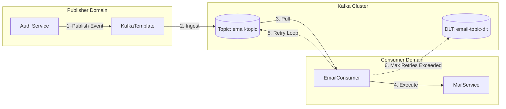

# Kiến Trúc Hướng Sự Kiện: Hệ Thống Kafka Messaging

## 1. Giới Thiệu

Ứng dụng sử dụng Apache Kafka làm nền tảng truyền tải dữ liệu phân tán (streaming platform) để triển khai Kiến trúc Hướng sự kiện (Event-Driven Architecture - EDA). Kiến trúc này giúp tách biệt các hoạt động I/O có độ trễ cao (như gửi email qua SMTP) khỏi chu trình request-response đồng bộ chính, giúp nâng cao độ phản hồi và khả năng chịu lỗi của hệ thống.

### 1.1 Mẫu Kiến Trúc (Architectural Pattern)

Hệ thống áp dụng mô hình **Fire-and-Forget** cho việc publish sự kiện, kết hợp với ngữ nghĩa **At-Least-Once** (Gửi ít nhất một lần) cho việc consume. Điều này đảm bảo tính bền vững của dữ liệu, chấp nhận khả năng xử lý trùng lặp (được giải quyết thông qua idempotent consumers khi cần thiết).

---

## 2. Kiến Trúc Hệ Thống

### 2.1 Topo Luồng Sự Kiện (Event Flow Topology)

Sơ đồ sau minh họa luồng đi của một sự kiện từ khi phát sinh đến khi được tiêu thụ thành công hoặc xử lý lỗi.



### 2.2 Đặc Tả Thành Phần

| Thành Phần | Vai Trò | Trách Nhiệm |
| :--- | :--- | :--- |
| `AuthServiceImpl` | Producer | Khởi tạo các sự kiện nghiệp vụ (`EmailEvent`) và publish vào topic cụ thể. |
| `KafkaTemplate` | Transport | Abstraction của Spring để xử lý serialization và giao tiếp với broker. |
| `EmailConsumer` | Consumer | Đăng ký lắng nghe topic, deserialize payload và kích hoạt logic nghiệp vụ. |
| `Dead Letter Queue` | Fault Tolerance | Lưu trữ message thất bại sau khi đã thử lại hết số lần quy định để xử lý thủ công. |

---

## 3. Đặc Tả Dữ Liệu

### 3.1 Schema Sự Kiện: `EmailEvent`

Các sự kiện được serialize sử dụng định dạng JSON chuẩn để đảm bảo khả năng tương tác.

```json
{
  "to": "user@example.com",
  "subject": "Xác thực tài khoản",
  "content": "<html>...</html>"
}
```

**Định Nghĩa Schema:**

| Trường | Kiểu | Ràng Buộc | Mô Tả |
| :--- | :--- | :--- | :--- |
| `to` | `String` | Non-Null, Email | Địa chỉ người nhận. |
| `subject` | `String` | Non-Null | Tiêu đề email. |
| `content` | `String` | Non-Null, HTML | Nội dung HTML đã render. |

---

## 4. Ngữ Nghĩa Vận Hành (Operational Semantics)

### 4.1 Độ Tin Cậy & Chịu Lỗi

Hệ thống triển khai chiến lược retry mạnh mẽ với exponential backoff để xử lý các lỗi tạm thời (transient failures) như timeout SMTP.

*   **Lần Thử Đầu:** Xử lý ngay lập tức khi consume.
*   **Chính Sách Retry:** Exponential Backoff `(delay * multiplier)`.
    *   *Delay:* 1000ms
    *   *Multiplier:* 2.0
    *   *Max Delay:* 4000ms
    *   *Max Attempts:* 4
*   **Xử Lý Lỗi:** Sau khi dùng hết số lần retry, message được chuyển hướng tới DLT (`email-topic-dlt`).

### 4.2 Cấu Hình

Cấu hình được quản lý qua `application.yml` và được inject vào `KafkaConfig`.

```yaml
spring:
  kafka:
    bootstrap-servers: ${KAFKA_BOOTSTRAP_SERVERS:localhost:9092}
    consumer:
      group-id: email-group
      auto-offset-reset: latest
      key-deserializer: org.apache.kafka.common.serialization.StringDeserializer
      value-deserializer: org.springframework.kafka.support.serializer.JsonDeserializer
    producer:
      key-serializer: org.apache.kafka.common.serialization.StringSerializer
      value-serializer: org.springframework.kafka.support.serializer.JsonSerializer
```

---

## 5. Tham Chiếu Triển Khai (Implementation Reference)

### 5.1 Triển Khai Producer

```java
@Service
@RequiredArgsConstructor
public class AuthServiceImpl implements AuthService {
    
    private final KafkaTemplate<String, Object> kafkaTemplate;
    
    private void dispatchEvent(User user, String type) {
        EmailEvent event = buildEvent(user, type);
        // Publish bất đồng bộ
        kafkaTemplate.send(KafkaTopicNames.EMAIL_TOPIC, event)
            .whenComplete((result, ex) -> {
                if (ex != null) log.error("Publish thất bại", ex);
                else log.debug("Offset: {}", result.getRecordMetadata().offset());
            });
    }
}
```

### 5.2 Triển Khai Consumer

```java
@Component
@KafkaListener(topics = "email-topic", groupId = "email-group")
public class EmailConsumer {

    @RetryableTopic(
        backoff = @Backoff(delay = 1000, multiplier = 2.0),
        dltTopicSuffix = "-dlt"
    )
    public void consume(EmailEvent event) {
        // Thực thi logic nghiệp vụ
        mailService.send(event);
    }
    
    @DltHandler
    public void processFailure(EmailEvent event) {
        // Logic cảnh báo cho lỗi vĩnh viễn
        monitor.alert("Gửi email thất bại cho " + event.getTo());
    }
}
```

---

## 6. Hướng Dẫn Mở Rộng

Để thêm các luồng công việc bất đồng bộ mới:

1.  **Định Nghĩa Event:** Tạo POJO trong `com.per.common.event` (Immutable, Serializable).
2.  **Cấp Phát Topic:** Thêm hằng số vào `KafkaTopicNames` và tạo topic trên broker.
3.  **Triển Khai Producer:** Inject `KafkaTemplate` và publish event.
4.  **Triển Khai Consumer:** Annotation method với `@KafkaListener` và định nghĩa chính sách retry.
