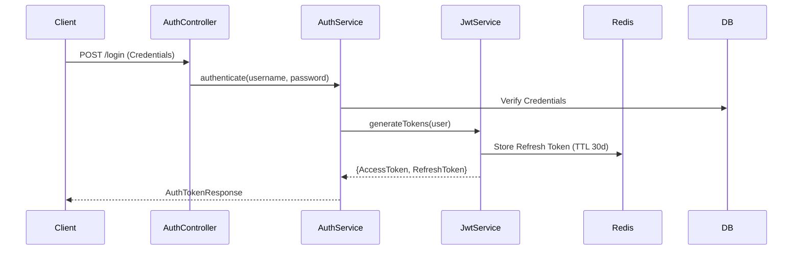

# Domain Module: Authentication & Identity

## 1. Introduction

The **Authentication Module** serves as the security gateway for the platform, implementing a stateless, token-based authentication mechanism (JWT). It manages the entire identity lifecycle—including registration, session management, and password recovery—while ensuring strict adherence to security best practices such as cryptographic storage and secure token transmission.

---

## 2. Architecture

The system utilizes a dual-token architecture (Access + Refresh) to balance security and user experience.

### 2.1 Authentication Flow Topology



### 2.2 Token Strategy

*   **Access Token**: Short-lived (15 minutes), signed stateless JWT containing claims (ID, Roles). Used for API authorization.
*   **Refresh Token**: Long-lived (30 days), stateful (stored in Redis) opaque reference. Used to obtain new access tokens without re-login.

---

## 3. Business Logic & Security Policies

### 3.1 Security Invariants

1.  **Rate Limiting**: Critical endpoints (`/login`, `/register`) are guarded by strict rate limiters to prevent brute-force attacks.
2.  **Stateful Revocation**: Logout or security events trigger the deletion of the Refresh Token from Redis, effectively invalidating the session.
3.  **Cryptographic Storage**: Passwords are hashed using BCrypt before persistence.

### 3.2 Asynchronous Notifications

Identity events (Email Verification, Password Reset) decouple the notification process using an Event-Driven Architecture.

*   **Producer**: `AuthService` publishes `EmailEvent`.
*   **Consumer**: `EmailConsumer` processes the event and dispatches via SMTP.

---

## 4. API Specification

Prefix: `/api/v1/auth`

### 4.1 Session Management

#### Login
`POST /login`
Authenticates credentials and issues a token pair.

#### Refresh
`POST /refresh`
Exchanges a valid Refresh Token for a new Access Token.

#### Logout
`POST /logout`
Revokes the current Refresh Token.

#### Introspect
`POST /introspect`
Lightweight verification of Access Token validity (useful for gateway services).

### 4.2 Identity Lifecycle

#### Register
`POST /register`
Creates a new user account with `USER` role. Triggers verification email.

#### Verify Email
`GET /verify-email?token={token}`
Confirms account ownership.

#### Password Management
*   `POST /forgot-password`: Initiates reset flow.
*   `POST /reset-password`: Consumes reset token and updates credentials.

---

## 5. Implementation Reference

### 5.1 Service Layer

`AuthService` orchestrates the interaction between Spring Security, JWT generation, and persistence.

```java
public AuthTokenResponse login(SignInRequest request) {
    // 1. Authenticate via AuthenticationManager
    Authentication auth = authenticationManager.authenticate(
        new UsernamePasswordAuthenticationToken(request.email(), request.password())
    );

    // 2. Generate Tokens
    String accessToken = jwtService.generateAccessToken(user);
    String refreshToken = jwtService.generateRefreshToken(user);

    // 3. Persist State
    refreshTokenService.save(user.getId(), refreshToken);

    return new AuthTokenResponse(accessToken, refreshToken);
}
```

### 5.2 Infrastructure Dependencies

*   **Redis**: Stores Refresh Token whitelist/blacklist.
*   **PostgreSQL**: Stores User entities and simple Role-Based Access Control (RBAC).
*   **JavaMailSender**: SMTP integration for transactional emails.
