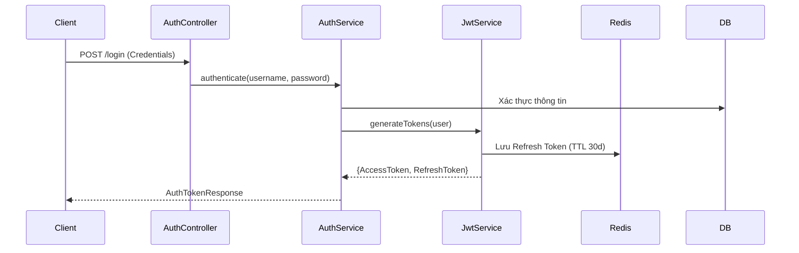

# Domain Module: Xác Thực & Định Danh (Authentication)

## 1. Giới Thiệu

**Mô đun Xác Thực** đóng vai trò là cổng bảo mật cho nền tảng, triển khai cơ chế xác thực dựa trên token không trạng thái (stateless JWT). Nó quản lý toàn bộ vòng đời định danh—bao gồm đăng ký, quản lý phiên và khôi phục mật khẩu—trong khi đảm bảo tuân thủ nghiêm ngặt các thực hành bảo mật tốt nhất như lưu trữ mã hóa và truyền tải token an toàn.

---

## 2. Kiến Trúc

Hệ thống sử dụng kiến trúc dual-token (Access + Refresh) để cân bằng giữa bảo mật và trải nghiệm người dùng.

### 2.1 Sơ Đồ Luồng Xác Thực



### 2.2 Chiến Lược Token

*   **Access Token**: Thời gian sống ngắn (15 phút), JWT stateless chứa các claims (ID, Roles). Được sử dụng để ủy quyền API.
*   **Refresh Token**: Thời gian sống dài (30 ngày), tham chiếu stateful (lưu trong Redis). Được sử dụng để lấy access token mới mà không cần đăng nhập lại.

---

## 3. Logic Nghiệp Vụ & Chính Sách Bảo Mật

### 3.1 Các Bất Biến Bảo Mật

1.  **Rate Limiting**: Các endpoint quan trọng (`/login`, `/register`) được bảo vệ bởi bộ giới hạn tốc độ nghiêm ngặt để ngăn chặn tấn công brute-force.
2.  **Stateful Revocation**: Đăng xuất hoặc sự kiện bảo mật sẽ kích hoạt việc xóa Refresh Token khỏi Redis, làm mất hiệu lực phiên làm việc ngay lập tức.
3.  **Lưu Trữ Mã Hóa**: Mật khẩu được băm (hashed) bằng BCrypt trước khi lưu trữ.

### 3.2 Thông Báo Bất Đồng Bộ

Các sự kiện định danh (Xác thực Email, Đặt lại Mật khẩu) tách biệt quá trình thông báo bằng Kiến trúc Hướng Sự Kiện.

*   **Producer**: `AuthService` publish `EmailEvent`.
*   **Consumer**: `EmailConsumer` xử lý sự kiện và gửi qua SMTP.

---

## 4. Đặc Tả API

Tiền tố: `/api/v1/auth`

### 4.1 Quản Lý Phiên

#### Đăng Nhập
`POST /login`
Xác thực thông tin và cấp cặp token.

#### Làm Mới (Refresh)
`POST /refresh`
Đổi Refresh Token hợp lệ lấy Access Token mới.

#### Đăng Xuất
`POST /logout`
Thu hồi Refresh Token hiện tại.

#### Introspect
`POST /introspect`
Xác minh nhẹ tính hợp lệ của Access Token (hữu ích cho các gateway services).

### 4.2 Vòng Đời Định Danh

#### Đăng Ký
`POST /register`
Tạo tài khoản người dùng mới với vai trò `USER`. Kích hoạt email xác thực.

#### Xác Thực Email
`GET /verify-email?token={token}`
Xác nhận quyền sở hữu tài khoản.

#### Quản Lý Mật Khẩu
*   `POST /forgot-password`: Khởi tạo luồng đặt lại mật khẩu.
*   `POST /reset-password`: Tiêu thụ token đặt lại và cập nhật thông tin xác thực.

---

## 5. Tham Chiếu Triển Khai

### 5.1 Tầng Service

`AuthService` điều phối sự tương tác giữa Spring Security, tạo JWT và persistence.

```java
public AuthTokenResponse login(SignInRequest request) {
    // 1. Xác thực qua AuthenticationManager
    Authentication auth = authenticationManager.authenticate(
        new UsernamePasswordAuthenticationToken(request.email(), request.password())
    );

    // 2. Tạo Tokens
    String accessToken = jwtService.generateAccessToken(user);
    String refreshToken = jwtService.generateRefreshToken(user);

    // 3. Persist State
    refreshTokenService.save(user.getId(), refreshToken);

    return new AuthTokenResponse(accessToken, refreshToken);
}
```

### 5.2 Phụ Thuộc Hạ Tầng

*   **Redis**: Lưu trữ danh sách trắng/đen của Refresh Token.
*   **PostgreSQL**: Lưu trữ thực thể User và RBAC đơn giản.
*   **JavaMailSender**: Tích hợp SMTP cho email giao dịch.
