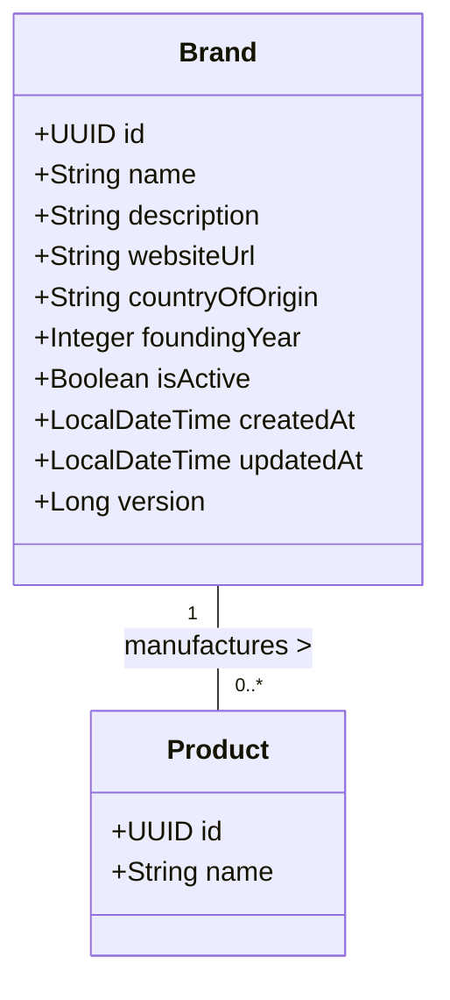

# Domain Module: Brand Management

## 1. Overview

The **Brand Module** functions as the master data repository for fragrance houses and manufacturers. It serves as a foundational entity upon which product catalogs are structured. This module enforces strict data integrity regarding identity (uniqueness) while providing high-performance retrieval via caching and indexing strategies.

---

## 2. Data Model Architecture

The `Brand` entity represents the root manufacturer.

### 2.1 Entity Relationship Diagram



### 2.2 Schema Constraints

*   **Identity**: `id` is a UUID v4 primary key.
*   **Uniqueness**: `name` must be unique (case-insensitive) across the system to prevent duplication of catalogue entries.
*   **Audit**: Timestamps (`createdAt`, `updatedAt`) are automatically managed via JPA auditing.

---

## 3. Business Logic & Invariants

### 3.1 Validation Rules

1.  **Name Uniqueness**: Before insertion or update, a check against the persistence layer (`existsByNameIgnoreCase`) is mandatory. If a conflict is detected, `BRAND_NAME_CONFLICT` is thrown.
2.  **referential Integrity**: Deletion of a Brand may be restricted if active Products are linked (depending on cascade configuration).

### 3.2 Caching Strategy

To optimize read-heavy workloads, this module integrates with the Redis Cache Layer.

*   **Read-Through**:
    *   `GET /brands/{id}` hits cache key `brand::{id}`.
    *   `GET /brands` (search/list) hits cache key `brands::{query_hash}`.
*   **Cache Invalidation**:
    *   **Write Operations** (Create/Update/Delete) trigger a post-transaction eviction event.
    *   Eviction targets both specific entity keys and the aggregate listing cache to ensure consistency.

---

## 4. API Specification

All endpoints are prefixed with `/api/v1/brands`.

### 4.1 Retrieval Operations

#### Get Single Brand
`GET /{id}`

*   **Response**: `200 OK` with `BrandResponse`
*   **Error**: `404 NOT_FOUND` if ID does not exist.

#### Search & List
`GET /`

Supports pagination and keyword search (matching name or textual description).

| Parameter | Type | Description |
| :--- | :--- | :--- |
| `query` | `string` | Optional text filter. |
| `page` | `int` | Page index (0-based). |
| `size` | `int` | Elements per page. |
| `sort` | `string` | Sorting criteria (default: `createdAt,desc`). |

### 4.2 State Mutation Operations

#### Create Brand
`POST /`

**Body**: `BrandCreateRequest`

```json
{
  "name": "Dior",
  "description": "French luxury fashion house",
  "websiteUrl": "https://dior.com",
  "foundingYear": 1946,
  "isActive": true
}
```

#### Update Brand
`PUT /{id}`

**Body**: `BrandUpdateRequest` (Partial Update / Patch behavior supported if implemented via non-null checks).

#### Delete Brand
`DELETE /{id}`

*   Physical deletion of the record.
*   Triggers cache eviction.

---

## 5. Implementation Reference

### 5.1 Service Layer

The `BrandService` acts as a transaction boundary.

```java
@Transactional
public BrandResponse create(BrandCreateRequest request) {
    if (repository.existsByNameIgnoreCase(request.name())) {
        throw new ApiException(ApiErrorCode.BRAND_NAME_CONFLICT);
    }
    Brand entity = mapper.toEntity(request);
    return mapper.toResponse(repository.save(entity));
}
```

### 5.2 Extensions

*   **Elasticsearch Sync**: Brand updates emit events to Kafka topics (`brand-index-topic`) for search engine synchronization.
*   **Media Integration**: Brand logos/banners are linked via the Media Module (refer to [Media Documentation](../media/README.md)).
