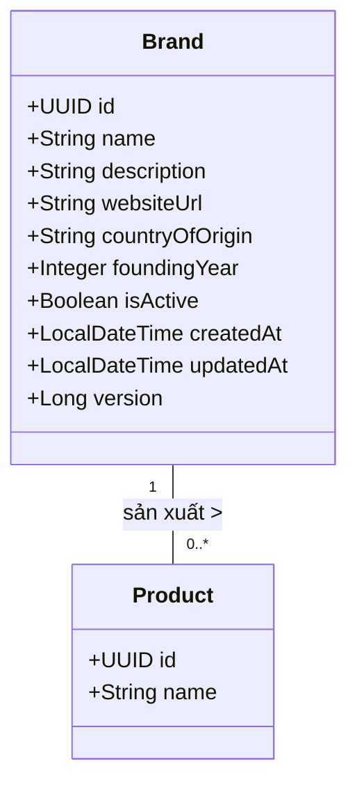

# Mô Đun Miền: Quản Lý Thương Hiệu (Brand)

## 1. Tổng Quan

**Mô đun Thương hiệu** đóng vai trò là kho dữ liệu chủ (master data repository) cho các nhà sản xuất và thương hiệu nước hoa. Đây là thực thể nền tảng mà danh mục sản phẩm được xây dựng dựa trên đó. Mô đun này thực thi sự toàn vẹn dữ liệu nghiêm ngặt về danh tính (tính duy nhất) đồng thời cung cấp khả năng truy xuất hiệu năng cao thông qua các chiến lược caching và indexing.

---

## 2. Kiến Trúc Mô Hình Dữ Liệu

Thực thể `Brand` đại diện cho nhà sản xuất gốc.

### 2.1 Sơ Đồ Quan Hệ Thực Thể (ERD)



### 2.2 Ràng Buộc Schema

*   **Định Danh**: `id` là khóa chính UUID v4.
*   **Tính Duy Nhất**: `name` phải là duy nhất (không phân biệt hoa thường - case-insensitive) trên toàn hệ thống để ngăn chặn việc trùng lặp danh mục.
*   **Kiểm Toán**: Các timestamps (`createdAt`, `updatedAt`) được quản lý tự động thông qua JPA auditing.

---

## 3. Logic Nghiệp Vụ & Bất Biến

### 3.1 Quy Tắc Validate

1.  **Tên Duy Nhất**: Trước khi insert hoặc update, bắt buộc phải kiểm tra đối chiếu với lớp persistence (`existsByNameIgnoreCase`). Nếu phát hiện xung đột, ngoại lệ `BRAND_NAME_CONFLICT` sẽ được ném ra.
2.  **Toàn Vẹn Tham Chiếu**: Việc xóa một Brand có thể bị hạn chế nếu có các Product đang hoạt động liên kết với nó (tùy thuộc vào cấu hình cascade).

### 3.2 Chiến Lược Caching

Để tối ưu hóa cho các tác vụ đọc nhiều (read-heavy), mô đun này tích hợp với Lớp Redis Cache.

*   **Read-Through**:
    *   `GET /brands/{id}` truy cập cache key `brand::{id}`.
    *   `GET /brands` (search/list) truy cập cache key `brands::{query_hash}`.
*   **Cache Invalidation**:
    *   **Thao Tác Ghi** (Create/Update/Delete) kích hoạt sự kiện eviction sau transaction.
    *   Eviction nhắm mục tiêu cả key thực thể cụ thể và cache danh sách tổng hợp để đảm bảo tính nhất quán.

---

## 4. Đặc Tả API

Tất cả endpoint đều có tiền tố `/api/v1/brands`.

### 4.1 Thao Tác Truy Xuất

#### Lấy Brand Đơn Lẻ
`GET /{id}`

*   **Phản hồi**: `200 OK` với `BrandResponse`
*   **Lỗi**: `404 NOT_FOUND` nếu ID không tồn tại.

#### Tìm Kiếm & Liệt Kê
`GET /`

Hỗ trợ phân trang và tìm kiếm từ khóa (khớp tên hoặc mô tả văn bản).

| Tham Số | Kiểu | Mô Tả |
| :--- | :--- | :--- |
| `query` | `string` | Bộ lọc văn bản tùy chọn. |
| `page` | `int` | Chỉ số trang (bắt đầu từ 0). |
| `size` | `int` | Số phần tử mỗi trang. |
| `sort` | `string` | Tiêu chí sắp xếp (mặc định: `createdAt,desc`). |

### 4.2 Thao Tác Thay Đổi Trạng Thái

#### Tạo Brand
`POST /`

**Body**: `BrandCreateRequest`

```json
{
  "name": "Dior",
  "description": "Nhà mốt sang trọng của Pháp",
  "websiteUrl": "https://dior.com",
  "foundingYear": 1946,
  "isActive": true
}
```

#### Cập Nhật Brand
`PUT /{id}`

**Body**: `BrandUpdateRequest` (Hỗ trợ cập nhật một phần nếu triển khai kiểm tra null).

#### Xóa Brand
`DELETE /{id}`

*   Xóa vật lý bản ghi.
*   Kích hoạt cache eviction.

---

## 5. Tham Chiếu Triển Khai

### 5.1 Tầng Service

`BrandService` hoạt động như một ranh giới transaction.

```java
@Transactional
public BrandResponse create(BrandCreateRequest request) {
    if (repository.existsByNameIgnoreCase(request.name())) {
        throw new ApiException(ApiErrorCode.BRAND_NAME_CONFLICT);
    }
    Brand entity = mapper.toEntity(request);
    return mapper.toResponse(repository.save(entity));
}
```

### 5.2 Mở Rộng

*   **Đồng Bộ Elasticsearch**: Cập nhật Brand phát ra sự kiện tới Kafka topic (`brand-index-topic`) để đồng bộ hóa công cụ tìm kiếm.
*   **Tích Hợp Media**: Logo/Banner của Brand được liên kết thông qua Module Media (tham khảo [Tài Liệu Media](../media/README.md)).
