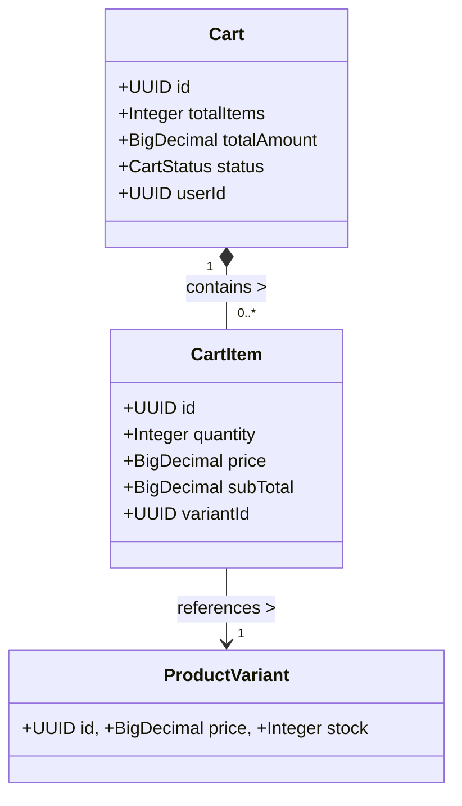

# Domain Module: Shopping Cart

## 1. Overview

The **Cart Module** manages the transient state of a user's purchase intent. It persists line items, handles quantity updates, and performs real-time price aggregation. Unlike a simple session storage, the cart is a fully persisted domain entity backed by PostgreSQL to ensure cross-device consistency.

---

## 2. Data Model Architecture

The cart model is designed as an aggregate root where the `Cart` entity controls the lifecycle of its `CartItem` children.

### 2.1 Entity Relationship Diagram



### 2.2 Aggregate Rules

*   **Consistency**: The `Cart` entity maintains denormalized totals (`totalItems`, `totalAmount`) which are strictly recomputed upon any modification to its items.
*   **Ownership**: A persistent cart is uniquely bound to a `User`. Anonymous carts are not currently supported in the backend (handled client-side or via future guest extensions).

---

## 3. Business Logic & Invariants

### 3.1 Inventory Validation

Every mutation (Add, Update Quantity) triggers a strict inventory check against the stock service.

1.  **Availability**: The requested Variant must be `ACTIVE`.
2.  **Stock Check**: `Requested Quantity <= Available Stock`.
    *   Violation raises `CART_ITEM_OUT_OF_STOCK`.

### 3.2 Price Synchronization

Prices are snapshotted at the time of addition but should ideally be re-validated during checkout. The current implementation uses the price at the moment of the cart operation.

### 3.3 Lifecycle

*   **ACTIVE**: The cart is reliable for mutation.
*   **COMPLETED**: When an order is successfully placed, the cart is effectively cleared or archived (logically). Currently, checkout flows often clear the cart items to reset state.

---

## 4. API Specification

Prefix: `/api/v1/cart`

### 4.1 Cart Management

#### Get Current Cart
`GET /`
Retrieves the active cart for the authenticated user. Creates one if none exists.

#### Clear Cart
`DELETE /items`
Removes all items efficiently.

### 4.2 Item Mutation

#### Add Item
`POST /items`
**Body**: `CartItemCreateRequest { variantId, quantity }`
Adds a new item or increments the quantity if the variant already exists (merging).

#### Update Quantity
`PATCH /items/{itemId}`
**Body**: `CartItemUpdateRequest { quantity }`
Sets the absolute quantity.

#### Remove Item
`DELETE /items/{itemId}`
Removes a specific line item.

---

## 5. Implementation Reference

### 5.1 Helper Utilities

`CartHelper` encapsulates the logic for retrieving the cart and recalculating totals, ensuring DRY principles across controllers.

```java
public void recalculateCart(Cart cart) {
    int totalItems = 0;
    BigDecimal totalAmount = BigDecimal.ZERO;

    for (CartItem item : cart.getItems()) {
        totalItems += item.getQuantity();
        totalAmount = totalAmount.add(item.getSubTotal());
    }

    cart.setTotalItems(totalItems);
    cart.setTotalAmount(totalAmount);
    cartRepository.save(cart);
}
```

### 5.2 Error Handling

*   `CART_ITEM_NOT_FOUND`: Manipulation of an ID that doesn't exist in the current user's cart.
*   `CART_ITEM_OUT_OF_STOCK`: Request exceeds inventory.

---

## 6. Future Extensions

*   **Guest Cart**: Implementing a token-based guest cart that merges into the user cart upon login.
*   **Price Refresh**: A mechanism to warn users if prices have changed since the item was added.
