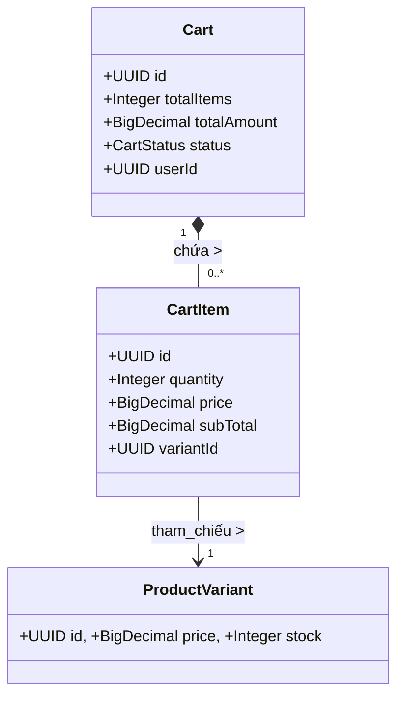

# Domain Module: Giỏ Hàng (Shopping Cart)

## 1. Tổng Quan

**Mô đun Giỏ Hàng** quản lý trạng thái nhất thời (transient state) của ý định mua hàng từ người dùng. Nó lưu trữ các mục hàng (line items), xử lý cập nhật số lượng và thực hiện tính toán tổng hợp giá theo thời gian thực. Khác với lưu trữ session đơn giản, giỏ hàng là một thực thể miền bền vững được hỗ trợ bởi PostgreSQL để đảm bảo tính nhất quán trên nhiều thiết bị.

---

## 2. Kiến Trúc Mô Hình Dữ Liệu

Mô hình giỏ hàng được thiết kế như một Aggregate Root, trong đó thực thể `Cart` kiểm soát vòng đời của các `CartItem` con.

### 2.1 Sơ Đồ Quan Hệ Thực Thể (ERD)



### 2.2 Quy Tắc Tổng Hợp (Aggregate Rules)

*   **Tính Nhất Quán**: Thực thể `Cart` duy trì các tổng số được phi chuẩn hóa (`totalItems`, `totalAmount`), các giá trị này được tính toán lại nghiêm ngặt sau bất kỳ sửa đổi nào đối với các item con.
*   **Quyền Sở Hữu**: Một giỏ hàng bền vững được liên kết duy nhất với một `User`. Giỏ hàng vô danh (Anonymous carts) hiện chưa được hỗ trợ ở backend (xử lý phía client hoặc qua mở rộng guest trong tương lai).

---

## 3. Logic Nghiệp Vụ & Bất Biến

### 3.1 Validate Tồn Kho

Mọi thay đổi (Thêm, Cập nhật số lượng) đều kích hoạt kiểm tra tồn kho nghiêm ngặt.

1.  **Tính Khả Dụng**: Variant được yêu cầu phải ở trạng thái `ACTIVE`.
2.  **Kiểm Tra Kho**: `Số Lượng Yêu Cầu <= Tồn Kho Khả Dụng`.
    *   Vi phạm sẽ gây ra lỗi `CART_ITEM_OUT_OF_STOCK`.

### 3.2 Đồng Bộ Giá

Giá được snapshot tại thời điểm thêm vào giỏ nhưng lý tưởng nhất nên được validate lại trong quá trình checkout. Triển khai hiện tại sử dụng giá tại thời điểm thao tác giỏ hàng.

### 3.3 Vòng Đời

*   **ACTIVE**: Giỏ hàng đáng tin cậy để thay đổi.
*   **COMPLETED**: Khi đơn hàng được đặt thành công, giỏ hàng được coi là đã hoàn tất hoặc xóa sạch (về mặt logic). Hiện tại, luồng checkout thường xóa các item trong giỏ để reset trạng thái.

---

## 4. Đặc Tả API

Tiền tố: `/api/v1/cart`

### 4.1 Quản Lý Giỏ Hàng

#### Lấy Giỏ Hàng Hiện Tại
`GET /`
Truy xuất giỏ hàng hoạt động cho người dùng đã xác thực. Tạo mới nếu chưa tồn tại.

#### Xóa Sạch Giỏ Hàng
`DELETE /items`
Xóa tất cả các item một cách hiệu quả.

### 4.2 Thao Tác Item

#### Thêm Item
`POST /items`
**Body**: `CartItemCreateRequest { variantId, quantity }`
Thêm item mới hoặc tăng số lượng nếu variant đã tồn tại (gộp dòng).

#### Cập Nhật Số Lượng
`PATCH /items/{itemId}`
**Body**: `CartItemUpdateRequest { quantity }`
Thiết lập số lượng tuyệt đối.

#### Xóa Item
`DELETE /items/{itemId}`
Xóa một dòng item cụ thể.

---

## 5. Tham Chiếu Triển Khai

### 5.1 Các Tiện Ích Helper

`CartHelper` đóng gói logic truy xuất giỏ hàng và tính toán lại tổng số, đảm bảo nguyên tắc DRY (Don't Repeat Yourself) trên các controller.

```java
public void recalculateCart(Cart cart) {
    int totalItems = 0;
    BigDecimal totalAmount = BigDecimal.ZERO;

    for (CartItem item : cart.getItems()) {
        totalItems += item.getQuantity();
        totalAmount = totalAmount.add(item.getSubTotal());
    }

    cart.setTotalItems(totalItems);
    cart.setTotalAmount(totalAmount);
    cartRepository.save(cart);
}
```

### 5.2 Xử Lý Lỗi

*   `CART_ITEM_NOT_FOUND`: Thao tác trên ID không tồn tại trong giỏ của user hiện tại.
*   `CART_ITEM_OUT_OF_STOCK`: Yêu cầu vượt quá tồn kho.

---

## 6. Mở Rộng Tương Lai

*   **Giỏ Hàng Khách (Guest)**: Triển khai giỏ hàng dựa trên token cho khách, sau đó gộp vào giỏ hàng user khi đăng nhập.
*   **Làm Mới Giá**: Cơ chế cảnh báo người dùng nếu giá thay đổi so với thời điểm thêm vào giỏ.
