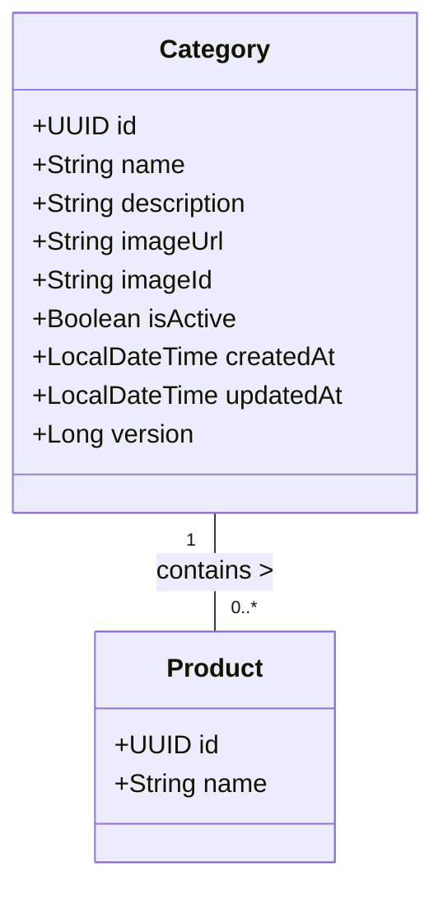

# Domain Module: Category Management

## 1. Overview

The **Category Module** defines the taxonomical structure of the product catalog. It organizes products into hierarchical or flat families (e.g., "Floral", "Woody", "Summer Collection"). This classification is critical for navigation, filtering, and SEO. Like other master data modules, it emphasizes data integrity and high availability.

---

## 2. Data Model Architecture

The `Category` entity enforces the classification schema.

### 2.1 Entity Relationship Diagram



### 2.2 Schema Constraints

*   **Identity**: `id` is a UUID v4.
*   **Uniqueness**: `name` must be unique (case-insensitive) to prevent taxonomical confusion.
*   **Audit**: Auto-managed timestamps (`createdAt`, `updatedAt`).

---

## 3. Business Logic & Invariants

### 3.1 Validation Rules

1.  **Unique Nomenclature**: The system forbids duplicate category names. This is enforced via a pre-persistence lookup (`existsByNameIgnoreCase`). Violation results in `CATEGORY_NAME_CONFLICT`.
2.  **Referential Safety**: Deleting a Category containing active products may be restricted by Foreign Key constraints or application logic, necessitating reassignment or cascade deletion.

### 3.2 Caching Strategy

Optimized for read-heavy navigation menus and filters.

*   **L2 Cache (Redis)**:
    *   `GET /categories` → `categories::{hash}`
    *   `GET /categories/{id}` → `category::{id}`
*   **Invalidation Protocol**:
    *   Any state change (Create/Update/Delete) triggers a holistic eviction of the `categories` list cache and the specific `category` key.

---

## 4. API Specification

Prefix: `/api/v1/categories`

### 4.1 Retrieval Operations

#### Get Single Category
`GET /{id}`

*   **Response**: `CategoryResponse`
*   **Error**: `404` if not found.

#### List & Search
`GET /`

Supports filtering by name or description.

| Parameter | Type | Description |
| :--- | :--- | :--- |
| `query` | `string` | Text search (Name/Description). |
| `page`, `size` | `int` | Pagination controls. |
| `sort` | `string` | e.g. `name,asc`. |

### 4.2 State Mutation Operations

#### Create Category
`POST /`

**Schema**: `CategoryCreateRequest`

```json
{
  "name": "Eau de Parfum",
  "description": "Concentration of 15-20%",
  "isActive": true
}
```

#### Update Category
`PUT /{id}`

**Schema**: `CategoryUpdateRequest`
Supports partial updates. Only non-null fields modify the state.

#### Delete Category
`DELETE /{id}`

Removes the entity and invalidates associated caches.

---

## 5. Implementation Details

### 5.1 Service Layer

The `CategoryService` handles the orchestration of validation, mapping, and persistence.

**Key Responsibilities:**
*   Name collision detection.
*   DTO/Entity mapping via MapStruct.
*   Transaction management (`@Transactional`).
*   Cache eviction calls.

### 5.2 Extensions

*   **Hierarchical Structures**: The module can be extended to support `parentId` for tree-based navigation (Sub-categories).
*   **Search Sync**: Updates propagate to the Elasticsearch index via Kafka (`category-index-topic`) to enable faceted search.
