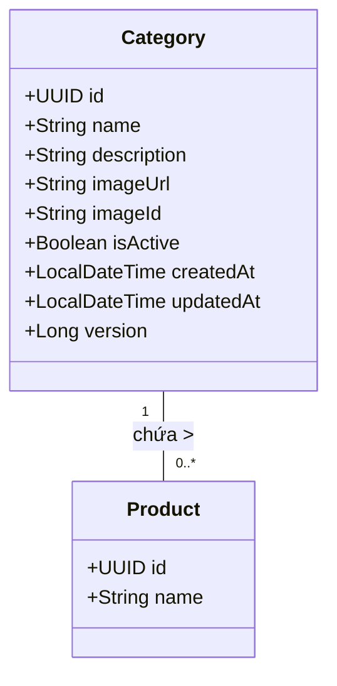

# Mô Đun Miền: Quản Lý Danh Mục (Category)

## 1. Tổng Quan

**Mô đun Danh mục (Category)** định nghĩa cấu trúc phân loại của danh mục sản phẩm. Nó tổ chức các sản phẩm thành các nhóm phân cấp hoặc phẳng (ví dụ: "Nhóm Hương Hoa", "Bộ Sưu Tập Hè"). Việc phân loại này đóng vai trò quan trọng cho điều hướng, bộ lọc và SEO. Tương tự như các mô đun dữ liệu chủ (master data) khác, nó nhấn mạnh vào tính toàn vẹn dữ liệu và tính sẵn sàng cao.

---

## 2. Kiến Trúc Mô Hình Dữ Liệu

Thực thể `Category` thực thi schema phân loại.

### 2.1 Sơ Đồ Quan Hệ Thực Thể (ERD)



### 2.2 Ràng Buộc Schema

*   **Định Danh**: `id` là UUID v4.
*   **Tính Duy Nhất**: `name` phải là duy nhất (không phân biệt hoa thường) để ngăn chặn sự nhầm lẫn trong phân loại.
*   **Kiểm Toán**: Các timestamps (`createdAt`, `updatedAt`) được quản lý tự động.

---

## 3. Logic Nghiệp Vụ & Bất Biến

### 3.1 Quy Tắc Validate

1.  **Danh Pháp Duy Nhất**: Hệ thống cấm các tên danh mục trùng lặp. Điều này được thực thi thông qua kiểm tra trước khi lưu trữ (`existsByNameIgnoreCase`). Vi phạm sẽ dẫn đến lỗi `CATEGORY_NAME_CONFLICT`.
2.  **An Toàn Tham Chiếu**: Việc xóa một Danh mục có chứa sản phẩm đang hoạt động có thể bị hạn chế bởi ràng buộc Khóa Ngoại hoặc logic ứng dụng, yêu cầu gán lại danh mục hoặc xóa theo tầng (cascade).

### 3.2 Chiến Lược Caching

Được tối ưu hóa cho các menu điều hướng và bộ lọc có tần suất đọc cao.

*   **L2 Cache (Redis)**:
    *   `GET /categories` → `categories::{hash}`
    *   `GET /categories/{id}` → `category::{id}`
*   **Giao Thức Invalidation**:
    *   Bất kỳ thay đổi trạng thái nào (Tạo/Cập Nhật/Xóa) đều kích hoạt việc loại bỏ toàn bộ cache danh sách `categories` và key `category` cụ thể.

---

## 4. Đặc Tả API

Tiền tố: `/api/v1/categories`

### 4.1 Thao Tác Truy Xuất

#### Lấy Category Đơn Lẻ
`GET /{id}`

*   **Phản hồi**: `CategoryResponse`
*   **Lỗi**: `404` nếu không tìm thấy.

#### Liệt Kê & Tìm Kiếm
`GET /`

Hỗ trợ lọc theo tên hoặc mô tả.

| Tham số | Kiểu | Mô tả |
| :--- | :--- | :--- |
| `query` | `string` | Tìm kiếm văn bản (Tên/Mô tả). |
| `page`, `size` | `int` | Điều khiển phân trang. |
| `sort` | `string` | Ví dụ: `name,asc`. |

### 4.2 Thao Tác Thay Đổi Trạng Thái

#### Tạo Category
`POST /`

**Schema**: `CategoryCreateRequest`

```json
{
  "name": "Eau de Parfum",
  "description": "Nồng độ từ 15-20%",
  "isActive": true
}
```

#### Cập Nhật Category
`PUT /{id}`

**Schema**: `CategoryUpdateRequest`
Hỗ trợ cập nhật một phần. Chỉ các trường non-null mới làm thay đổi trạng thái.

#### Xóa Category
`DELETE /{id}`

Xóa thực thể và invalidate các cache liên quan.

---

## 5. Chi Tiết Triển Khai

### 5.1 Tầng Service

`CategoryService` xử lý việc điều phối validate, mapping, và persistence.

**Trách Nhiệm Chính:**
*   Phát hiện xung đột tên.
*   Mapping DTO/Entity qua MapStruct.
*   Quản lý Transaction (`@Transactional`).
*   Gọi cache eviction.

### 5.2 Mở Rộng

*   **Cấu Trúc Phân Cấp**: Mô đun có thể mở rộng để hỗ trợ `parentId` cho điều hướng dạng cây (Sub-categories).
*   **Đồng Bộ Search**: Các cập nhật được lan truyền tới chỉ mục Elasticsearch qua Kafka (`category-index-topic`) để kích hoạt Faceted Search.
