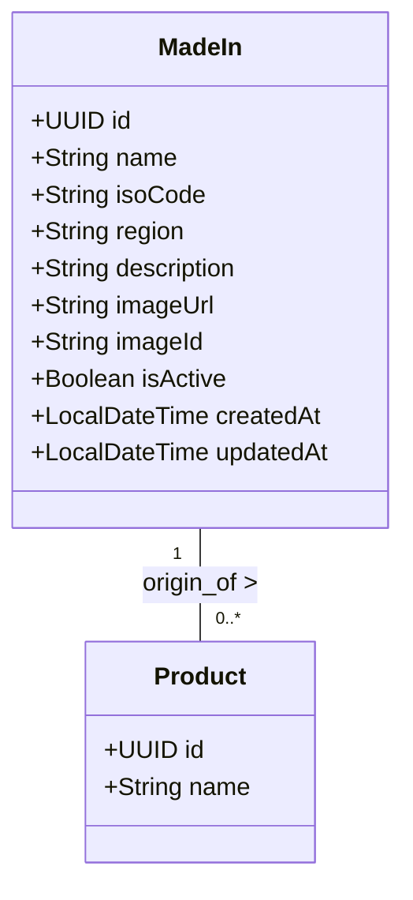

# Domain Module: Origin Management (Made In)

## 1. Overview

The **Made-In Module** manages geolocation metadata regarding the manufacturing origin of products. In the luxury fragrance domain, provenance (e.g., "France", "Italy") is a significant attribute of value and authenticity. This module standardizes these geographic designators.

---

## 2. Data Model Architecture

The `MadeIn` entity serves as a controlled vocabulary for geographical origins.

### 2.1 Entity Relationship Diagram



### 2.2 Schema Constraints

*   **Identity**: UUID v4 Primary Key.
*   **Uniqueness**: `name` must be globally unique to ensure consistent labeling.
*   **ISO Standardization**: The optional `isoCode` field is intended to adhere to ISO 3166-1 alpha-2 standards (e.g., "FR", "IT") where applicable.

---

## 3. Business Logic & Invariants

### 3.1 Validation Rules

1.  **Duplicate Prevention**: Name conflicts are intercepted before database insertion using `existsByNameIgnoreCase`. Raises `MADEIN_NAME_CONFLICT`.
2.  **Data Consistency**: Used as a strict foreign key reference in `Product` entities to prevent "magic string" storage of country names.

### 3.2 Caching Strategy

*   **Patterns**: Read-Through / Write-Invalidate.
*   **Keys**: `madeIns` (Listing) and `madeIn::{id}` (Detail).
*   **TTL**: 30 Minutes (Standard Master Data TTL).

---

## 4. API Specification

Prefix: `/api/v1/made-in`

### 4.1 Retrieval Operations

#### Get Origin Detail
`GET /{id}`

#### List & Search
`GET /`

Enables searching by `name`, `isoCode`, or `region`.

| Parameter | Type | Description |
| :--- | :--- | :--- |
| `query` | `string` | Matches Name OR ISO Code OR Region. |
| `page`, `size` | `int` | Pagination. |

### 4.2 State Mutation Operations

#### Create Origin
`POST /`

**Schema**: `MadeInCreateRequest`

```json
{
  "name": "France",
  "isoCode": "FR",
  "region": "Europe",
  "description": "The heart of modern perfumery."
}
```

#### Update Origin
`PUT /{id}`

**Schema**: `MadeInUpdateRequest`
Allows partial updates to metadata (e.g., updating the description or correcting an ISO code).

#### Delete Origin
`DELETE /{id}`

Physical deletion. Requires reference checking in the Product module to avoid orphan records.

---

## 5. Implementation Reference

### 5.1 MapStruct Integration

The module utilizes MapStruct for zero-overhead bean mapping.

```java
@Mapper(componentModel = "spring", unmappedTargetPolicy = ReportingPolicy.IGNORE)
public interface MadeInMapper {
    @Mapping(target = "id", ignore = true)
    @Mapping(target = "createdAt", ignore = true)
    MadeIn toEntity(MadeInCreateRequest request);
}
```

### 5.2 External Integrations

*   **Search Engine**: Origin data is replicated to Elasticsearch to allow users to filter products by country (e.g., "Show me perfumes made in Italy").
*   **Frontend**: Used to render "Flag" icons or "Origin" badges on product cards.
