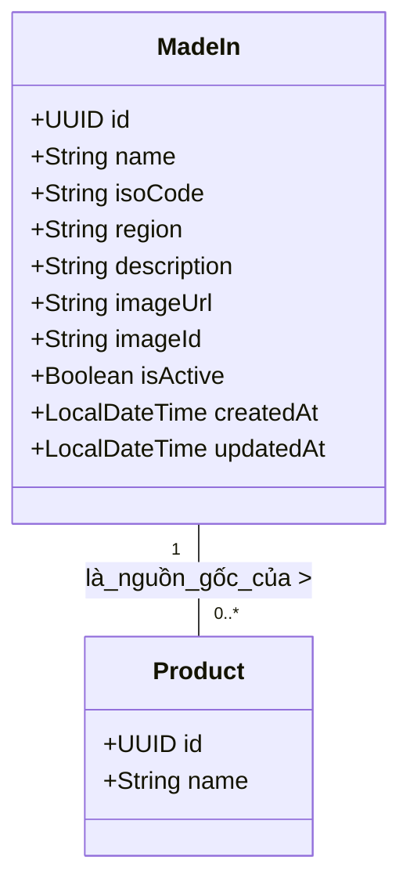

# Domain Module: Quản Lý Xuất Xứ (Made In)

## 1. Tổng Quan

**Mô đun Xuất xứ (Made-In)** quản lý siêu dữ liệu địa lý liên quan đến nguồn gốc sản xuất của sản phẩm. Trong lĩnh vực nước hoa cao cấp, nguồn gốc (ví dụ: "Pháp", "Ý") là một thuộc tính quan trọng thể hiện giá trị và tính xác thực. Mô đun này chuẩn hóa các định danh địa lý này.

---

## 2. Kiến Trúc Mô Hình Dữ Liệu

Thực thể `MadeIn` đóng vai trò là danh mục từ vựng được kiểm soát cho nguồn gốc địa lý.

### 2.1 Sơ Đồ Quan Hệ Thực Thể (ERD)



### 2.2 Ràng Buộc Schema

*   **Định Danh**: Khóa chính UUID v4.
*   **Tính Duy Nhất**: `name` phải là duy nhất toàn cục để đảm bảo việc định danh nhất quán.
*   **Chuẩn Hóa ISO**: Trường tùy chọn `isoCode` nhằm tuân thủ chuẩn ISO 3166-1 alpha-2 (ví dụ: "FR", "IT") khi áp dụng.

---

## 3. Logic Nghiệp Vụ & Bất Biến

### 3.1 Quy Tắc Validate

1.  **Ngăn Chặn Trùng Lặp**: Xung đột tên được chặn trước khi insert vào cơ sở dữ liệu sử dụng `existsByNameIgnoreCase`. Gây ra lỗi `MADEIN_NAME_CONFLICT`.
2.  **Nhất Quán Dữ Liệu**: Được sử dụng như tham chiếu khóa ngoại nghiêm ngặt trong thực thể `Product` để ngăn chặn việc lưu trữ tên quốc gia dưới dạng "magic string" (chuỗi tự do).

### 3.2 Chiến Lược Caching

*   **Mẫu (Patterns)**: Read-Through / Write-Invalidate.
*   **Keys**: `madeIns` (Danh sách) và `madeIn::{id}` (Chi tiết).
*   **TTL**: 30 Phút (TTL chuẩn cho Master Data).

---

## 4. Đặc Tả API

Tiền tố: `/api/v1/made-in`

### 4.1 Thao Tác Truy Xuất

#### Lấy Chi Tiết Xuất Xứ
`GET /{id}`

#### Liệt Kê & Tìm Kiếm
`GET /`

Cho phép tìm kiếm theo `name`, `isoCode`, hoặc `region`.

| Tham số | Kiểu | Mô tả |
| :--- | :--- | :--- |
| `query` | `string` | Khớp Tên HOẶC Mã ISO HOẶC Vùng. |
| `page`, `size` | `int` | Phân trang. |

### 4.2 Thao Tác Thay Đổi Trạng Thái

#### Tạo Xuất Xứ
`POST /`

**Schema**: `MadeInCreateRequest`

```json
{
  "name": "France",
  "isoCode": "FR",
  "region": "Europe",
  "description": "Cái nôi của ngành nước hoa hiện đại."
}
```

#### Cập Nhật Xuất Xứ
`PUT /{id}`

**Schema**: `MadeInUpdateRequest`
Cho phép cập nhật một phần siêu dữ liệu (ví dụ: cập nhật mô tả hoặc sửa mã ISO).

#### Xóa Xuất Xứ
`DELETE /{id}`

Xóa vật lý. Yêu cầu kiểm tra tham chiếu trong mô đun Product để tránh bản ghi mồ côi (orphan records).

---

## 5. Tham Chiếu Triển Khai

### 5.1 Tích Hợp MapStruct

Mô đun sử dụng MapStruct để mapping object với overhead bằng 0.

```java
@Mapper(componentModel = "spring", unmappedTargetPolicy = ReportingPolicy.IGNORE)
public interface MadeInMapper {
    @Mapping(target = "id", ignore = true)
    @Mapping(target = "createdAt", ignore = true)
    MadeIn toEntity(MadeInCreateRequest request);
}
```

### 5.2 Tích Hợp Bên Ngoài

*   **Search Engine**: Dữ liệu xuất xứ được sao chép sang Elasticsearch để cho phép người dùng lọc sản phẩm theo quốc gia (ví dụ: "Hiện nước hoa sản xuất tại Ý").
*   **Frontend**: Được dùng để render icon "Cờ" hoặc huy hiệu "Xuất xứ" trên thẻ sản phẩm.
