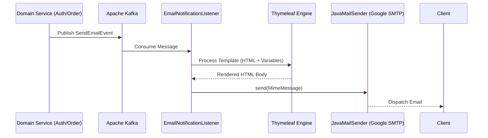

# Domain Module: Infrastructure & Notification (Mail)

## 1. Introduction

The **Mail Module** provides a high-performance, decoupled notification infrastructure for the platform. It utilizes an asynchronous, event-driven architecture powered by **Spring Boot Mail (JavaMailSender)** with Google SMTP. The module is designed for reliability, scalability, and strict brand consistency, utilizing specialized **Thymeleaf** templates for luxury communication.

---

## 2. Architecture

The system utilizes an asynchronous processing model to ensure notification delivery does not block transactional business logic.

### 2.1 Notification Pipeline Topology



### 2.2 Core Components

*   **EmailNotificationListener**: A Kafka consumer that subscribes to the `notification.email.send` topic. It orchestrates the rendering and dispatching process.
*   **SmtpEmailService**: The core implementation responsible for constructing `MimeMessage` using Spring's `JavaMailSender` and `MimeMessageHelper`.
*   **MailProperties**: A configuration component that defines the sender email address (`from`).

---

## 3. Reliability & Security Policies

### 3.1 Resilience4j Retry Strategy

To ensure delivery reliability against transient network issues, the module implements a sophisticated retry mechanism:

1.  **Exponential Backoff**: Retries are scheduled with increasing delays to prevent overwhelming the SMTP server.
2.  **Explicit Exception Handling**:
    *   **Retry**: `MailSendException`, `SocketTimeout`, `ConnectException`, `MessagingException`.
    *   **Ignore (Fail-Fast)**: `MailAuthenticationException` (invalid credentials).

### 3.2 Security Configuration

The module uses **Google App Passwords** for SMTP authentication. Regular Gmail passwords are not supported; a 16-character App Password must be generated from Google Account settings.

---

## 4. Integration Guide

### 4.1 Event Payload

Domains wishing to send emails must publish a `SendEmailEvent` to the Kafka topic.

```java
public record SendEmailEvent(
    String to,
    String templateCode,
    Map<String, Object> variables
) {}
```

### 4.2 Available Templates

| Template Code | Scope | Context Variables |
| :--- | :--- | :--- |
| `welcome` | New Registration | `name`, `verificationLink` |
| `reset-password` | Security Flow | `name`, `resetCode`, `expiryMinutes` |

---

## 5. Implementation Reference

### 5.1 Service Implementation

The `SmtpEmailService` provides a clean interface for domain services using Spring's mail abstraction.

```java
@Override
public void sendTemplatedEmail(SendEmailEvent event) {
    Context ctx = new Context();
    ctx.setVariables(event.getVariables());
    String htmlBody = templateEngine.process("email/" + event.getTemplateCode(), ctx);

    MimeMessage message = mailSender.createMimeMessage();
    MimeMessageHelper helper = new MimeMessageHelper(message, true, "UTF-8");

    helper.setFrom(mailProps.getFrom());
    helper.setTo(event.getTo());
    helper.setSubject(getSubject(event.getTemplateCode()));
    helper.setText(htmlBody, true); // true = HTML content

    mailSender.send(message);
}
```

### 5.2 Infrastructure Requirements

*   **Apache Kafka**: Hosting the `notification.email.send` and `notification.email.dlq` topics.
*   **Google SMTP**: Valid Gmail account with App Password enabled. Configure via `spring.mail.*` properties.
*   **Thymeleaf**: Spring Boot starter for server-side HTML rendering.

### 5.3 Environment Variables

```bash
MAIL_USERNAME=your-gmail@gmail.com
MAIL_PASSWORD=xxxx-xxxx-xxxx-xxxx  # Google App Password
MAIL_FROM=your-gmail@gmail.com
```
