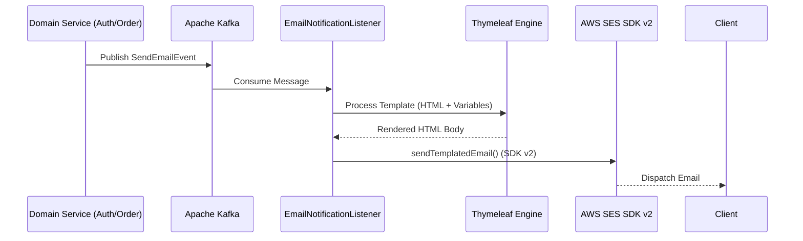

# Domain Module: Infrastructure & Notification (Mail)

## 1. Introduction

The **Mail Module** provides a high-performance, decoupled notification infrastructure for the platform. It transitions legacy SMTP-based delivery to an asynchronous, event-driven architecture powered by **AWS SES (Simple Email Service)**. The module is designed for reliability, scalability, and strict brand consistency, utilizing specialized **Thymeleaf** templates for luxury communication.

---

## 2. Architecture

The system utilizes an asynchronous processing model to ensure notification delivery does not block transactional business logic.

### 2.1 Notification Pipeline Topology



### 2.2 Core Components

*   **EmailNotificationListener**: A Kafka consumer that subscribes to the `notification.email.send` topic. It orchestrates the rendering and dispatching process.
*   **AwsSesEmailService**: The core implementation responsible for constructing the `SendEmailRequest` using the AWS SDK for Java v2.
*   **MailProperties**: A fail-fast configuration component that enforces valid AWS credentials and regional settings at startup.

---

## 3. Reliability & Security Policies

### 3.1 Resilience4j Retry Strategy

To ensure delivery reliability against transient network issues, the module implements a sophisticated retry mechanism:

1.  **Exponential Backoff**: Retries are scheduled with increasing delays to prevent overwhelming the AWS SES endpoint.
2.  **Explicit Exception Handling**:
    *   **Retry**: `SdkClientException`, `SocketTimeout`, `ConnectException`.
    *   **Ignore (Fail-Fast)**: 4xx Client Side errors such as `MessageRejected`, `MailFromDomainNotVerified`, and `BadRequestException`.

### 3.2 Security Configuration

The module implements a **StaticCredentialsProvider** model, explicitly injecting `access-key` and `secret-key` from the environment. This ensures that the application does not rely on ambient IAM roles, providing granular control across various deployment environments.

---

## 4. Integration Guide

### 4.1 Event Payload

Domains wishing to send emails must publish a `SendEmailEvent` to the Kafka topic.

```java
public record SendEmailEvent(
    String to,
    String templateCode,
    Map<String, Object> variables
) {}
```

### 4.2 Available Templates

| Template Code | Scope | Context Variables |
| :--- | :--- | :--- |
| `welcome` | New Registration | `name`, `verificationLink` |
| `reset-password` | Security Flow | `name`, `resetCode`, `expiryMinutes` |

---

## 5. Implementation Reference

### 5.1 Service Implementation

The `AwsSesEmailService` abstracts the complexity of the AWS SDK v2, providing a clean interface for domain services.

```java
@Override
public void sendTemplatedEmail(SendEmailEvent event) {
    Context ctx = new Context();
    ctx.setVariables(event.variables());
    String htmlBody = templateEngine.process("email/" + event.templateCode(), ctx);

    SendEmailRequest request = SendEmailRequest.builder()
            .source(mailProps.getSourceEmail())
            .destination(d -> d.toAddresses(event.to()))
            .message(m -> m.subject(s -> s.data(getSubject(event.templateCode())))
                           .body(b -> b.html(h -> h.data(htmlBody))))
            .build();

    sesClient.sendEmail(request);
}
```

### 5.2 Infrastructure Requirements

*   **Apache Kafka**: Hosting the `notification.email.send` and `notification.email.dlq` topics.
*   **AWS SES**: Verified identities and valid IAM credentials with `ses:SendEmail` permissions.
*   **Thymeleaf**: Spring Boot starter for server-side HTML rendering.
