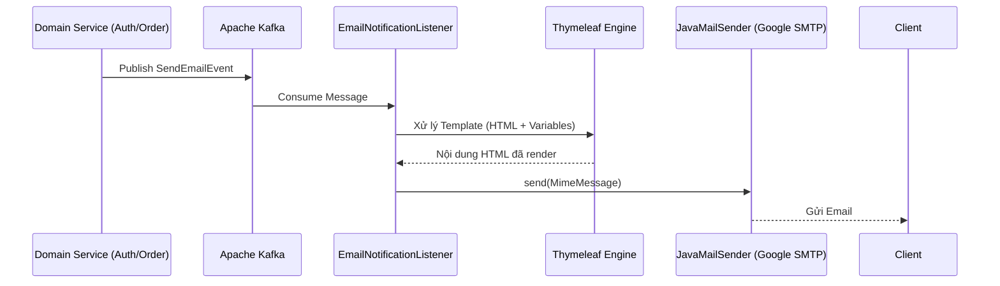

# Domain Module: Hạ Tầng & Thông Báo (Mail)

## 1. Giới Thiệu

**Mô đun Mail** cung cấp hạ tầng thông báo hiệu suất cao và được tách biệt (decoupled) cho nền tảng. Nó sử dụng kiến trúc hướng sự kiện (event-driven) bất đồng bộ, được vận hành bởi **Spring Boot Mail (JavaMailSender)** với Google SMTP. Mô đun được thiết kế để đảm bảo tính tin cậy, khả năng mở rộng và sự nhất quán nghiêm ngặt về thương hiệu, sử dụng các **Thymeleaf** templates chuyên biệt cho truyền thông cao cấp.

---

## 2. Kiến Trúc

Hệ thống sử dụng mô hình xử lý bất đồng bộ để đảm bảo việc gửi thông báo không làm gián đoạn logic nghiệp vụ giao dịch.

### 2.1 Sơ Đồ Luồng Thông Báo (Notification Pipeline)



### 2.2 Các Thành Phần Cốt Lõi

*   **EmailNotificationListener**: Một Kafka consumer đăng ký nhận tin từ topic `notification.email.send`. Nó điều phối toàn bộ quá trình render và gửi tin.
*   **SmtpEmailService**: Thành phần triển khai chính, chịu trách nhiệm xây dựng `MimeMessage` bằng cách sử dụng Spring's `JavaMailSender` và `MimeMessageHelper`.
*   **MailProperties**: Thành phần cấu hình định nghĩa địa chỉ email người gửi (`from`).

---

## 3. Các Chính Sách Về Độ Tin Cậy & Bảo Mật

### 3.1 Chiến Lược Retry Với Resilience4j

Để đảm bảo khả năng gửi tin trước các sự cố mạng tạm thời, mô đun triển khai cơ chế retry nâng cao:

1.  **Exponential Backoff**: Các lượt thử lại được lập lịch với độ trễ tăng dần để tránh gây quá tải cho SMTP server.
2.  **Xử Lý Ngoại Lệ (Exception Handling) Nghiêm Ngặt**:
    *   **Retry**: `MailSendException`, `SocketTimeout`, `ConnectException`, `MessagingException`.
    *   **Ignore (Fail-Fast)**: `MailAuthenticationException` (thông tin xác thực không hợp lệ).

### 3.2 Cấu Hình Bảo Mật

Mô đun sử dụng **Google App Passwords** để xác thực SMTP. Mật khẩu Gmail thông thường không được hỗ trợ; phải tạo App Password 16 ký tự từ cài đặt Google Account.

---

## 4. Hướng Dẫn Tích Hợp

### 4.1 Cấu Trúc Event Payload

Các domain muốn gửi email phải publish một `SendEmailEvent` tới Kafka topic.

```java
public record SendEmailEvent(
    String to,
    String templateCode,
    Map<String, Object> variables
) {}
```

### 4.2 Các Templates Hiện Có

| Template Code | Phạm Vi (Scope) | Các Biến Context |
| :--- | :--- | :--- |
| `welcome` | Đăng ký mới | `name`, `verificationLink` |
| `reset-password` | Luồng Bảo Mật | `name`, `resetCode`, `expiryMinutes` |

---

## 5. Tham Chiếu Triển Khai

### 5.1 Triển Khai Service

`SmtpEmailService` cung cấp một giao diện sạch cho các domain services sử dụng mail abstraction của Spring.

```java
@Override
public void sendTemplatedEmail(SendEmailEvent event) {
    Context ctx = new Context();
    ctx.setVariables(event.getVariables());
    String htmlBody = templateEngine.process("email/" + event.getTemplateCode(), ctx);

    MimeMessage message = mailSender.createMimeMessage();
    MimeMessageHelper helper = new MimeMessageHelper(message, true, "UTF-8");

    helper.setFrom(mailProps.getFrom());
    helper.setTo(event.getTo());
    helper.setSubject(getSubject(event.getTemplateCode()));
    helper.setText(htmlBody, true); // true = HTML content

    mailSender.send(message);
}
```

### 5.2 Yêu Cầu Hạ Tầng

*   **Apache Kafka**: Lưu trữ các topic `notification.email.send` và `notification.email.dlq`.
*   **Google SMTP**: Tài khoản Gmail hợp lệ với App Password đã bật. Cấu hình qua `spring.mail.*` properties.
*   **Thymeleaf**: Spring Boot starter để render HTML phía server.

### 5.3 Biến Môi Trường

```bash
MAIL_USERNAME=your-gmail@gmail.com
MAIL_PASSWORD=xxxx-xxxx-xxxx-xxxx  # Google App Password
MAIL_FROM=your-gmail@gmail.com
```
