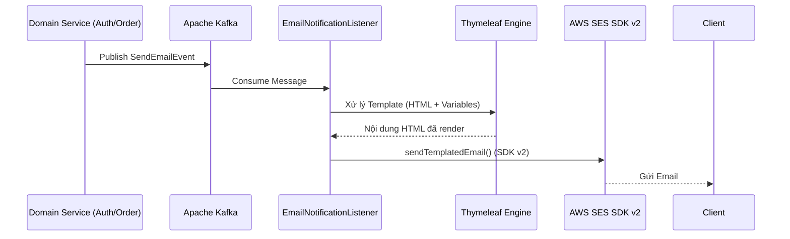

# Domain Module: Hạ Tầng & Thông Báo (Mail)

## 1. Giới Thiệu

**Mô đun Mail** cung cấp hạ tầng thông báo hiệu suất cao và được tách biệt (decoupled) cho nền tảng. Nó chuyển đổi cơ chế gửi tin dựa trên SMTP truyền thống sang kiến trúc hướng sự kiện (event-driven) bất đồng bộ, được vận hành bởi **AWS SES (Simple Email Service)**. Mô đun được thiết kế để đảm bảo tính tin cậy, khả năng mở rộng và sự nhất quán nghiêm ngặt về thương hiệu, sử dụng các **Thymeleaf** templates chuyên biệt cho truyền thông cao cấp.

---

## 2. Kiến Trúc

Hệ thống sử dụng mô hình xử lý bất đồng bộ để đảm bảo việc gửi thông báo không làm gián đoạn logic nghiệp vụ giao dịch.

### 2.1 Sơ Đồ Luồng Thông Báo (Notification Pipeline)



### 2.2 Các Thành Phần Cốt Lõi

*   **EmailNotificationListener**: Một Kafka consumer đăng ký nhận tin từ topic `notification.email.send`. Nó điều phối toàn bộ quá trình render và gửi tin.
*   **AwsSesEmailService**: Thành phần triển khai chính, chịu trách nhiệm xây dựng `SendEmailRequest` bằng cách sử dụng AWS SDK for Java v2.
*   **MailProperties**: Thành phần cấu hình fail-fast, bắt buộc phải có AWS credentials và các thiết lập vùng (region) hợp lệ ngay khi khởi động ứng dụng.

---

## 3. Các Chính Sách Về Độ Tin Cậy & Bảo Mật

### 3.1 Chiến Lược Retry Với Resilience4j

Để đảm bảo khả năng gửi tin trước các sự cố mạng tạm thời, mô đun triển khai cơ chế retry nâng cao:

1.  **Exponential Backoff**: Các lượt thử lại được lập lịch với độ trễ tăng dần để tránh gây quá tải cho endpoint của AWS SES.
2.  **Xử Lý Ngoại Lệ (Exception Handling) Nghiêm Ngặt**:
    *   **Retry**: `SdkClientException`, `SocketTimeout`, `ConnectException`.
    *   **Ignore (Fail-Fast)**: Các lỗi 4xx từ phía Client như `MessageRejected`, `MailFromDomainNotVerified`, và `BadRequestException`.

### 3.2 Cấu Hình Bảo Mật

Mô đun triển khai mô hình **StaticCredentialsProvider**, tiêm (inject) các giá trị `access-key` và `secret-key` trực tiếp từ môi trường. Điều này đảm bảo ứng dụng không phụ thuộc vào các IAM roles mặc định, cung cấp khả năng kiểm soát chi tiết trên các môi trường triển khai khác nhau.

---

## 4. Hướng Dẫn Tích Hợp

### 4.1 Cấu Trúc Event Payload

Các domain muốn gửi email phải publish một `SendEmailEvent` tới Kafka topic.

```java
public record SendEmailEvent(
    String to,
    String templateCode,
    Map<String, Object> variables
) {}
```

### 4.2 Các Templates Hiện Có

| Template Code | Phạm Vi (Scope) | Các Biến Context |
| :--- | :--- | :--- |
| `welcome` | Đăng ký mới | `name`, `verificationLink` |
| `reset-password` | Luồng Bảo Mật | `name`, `resetCode`, `expiryMinutes` |

---

## 5. Tham Chiếu Triển Khai

### 5.1 Triển Khai Service

`AwsSesEmailService` trừu tượng hóa sự phức tạp của AWS SDK v2, cung cấp một giao diện sạch cho các domain services.

```java
@Override
public void sendTemplatedEmail(SendEmailEvent event) {
    Context ctx = new Context();
    ctx.setVariables(event.variables());
    String htmlBody = templateEngine.process("email/" + event.templateCode(), ctx);

    SendEmailRequest request = SendEmailRequest.builder()
            .source(mailProps.getSourceEmail())
            .destination(d -> d.toAddresses(event.to()))
            .message(m -> m.subject(s -> s.data(getSubject(event.templateCode())))
                           .body(b -> b.html(h -> h.data(htmlBody))))
            .build();

    sesClient.sendEmail(request);
}
```

### 5.2 Yêu Cầu Hạ Tầng

*   **Apache Kafka**: Lưu trữ các topic `notification.email.send` và `notification.email.dlq`.
*   **AWS SES**: Các định danh đã được xác thực (verified identities) và IAM credentials hợp lệ với quyền `ses:SendEmail`.
*   **Thymeleaf**: Spring Boot starter để render HTML phía server.
