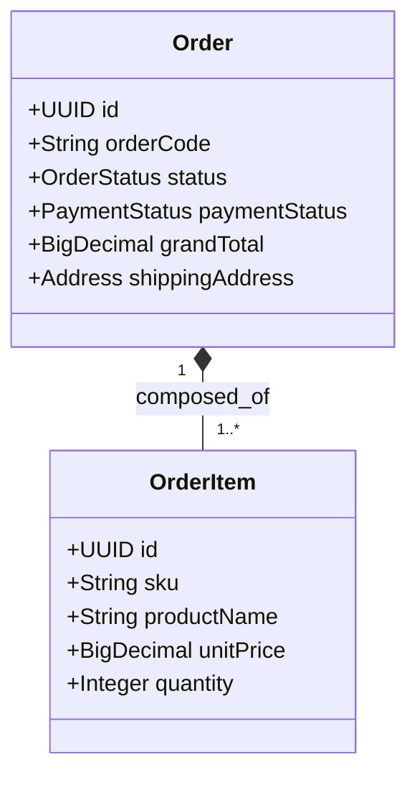
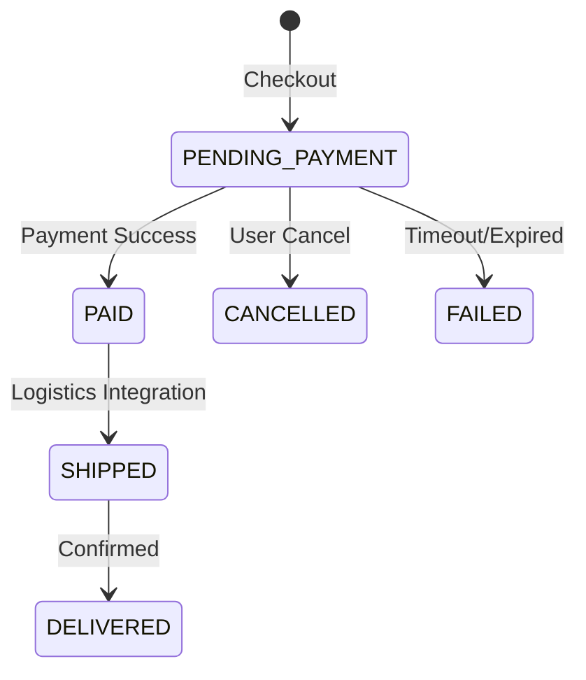

# Domain Module: Order Management

## 1. Overview

The **Order Module** is the transactional heart of the e-commerce platform. It snapshots the volatile state of a cart into an immutable contract of sale. It tracks fulfillment status, payment reconciliation, and serves as the source of truth for revenue.

---

## 2. Architecture

Orders are immutable snapshots. Once created, line items (price, quantity) do not change even if the catalog product is updated.

### 2.1 Entity Relationship Diagram



### 2.2 Lifecycle State Machine

The order status dictates the allowed operations.



---

## 3. Business Logic & Invariants

### 3.1 Immutable Snapshots

When converting a Cart to an Order:
1.  **Price Freeze**: The `unitPrice` is copied by value from the variant. Future price changes do not affect existing orders.
2.  **Product Freeze**: `productName` and `sku` are de-normalized into `OrderItem` to preserve historical accuracy even if the product is deleted.

### 3.2 Inventory Commit

*   **Reservation**: Creation of an Order (PENDING) strictly decrements stock.
*   **Rollback**: Transition to `CANCELLED` or `FAILED` triggers a compensating transaction (`restoreStock`) to return items to inventory.

---

## 4. API Specification

Prefix: `/api/v1/orders`

### 4.1 Retrieval

#### Get My Orders
`GET /`
Returns paginated orders for the authenticated user only.

#### Get Order Detail
`GET /{orderCode}`
Lookup by user-friendly 9-digit code (e.g., `192837465`) rather than UUID for better UX.

### 4.2 Administration

#### Admin List
`GET /admin`
Filtered list (Status, Date Range) for back-office operations.

---

## 5. Implementation Reference

### 5.1 Snapshot Logic

```java
// CheckoutServiceImpl.java
OrderItem item = new OrderItem();
item.setProductName(variant.getProduct().getName()); // Snapshot Name
item.setSku(variant.getSku());                     // Snapshot SKU
item.setUnitPrice(variant.getPrice());             // Snapshot Price
item.setSubTotal(variant.getPrice().multiply(qty));
```

### 5.2 Stock Compensation

`OrderInventoryService` handles the critical rollback logic.

```java
@Transactional
public void restoreStock(Order order) {
    for (OrderItem item : order.getItems()) {
        productVariantRepository.incrementStock(item.getSku(), item.getQuantity());
    }
}
```

---

## 6. Future Extensions

*   **Logistics Integration**: Add `shipping_tracking_code` and integrate with carriers (GHTK, GHN).
*   **Invoicing**: Generate PDF invoices snapshots upon `PAID` transition.
*   **Return Management (RMA)**: Handle partial returns and refunds.
