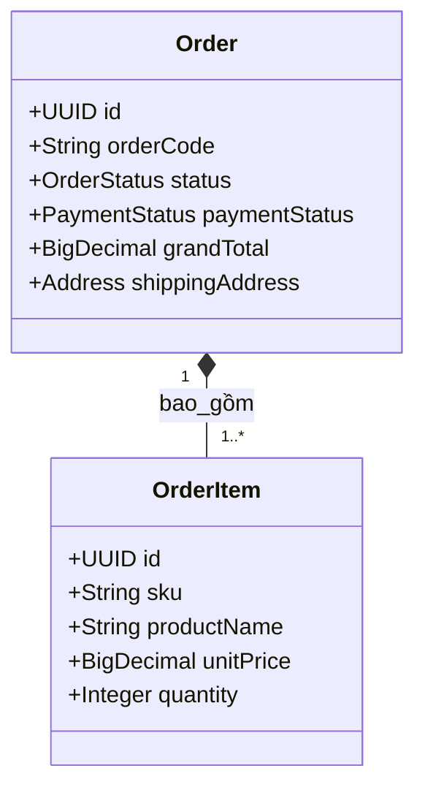
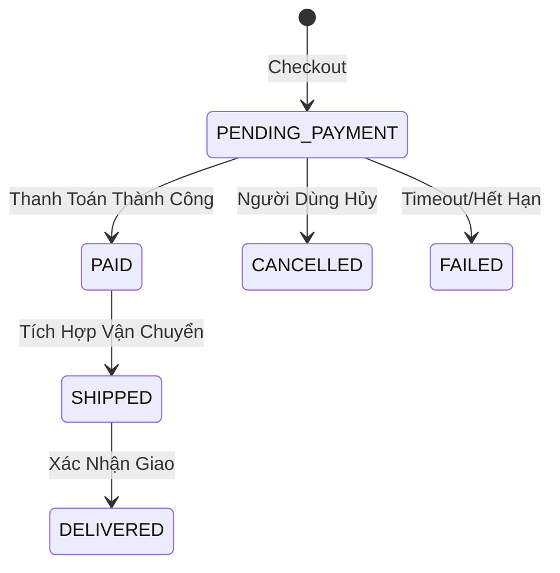

# Domain Module: Quản Lý Đơn Hàng (Order)

## 1. Tổng Quan

**Mô đun Đơn hàng** là trái tim giao dịch của nền tảng thương mại điện tử. Nó chụp lại (snapshot) trạng thái không ổn định của giỏ hàng thành một hợp đồng mua bán bất biến. Nó theo dõi trạng thái hoàn tất đơn hàng, đối soát thanh toán và đóng vai trò là nguồn sự thật cho doanh thu.

---

## 2. Kiến Trúc

Đơn hàng là các snapshot bất biến. Một khi đã tạo, các mục hàng (giá, số lượng) không thay đổi ngay cả khi sản phẩm trong danh mục được cập nhật.

### 2.1 Sơ Đồ Quan Hệ Thực Thể (ERD)



### 2.2 Máy Trạng Thái Vòng Đời

Trạng thái đơn hàng quy định các thao tác được phép.



---

## 3. Logic Nghiệp Vụ & Bất Biến

### 3.1 Snapshot Bất Biến

Khi chuyển đổi từ Giỏ hàng sang Đơn hàng:
1.  **Đóng Băng Giá**: `unitPrice` được sao chép theo giá trị từ biến thể. Thay đổi giá trong tương lai không ảnh hưởng đơn hàng cũ.
2.  **Đóng Băng Sản Phẩm**: `productName` và `sku` được phi chuẩn hóa vào `OrderItem` để bảo tồn độ chính xác lịch sử ngay cả khi sản phẩm bị xóa.

### 3.2 Cam Kết Tồn Kho (Inventory Commit)

*   **Đặt Chỗ**: Việc tạo Đơn hàng (PENDING) sẽ trừ tồn kho nghiêm ngặt.
*   **Rollback**: Chuyển sang `CANCELLED` hoặc `FAILED` sẽ kích hoạt giao dịch bù (`restoreStock`) để trả hàng về kho.

---

## 4. Đặc Tả API

Tiền tố: `/api/v1/orders`

### 4.1 Truy Xuất

#### Đơn Hàng Của Tôi
`GET /`
Trả về danh sách đơn hàng phân trang cho chỉ người dùng đã xác thực.

#### Chi Tiết Đơn Hàng
`GET /{orderCode}`
Tra cứu theo mã 9 chữ số thân thiện người dùng (ví dụ: `192837465`) thay vì UUID để tăng trải nghiệm UX.

### 4.2 Quản Trị

#### Admin List
`GET /admin`
Danh sách có lọc (Trạng thái, Khoảng ngày) cho các hoạt động back-office.

---

## 5. Tham Chiếu Triển Khai

### 5.1 Logic Snapshot

```java
// CheckoutServiceImpl.java
OrderItem item = new OrderItem();
item.setProductName(variant.getProduct().getName()); // Snapshot Tên
item.setSku(variant.getSku());                     // Snapshot SKU
item.setUnitPrice(variant.getPrice());             // Snapshot Giá
item.setSubTotal(variant.getPrice().multiply(qty));
```

### 5.2 Bù Trừ Tồn Kho

`OrderInventoryService` xử lý logic rollback quan trọng.

```java
@Transactional
public void restoreStock(Order order) {
    for (OrderItem item : order.getItems()) {
        productVariantRepository.incrementStock(item.getSku(), item.getQuantity());
    }
}
```

---

## 6. Mở Rộng Tương Lai

*   **Tích Hợp Vận Chuyển**: Thêm `shipping_tracking_code` và tích hợp với đơn vị vận chuyển (GHTK, GHN).
*   **Hóa Đơn**: Tạo snapshot hóa đơn PDF khi trạng thái chuyển sang `PAID`.
*   **Quản Lý Đổi Trả (RMA)**: Xử lý hoàn trả một phần và hoàn tiền.
