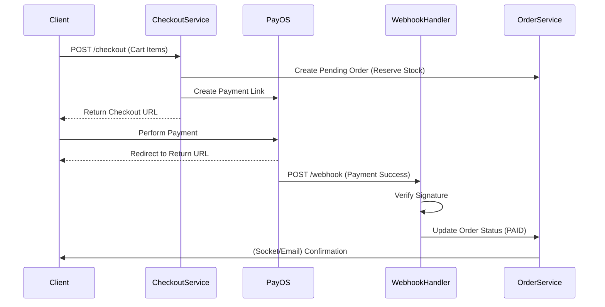
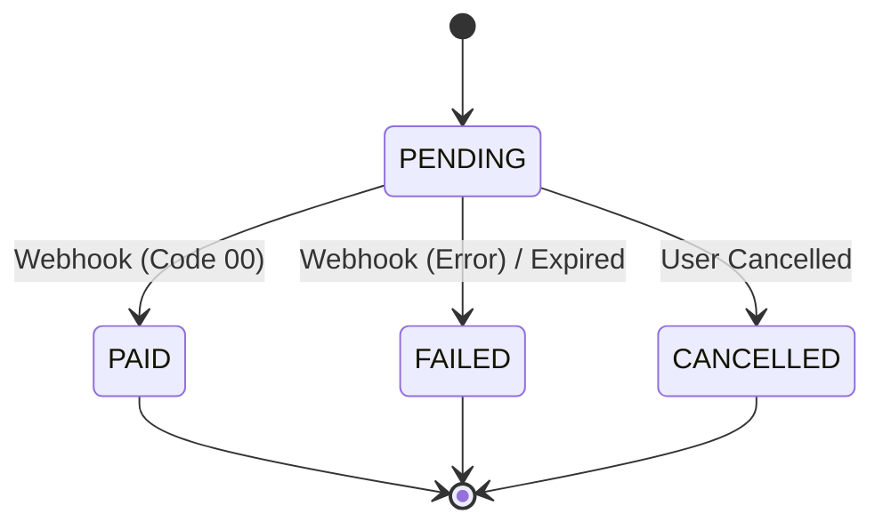

# Domain Module: Payment Processing

## 1. Overview

The **Payment Module** orchestrates the financial transaction lifecycle. It acts as an adapter between the internal Order Management System and external Payment Gateways (specifically **PayOS**). It handles checkout initiation, asynchronous webhook processing, and reconciliation of payment states.

---

## 2. Architecture

The module implements a direct integration pattern where the frontend redirects the user to the Payment Gateway's hosted checkout page.

### 2.1 Payment Flow Sequence



### 2.2 Entity State Machine

The persistence layer tracks the payment lifecycle via the `Payment` entity.



---

## 3. Business Logic & Integrations

### 3.1 Checkout Orchestration

The `CheckoutService` performs an atomic operation:
1.  **Validation**: Verifies Cart, Address, and Inventory.
2.  **Reservation**: Creates an `Order` in `PENDING_PAYMENT` state and decrements stock.
3.  **Gateway Registration**: Registers the transaction with PayOS to obtain a `paymentLinkId` and `checkoutUrl`.
4.  **Persistence**: Saves a `Payment` record linking the internal Order ID to the external Transaction ID.

### 3.2 Webhook Handling (Idempotency)

Webhooks are critical for final consistency but can be delivered multiple times.
*   **Signature Verification**: Authenticates the payload using `PAY_OS_CHECKSUM_KEY`.
*   **Idempotency**: Implemented by tracking processed transactions or strictly forcing state transitions (e.g., cannot go from PAID to PENDING).
*   **Stock Rollback**: If a payment fails or is cancelled, the reserved inventory is automatically released.

### 3.3 Reconciliation (Scheduler)

A scheduled job runs every minute to detect abandoned transactions (`PENDING` payments that have exceeded the TTL). These are marked as `EXPIRED`, and their inventory is released.

---

## 4. API Specification

Prefix: `/api/v1/payments`

### 4.1 Transaction Initiation

#### Checkout
`POST /checkout`
Initiates the flow.
**Body**:
```json
{
  "cartItemIds": ["..."],
  "receiverName": "John Doe",
  "shippingAddress": "123 Street",
  "paymentMethod": "PAYOS"
}
```
**Response**:
```json
{
  "checkoutUrl": "https://pay.payos.vn/web/...",
  "paymentLinkId": "..."
}
```

### 4.2 Gateway Callbacks

#### Webhook
`POST /payos/webhook`
Receives server-to-server notifications. Publicly accessible but protected by signature verification.

#### Return Handler
`GET /payos/return`
Handles the user redirection from the gateway. Updates the UI state but relies on the Webhook for the authoritative status update.

---

## 5. Configuration

Credentials are sourced from environment variables.

| Variable | Description |
| :--- | :--- |
| `PAY_OS_CLIENT_ID` | Merchant Identity |
| `PAY_OS_API_KEY` | Access Secret |
| `PAY_OS_CHECKSUM_KEY` | Webhook Signing Key |

---

## 6. Implementation Reference

### 6.1 Transaction Model

The `Payment` entity serves as the audit log.

```java
@Entity
public class Payment {
    @Id
    private UUID id;
    
    @Column(nullable = false)
    private BigDecimal amount;
    
    @Enumerated(EnumType.STRING)
    private PaymentStatus status; // PENDING, PAID, FAILED
    
    @OneToOne
    private Order order;
}
```

### 6.2 Extension Points

*   **Refunds**: Implement `POST /refunds` calling the gateway's refund API.
*   **Multi-Gateway**: Refactor `CheckoutService` to use the Strategy Pattern (`PaymentStrategy`) to support other providers like VNPay or Stripe.
