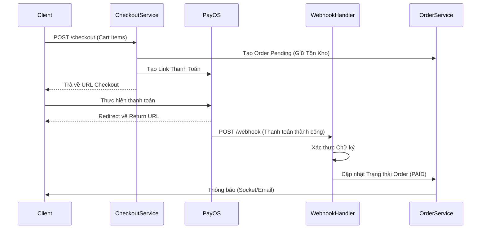
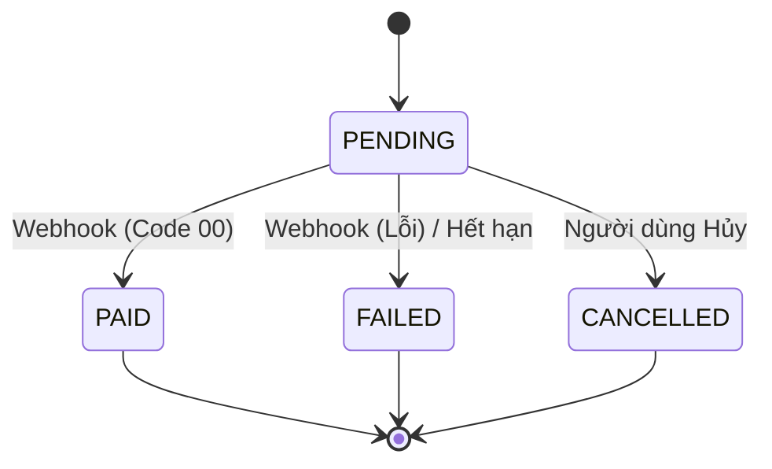

# Domain Module: Xử Lý Thanh Toán (Payment)

## 1. Tổng Quan

**Mô đun Thanh Toán** điều phối vòng đời giao dịch tài chính. Nó hoạt động như một adapter giữa Hệ thống Quản lý Đơn hàng (OMS) nội bộ và các Cổng thanh toán bên ngoài (cụ thể là **PayOS**). Nó xử lý việc khởi tạo checkout, xử lý webhook bất đồng bộ và đối soát trạng thái thanh toán.

---

## 2. Kiến Trúc

Mô đun triển khai mẫu tích hợp trực tiếp, trong đó frontend điều hướng người dùng đến trang thanh toán (hosted checkout) của Cổng thanh toán.

### 2.1 Sơ Đồ Tuần Tự Luồng Thanh Toán



### 2.2 Máy Trạng Thái Thực Thể

Lớp persistence theo dõi vòng đời thanh toán thông qua thực thể `Payment`.



---

## 3. Logic Nghiệp Vụ & Tích Hợp

### 3.1 Điều Phối Checkout

`CheckoutService` thực hiện một thao tác nguyên tử (atomic):
1.  **Validate**: Xác minh Cart, Địa chỉ và Tồn kho.
2.  **Đặt Chỗ (Reservation)**: Tạo một `Order` ở trạng thái `PENDING_PAYMENT` và trừ tồn kho.
3.  **Đăng Ký Gateway**: Đăng ký giao dịch với PayOS để lấy `paymentLinkId` và `checkoutUrl`.
4.  **Lưu Trữ**: Lưu bản ghi `Payment` liên kết Order ID nội bộ với Transaction ID bên ngoài.

### 3.2 Xử Lý Webhook (Tính Idempotency)

Webhooks rất quan trọng để đảm bảo tính nhất quán cuối cùng nhưng có thể được gửi nhiều lần.
*   **Xác Thực Chữ Ký**: Xác thực payload sử dụng `PAY_OS_CHECKSUM_KEY`.
*   **Tính Idempotency**: Triển khai bằng cách theo dõi các giao dịch đã xử lý hoặc ép buộc chuyển đổi trạng thái nghiêm ngặt (ví dụ: không thể chuyển từ PAID sang PENDING).
*   **Rollback Tồn Kho**: Nếu thanh toán thất bại hoặc bị hủy, tồn kho đã giữ sẽ tự động được giải phóng.

### 3.3 Đối Soát (Scheduler)

Một tác vụ định kỳ chạy mỗi phút để phát hiện các giao dịch bị bỏ rơi (các khoản thanh toán `PENDING` quá thời gian TTL). Chúng được đánh dấu là `EXPIRED`, và tồn kho được hoàn trả.

---

## 4. Đặc Tả API

Tiền tố: `/api/v1/payments`

### 4.1 Khởi Tạo Giao Dịch

#### Checkout
`POST /checkout`
Khởi tạo luồng thanh toán.
**Body**:
```json
{
  "cartItemIds": ["..."],
  "receiverName": "Nguyen Van A",
  "shippingAddress": "123 Đường B",
  "paymentMethod": "PAYOS"
}
```
**Response**:
```json
{
  "checkoutUrl": "https://pay.payos.vn/web/...",
  "paymentLinkId": "..."
}
```

### 4.2 Gateway Callbacks

#### Webhook
`POST /payos/webhook`
Nhận thông báo server-to-server. Truy cập công khai nhưng được bảo vệ bởi xác thực chữ ký.

#### Return Handler
`GET /payos/return`
Xử lý việc điều hướng người dùng từ gateway về. Cập nhật giao diện người dùng nhưng dựa vào Webhook để cập nhật trạng thái chính thức.

---

## 5. Cấu Hình

Thông tin xác thực được lấy từ biến môi trường.

| Biến | Mô Tả |
| :--- | :--- |
| `PAY_OS_CLIENT_ID` | Định danh Merchant |
| `PAY_OS_API_KEY` | Secret Truy cập |
| `PAY_OS_CHECKSUM_KEY` | Khóa ký Webhook |

---

## 6. Tham Chiếu Triển Khai

### 6.1 Mô Hình Giao Dịch

Thực thể `Payment` đóng vai trò là nhật ký kiểm toán.

```java
@Entity
public class Payment {
    @Id
    private UUID id;
    
    @Column(nullable = false)
    private BigDecimal amount;
    
    @Enumerated(EnumType.STRING)
    private PaymentStatus status; // PENDING, PAID, FAILED
    
    @OneToOne
    private Order order;
}
```

### 6.2 Điểm Mở Rộng

*   **Hoàn Tiền (Refunds)**: Triển khai `POST /refunds` gọi API hoàn tiền của gateway.
*   **Đa Gateway**: Refactor `CheckoutService` để sử dụng Mẫu Strategy (`PaymentStrategy`) nhằm hỗ trợ các nhà cung cấp khác như VNPay hoặc Stripe.
