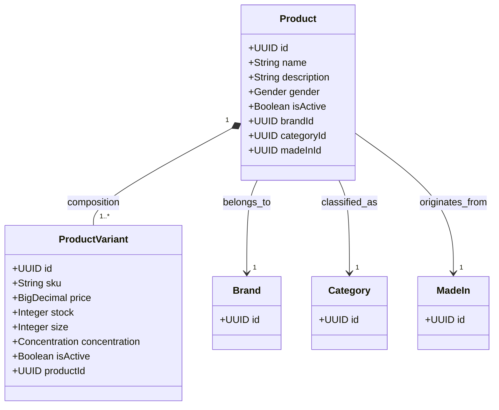

# Domain Module: Product Management

## 1. Introduction

The **Product Module** acts as the core aggregation root for the e-commerce catalog. It orchestrates the lifecycle of merchandise, managing not only the core product definition but also its dimensional variants (SKUs), inventory states, and pricing strategies. It serves as the primary data source for the search engine indexer.

---

## 2. Data Model Architecture

The domain model follows a parent-child hierarchy to support multi-variant products (e.g., different volumes of the same fragrance).

### 2.1 Entity Relationship Diagram



### 2.2 Schema Constraints

*   **Aggregation**: `ProductVariant` entities cannot exist independently of a `Product`.
*   **Identification**:
    *   `Product.name`: Unique within the catalog.
    *   `ProductVariant.sku`: Globally unique Stock Keeping Unit identifier.
*   **Referential Integrity**: Strict foreign key constraints bind products to their metadata (Brand, etc.).

---

## 3. Business Logic & Invariants

### 3.1 Lifecycle Management

1.  **Creation Integrity**: A product cannot be created without valid references to existing `Brand`, `Category`, and `MadeIn` entities.
2.  **Variant Enapsulation**: Variants are managed as a cohesive unit. Adding or updating a variant automatically updates the parent product's audit timestamps.
3.  **SKU Uniqueness**: A mandatory check prevents SKU collisions across the entire inventory system (`PRODUCT_VARIANT_SKU_CONFLICT`).

### 3.2 Synchronization (Event-Driven)

Creating or modifying products triggers side-effects via the Event Bus (Kafka):

*   **Event**: `ProductIndexEvent`
*   **Payload**: Full product state including denormalized variant data.
*   **Consumer**: Elasticsearch Service (for updating the search index).

### 3.3 Caching Strategy

*   **TTL**: 10 Minutes (Aggressive expiry due to inventory volatility).
*   **Eviction Scope**: Modifying a variant evicts the parent product's cache (`product::{id}`).

---

## 4. API Specification

Prefix: `/api/v1/products`

### 4.1 Product Operations

#### Retrieval
`GET /{id}`
Returns `ProductDetailResponse` (includes list of variants).

`GET /`
Standard pagination with name filtering.

#### Creation
`POST /`
**Body**: `ProductCreateRequest`
Can optionally include an initial list of variants for atomic creation.

#### Update
`PUT /{id}`
**Body**: `ProductUpdateRequest`
Supports updating core fields and managing variant lists (Add/Update/Delete) in a single transaction.

### 4.2 Variant Sub-Resources

Direct manipulation of variants is supported for granular inventory management.

#### Manage Variants
*   `POST /{id}/variants`: Append new variant.
*   `PUT /{id}/variants/{variantId}`: Update price/stock.
*   `DELETE /{id}/variants/{variantId}`: Deactivate/Remove variant.

---

## 5. Implementation Reference

### 5.1 Service Orchestration

`ProductService` encapsulates complex update logic:

```java
@Transactional
public ProductResponse update(UUID id, ProductUpdateRequest request) {
    // 1. Update Core Fields
    mapper.updateEntity(product, request);
    
    // 2. Handle Variants
    if (request.variantsToAdd() != null) addVariants(product, request.variantsToAdd());
    if (request.variantsToUpdate() != null) updateVariants(request.variantsToUpdate());
    if (request.variantsToDelete() != null) deleteVariants(request.variantsToDelete());
    
    // 3. Publish Event
    eventPublisher.publishEvent(new ProductIndexEvent(product.getId()));
}
```

### 5.2 Attributes & Enumerations

The domain defines specific enums for fragrance characteristics:
*   **Gender**: `MALE`, `FEMALE`, `UNISEX`.
*   **Concentration**: `EDP` (Eau de Parfum), `EDT` (Eau de Toilette), `PARFUM`, etc.
