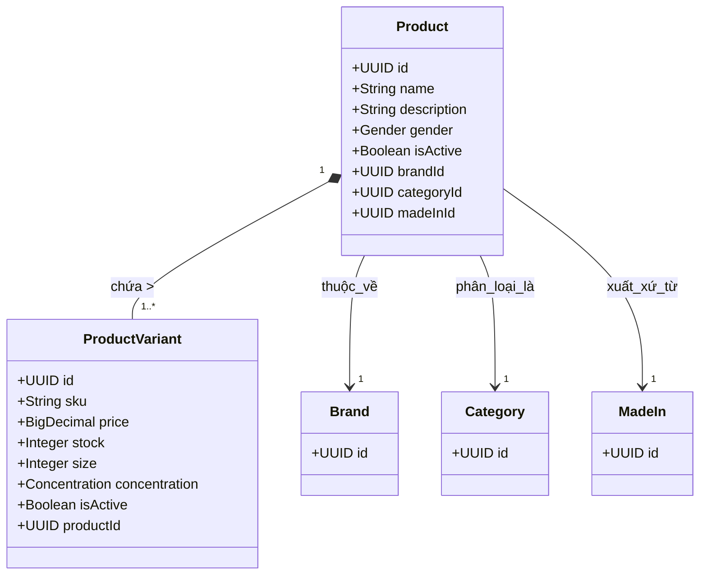

# Domain Module: Quản Lý Sản Phẩm (Product)

## 1. Giới Thiệu

**Mô đun Sản Phẩm (Product)** đóng vai trò là gốc tổng hợp (aggregation root) cốt lõi cho danh mục thương mại điện tử. Nó điều phối vòng đời của hàng hóa, quản lý không chỉ định nghĩa sản phẩm cốt lõi mà còn cả các biến thể đa chiều (SKUs), trạng thái tồn kho và chiến lược định giá. Nó đóng vai trò là nguồn dữ liệu chính cho bộ index của công cụ tìm kiếm.

---

## 2. Kiến Trúc Mô Hình Dữ Liệu

Mô hình miền tuân theo cấu trúc phân cấp cha-con để hỗ trợ các sản phẩm đa biến thể (ví dụ: các dung tích khác nhau của cùng một loại nước hoa).

### 2.1 Sơ Đồ Quan Hệ Thực Thể (ERD)



### 2.2 Ràng Buộc Schema

*   **Tính Tổng Hợp (Aggregation)**: Thực thể `ProductVariant` không thể tồn tại độc lập với `Product`.
*   **Định Danh**:
    *   `Product.name`: Duy nhất trong danh mục.
    *   `ProductVariant.sku`: Mã định danh đơn vị lưu kho (SKU) duy nhất toàn cục.
*   **Toàn Vẹn Tham Chiếu**: Các ràng buộc khóa ngoại nghiêm ngặt liên kết sản phẩm với siêu dữ liệu của chúng (Brand, v.v.).

---

## 3. Logic Nghiệp Vụ & Bất Biến

### 3.1 Quản Lý Vòng Đời

1.  **Toàn Vẹn Khi Tạo**: Không thể tạo sản phẩm nếu thiếu các tham chiếu hợp lệ đến các thực thể `Brand`, `Category`, và `MadeIn` đã tồn tại.
2.  **Đóng Gói Biến Thể**: Các biến thể được quản lý như một khối thống nhất. Việc thêm hoặc cập nhật biến thể sẽ tự động cập nhật timestamps kiểm toán của sản phẩm cha.
3.  **Tính Duy Nhất Của SKU**: Kiểm tra bắt buộc để ngăn chặn xung đột SKU trên toàn bộ hệ thống kho (`PRODUCT_VARIANT_SKU_CONFLICT`).

### 3.2 Đồng Bộ Hóa (Hướng Sự Kiện)

Việc tạo hoặc sửa đổi sản phẩm kích hoạt các hiệu ứng phụ (side-effects) qua Event Bus (Kafka):

*   **Sự Kiện**: `ProductIndexEvent`
*   **Payload**: Trạng thái đầy đủ của sản phẩm bao gồm dữ liệu biến thể đã chuẩn hóa.
*   **Consumer**: Elasticsearch Service (để cập nhật chỉ mục tìm kiếm).

### 3.3 Chiến Lược Caching

*   **TTL**: 10 Phút (Hết hạn nhanh do tính biến động của tồn kho).
*   **Phạm Vi Eviction**: Sửa đổi một biến thể làm mất hiệu lực cache của sản phẩm cha (`product::{id}`).

---

## 4. Đặc Tả API

Tiền tố: `/api/v1/products`

### 4.1 Thao Tác Sản Phẩm

#### Truy Xuất
`GET /{id}`
Trả về `ProductDetailResponse` (bao gồm danh sách biến thể).

`GET /`
Phân trang tiêu chuẩn với bộ lọc theo tên.

#### Tạo Mới
`POST /`
**Body**: `ProductCreateRequest`
Có thể tùy chọn bao gồm danh sách biến thể ban đầu để tạo kiểu nguyên tử (atomic creation).

#### Cập Nhật
`PUT /{id}`
**Body**: `ProductUpdateRequest`
Hỗ trợ cập nhật các trường cốt lõi và quản lý danh sách biến thể (Thêm/Sửa/Xóa) trong một transaction duy nhất.

### 4.2 Sub-Resources Biến Thể

Hỗ trợ thao tác trực tiếp trên các biến thể để quản lý tồn kho chi tiết.

*   `POST /{id}/variants`: Thêm biến thể mới.
*   `PUT /{id}/variants/{variantId}`: Cập nhật giá/tồn kho.
*   `DELETE /{id}/variants/{variantId}`: Ngưng hoạt động/Xóa biến thể.

---

## 5. Tham Chiếu Triển Khai

### 5.1 Điều Phối Service

`ProductService` đóng gói logic cập nhật phức tạp:

```java
@Transactional
public ProductResponse update(UUID id, ProductUpdateRequest request) {
    // 1. Update Core Fields
    mapper.updateEntity(product, request);
    
    // 2. Handle Variants
    if (request.variantsToAdd() != null) addVariants(product, request.variantsToAdd());
    if (request.variantsToUpdate() != null) updateVariants(request.variantsToUpdate());
    if (request.variantsToDelete() != null) deleteVariants(request.variantsToDelete());
    
    // 3. Publish Event
    eventPublisher.publishEvent(new ProductIndexEvent(product.getId()));
}
```

### 5.2 Thuộc Tính & Liệt Kê

Miền định nghĩa các enums cụ thể cho đặc tính nước hoa:
*   **Gender**: `MALE`, `FEMALE`, `UNISEX`.
*   **Concentration**: `EDP` (Eau de Parfum), `EDT` (Eau de Toilette), `PARFUM`, v.v.
