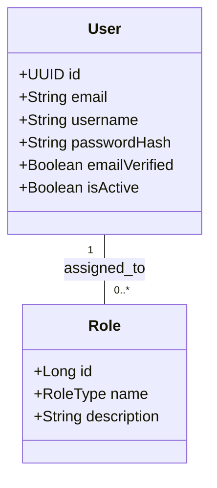

# Domain Module: User Management

## 1. Overview

The **User Module** handles the profile management and role-based access control (RBAC) foundation of the platform. While authentication provides identity, this module manages the **attributes** (profile data) and **permissions** (roles) associated with that identity. It differentiates between standard customer capabilities and administrative privileges.

---

## 2. Architecture

The user model allows for extensible profile data and flexible role assignments.

### 2.1 Entity Relationship Diagram



### 2.2 Role-Based Access Control (RBAC) Query Model

| Role | Scope | Permissions |
| :--- | :--- | :--- |
| `USER` | Self | Read/Update own Profile, Manage own Address/Cart/Orders. |
| `ADMIN` | Global | CRUD on all Users, Products, Categories, Brands. View System Metrics. |

---

## 3. Business Logic & Invariants

### 3.1 Uniqueness Constraints

To ensure distinct identities, the system enforces:
1.  **Unique Email**: Case-insensitive check. Prevents multiple accounts with the same contact.
2.  **Unique Username**: Case-insensitive check. Ensures unique display handles.

### 3.2 Security Policies

1.  **Immutable Identity**: Once created, the `id` (UUID) never changes.
2.  **Password Safety**: Passwords are never returned in downstream DTOs (`UserResponse`). They are write-only fields during registration/reset.
3.  **Role Escalation Prevention**: Only an administrator can assign the `ADMIN` role. Regular registration defaults to `USER` role.

---

## 4. API Specification

Prefix: `/api/v1/users`

### 4.1 Administration (Admin Only)

#### List Users
`GET /search`
Supports pagination and filtering (`q` for partial match on name/email).

#### Create User (Admin)
`POST /`
Create accounts explicitly with specific roles (e.g., creating another admin).

#### Update User
`PUT /{id}`
Modify sensitive attributes or roles.

#### Delete User
`DELETE /{id}`
Hard delete. *Caution: Use soft-delete (isActive=false) for history preservation.*

### 4.2 Profile Management (Self)

Current user operations are handled via the `Auth` module (`/api/v1/auth/me`), which delegates to the `User` domain for data retrieval.

---

## 5. Implementation Reference

### 5.1 Service Layer

`UserServiceImpl` handles the raw entity manipulation.

```java
@Override
public UserResponse createUser(UserCreateRequest request) {
    if (repository.existsByUsername(request.username())) {
        throw new ApiException(ApiErrorCode.USER_USERNAME_CONFLICT);
    }
    // ... hashing and persistence
}
```

### 5.2 Persistence

*   **Repository**: `UserAdminRepository` extends `JpaRepository` and `JpaSpecificationExecutor` for dynamic filtering.
*   **Projections**: Data is always projected to `UserResponse` to prevent leaking JPA-managed entities to the controller.

---

## 6. Future Extensions

*   **Address Book**: Extract addresses into a separate `UserAddress` entity (One-to-Many) for multi-address support.
*   **Audit Logging**: Integrate with `Javers` or Hibernate Envers to track who changed what profile field and when.
