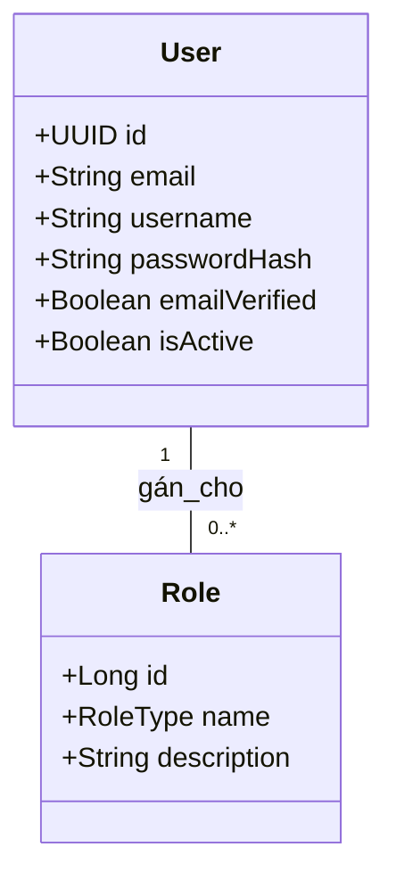

# Domain Module: Quản Lý Người Dùng (User)

## 1. Tổng Quan

**Mô đun Người dùng (User)** xử lý việc quản lý hồ sơ và nền tảng kiểm soát truy cập dựa trên vai trò (RBAC). Trong khi mô đun xác thực cung cấp danh tính, mô đun này quản lý các **thuộc tính** (dữ liệu hồ sơ) và **quyền hạn** (vai trò) liên quan đến danh tính đó. Nó phân biệt giữa khả năng của khách hàng tiêu chuẩn và đặc quyền quản trị.

---

## 2. Kiến Trúc

Mô hình người dùng cho phép dữ liệu hồ sơ có thể mở rộng và gán vai trò linh hoạt.

### 2.1 Sơ Đồ Quan Hệ Thực Thể (ERD)



### 2.2 Mô Hình Truy Vấn RBAC

| Vai Trò | Phạm Vi | Quyền Hạn |
| :--- | :--- | :--- |
| `USER` | Cá nhân | Xem/Sửa Hồ sơ bản thân, Quản lý Địa chỉ/Giỏ hàng/Đơn hàng của mình. |
| `ADMIN` | Toàn cục | CRUD trên tất cả User, Product, Category, Brand. Xem Metrics hệ thống. |

---

## 3. Logic Nghiệp Vụ & Bất Biến

### 3.1 Ràng Buộc Duy Nhất

Để đảm bảo danh tính riêng biệt, hệ thống thực thi:
1.  **Email Duy Nhất**: Kiểm tra không phân biệt hoa thường. Ngăn chặn nhiều tài khoản dùng chung liên hệ.
2.  **Username Duy Nhất**: Kiểm tra không phân biệt hoa thường. Đảm bảo tên hiển thị duy nhất.

### 3.2 Chính Sách Bảo Mật

1.  **Danh Tính Bất Biến**: Khi đã tạo, `id` (UUID) không bao giờ thay đổi.
2.  **An Toàn Mật Khẩu**: Mật khẩu không bao giờ được trả về trong các DTO hạ nguồn (`UserResponse`). Chúng là trường chỉ ghi (write-only) trong quá trình đăng ký/đặt lại.
3.  **Ngăn Chặn Leo Thang Vai Trò**: Chỉ quản trị viên mới có thể gán vai trò `ADMIN`. Đăng ký thông thường mặc định là vai trò `USER`.

---

## 4. Đặc Tả API

Tiền tố: `/api/v1/users`

### 4.1 Quản Trị (Chỉ Admin)

#### Danh Sách Người Dùng
`GET /search`
Hỗ trợ phân trang và lọc (`q` để tìm khớp một phần tên/email).

#### Tạo Người Dùng (Admin)
`POST /`
Tạo tài khoản tường minh với các vai trò cụ thể (ví dụ: tạo admin khác).

#### Cập Nhật Người Dùng
`PUT /{id}`
Sửa đổi các thuộc tính nhạy cảm hoặc vai trò.

#### Xóa Người Dùng
`DELETE /{id}`
Xóa cứng. *Lưu ý: Nên dùng xóa mềm (isActive=false) để bảo tồn lịch sử.*

### 4.2 Quản Lý Hồ Sơ (Cá Nhân)

Các thao tác của người dùng hiện tại được xử lý qua mô đun `Auth` (`/api/v1/auth/me`), mô đun này ủy quyền cho domain `User` để lấy dữ liệu.

---

## 5. Tham Chiếu Triển Khai

### 5.1 Tầng Service

`UserServiceImpl` xử lý thao tác thực thể thô.

```java
@Override
public UserResponse createUser(UserCreateRequest request) {
    if (repository.existsByUsername(request.username())) {
        throw new ApiException(ApiErrorCode.USER_USERNAME_CONFLICT);
    }
    // ... hashing và persistence
}
```

### 5.2 Persistence

*   **Repository**: `UserAdminRepository` mở rộng `JpaRepository` và `JpaSpecificationExecutor` cho lọc động.
*   **Projections**: Dữ liệu luôn được project sang `UserResponse` để tránh rò rỉ các thực thể được JPA quản lý ra controller.

---

## 6. Mở Rộng Tương Lai

*   **Sổ Địa Chỉ**: Tách địa chỉ thành thực thể `UserAddress` riêng biệt (Một-Nhiều) để hỗ trợ nhiều địa chỉ.
*   **Audit Logging**: Tích hợp với `Javers` hoặc Hibernate Envers để theo dõi ai đã thay đổi trường hồ sơ nào và khi nào.
